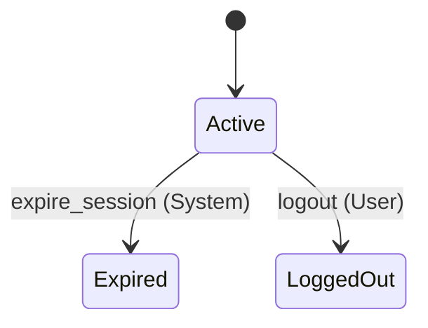
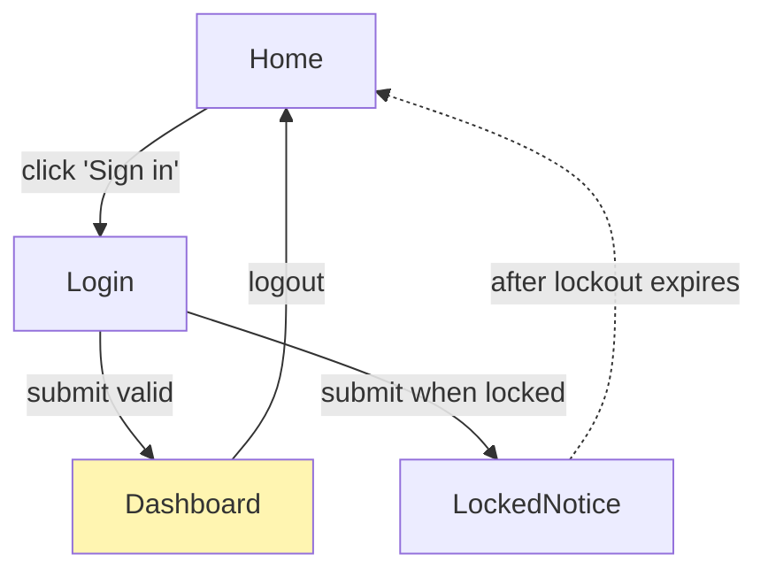
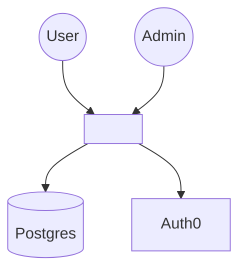
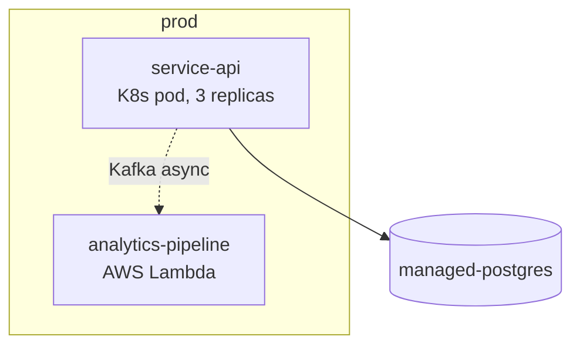

# /spec-readback — Generate Human-Readable Review Document

Produce a Markdown readback document that translates the area JSON and its Quint sidecar into a form humans can review: natural-language summary, embedded Mermaid diagrams, traceability snapshot, verification status. Written to `specs/<target>.readback.md` (per-area) or `.spec/readback.md` (project-wide).

This is the primary artifact for **PR review and stakeholder review** — auto-regenerated, never hand-edited, but rendered as a clean Markdown file in any viewer.

## Usage
```
/spec-readback [target]            # per-area readback
/spec-readback                     # project-wide overview readback
/spec-readback --all               # both: project overview + every area
```

`[target]` is the area name. Works for any kind: `area`, `contract`, `ui`. The shape of the readback adapts to the kind.

## Instructions

You are the **Readback Author**. You read structured artifacts (area JSON + sidecar + project config) and emit a human-readable Markdown document with embedded Mermaid diagrams. You do NOT invent content — everything in the readback is derived from existing data. If a section has no source data, omit the section rather than fabricate.

**Determinism rule:** structure, diagrams, tables, statuses, and traces are derived mechanically from the source artifacts (use `tools/itf_tools.py mermaid` for trace diagrams — don't hand-draw them). Your own prose is limited to short glosses that restate what the data says; where you add an interpretive sentence, it must be traceable to a specific field. The readback is the review surface humans trust — it must not be able to diverge from what the checker actually verified.

### Step 1 — Resolve target and read sources

Per-area readback (`/spec-readback <target>`):
- `specs/<target>.json` (required)
- `specs/<target>.qnt` (the sidecar; used for state machine inference)
- `.spec/project.json` (for resolved architecture and topology context)
- `.spec/patterns/*.json` and `.spec/protocols/*.json` (to resolve referenced names to descriptions)
- For UI areas: also read each `spans` area's JSON to cross-reference.
- For contracts: read each `spans` area's JSON for participant summaries.

Project-wide readback (`/spec-readback` with no target):
- `.spec/project.json`
- Every `specs/*.json` (for the per-area summary table)

### Step 2 — Choose template by kind

#### Per-area readback for `kind: "area"`

```markdown
# Spec Readback: <area> — v<version>

> Auto-generated from `specs/<area>.json` by `/spec-readback`. Do not edit directly.
> Regenerate after spec changes: `claude /spec-readback <area>`

**Status:** <status>  |  **Last modified:** <last_modified>  |  **Last verified:** <date from verification_log[-1] or "never">

## Purpose
<purpose>

## Concepts

**Entities:**
- **<Name>** — <states or description>
- ...

**Actors:** <comma-separated>
**Verbs:** <comma-separated>

## State Machines

For each entry in `state_machines[]`, emit a state diagram directly from the declared transitions (no sidecar inference needed — the structure is right there in the JSON):



Terminal states get the `--> [*]` edge; `lifecycle_actions[]` show as `[*] --> initial_state: <action_name>` to indicate creation. Edge labels use `trigger (actor)`; the guard becomes a tooltip if rendered with Mermaid extensions.

If `state_machines[]` is missing but an entity has `concepts.entities[].states[]`, fall back to inference from the sidecar's `action` mutations and emit a less precise diagram, plus a note: "State machine not declared explicitly. Run `/spec <area>` to capture it formally."

## Components

Only if `architecture.components[]` is non-empty:

```mermaid
graph LR
  subgraph <area> [<area>]
    service[service<br/>role: transport]
    worker[worker<br/>role: async]
  end
  service -. emits .-> worker
```

Then list components with their roles + implemented actions in a bulleted form.

## What the System Does

For each requirement, write one bullet. Render the EARS fields when present (they're the source of truth; the free-text description is derived):

- **REQ-003** — *While* the account is Unlocked, *when* the user submits invalid credentials, the system *shall* increment failedAttempts and lock the account at MAX_FAILED_ATTEMPTS.
  - Realized by Quint action `login_failed` in component **service**.
  - Witness: ✓ demonstrated — see trace below. (or: ✗ NO WITNESS — unreachable in model; or ⏳ not checked yet)
  - Followed by the **Quint excerpt**: the body of the `quint_ref` action (verbatim from the sidecar) in a collapsed `<details>` block. EARS sentence and formal encoding sit side by side — this is the one semantic link no tool checks, so the readback makes the human review of it a diff, not a hunt.

Group by component if helpful.

### Witnessed Behavior (machine-found example traces)

For each requirement whose `witness.status == "witnessed"`, embed the trace as a sequence diagram — generated, not drawn:

```bash
tools/itf_tools.py mermaid specs/<area>/traces/REQ-003.itf.json --title "REQ-003 witness"
```

Paste the output into a `mermaid` block under the requirement, with one caption line: "Machine-found by Apalache on <witness.checked_at>; replayed against code by /spec-verify." For traces longer than ~12 steps, link the `.itf.json` and show `tools/itf_tools.py summarize` output instead.

## What Must Always Be True

For each invariant:

- **INV-001 (atMostOneActiveSession)** — At most one Active session per user.
  - Criticality: critical | Formal status: ✓ verified (or ✗ counterexample / ~ specified)

If `check_results[]` has counterexamples, embed a brief summary of the trace.

## What Must Eventually Happen

For each property (liveness):

- **PROP-001 (eventualLogout)** — Every Active session eventually transitions to LoggedOut or Expired.
  - Formal status: ✓ verified

(Omit section if no properties.)

## Architecture

Resolved view (project ⊕ area ⊕ components):

- **Stack:** TypeScript 5.4 + Express + Vitest
- **Persistence:** Postgres via Prisma
- **Patterns referenced:**
  - `outbox` — append-only outbox for transactional outbound messaging
- **Protocols spoken:**
  - `api-envelope` — {data, errors, meta} response shape
- **Cross-cutting:** pino logging (json), OpenTelemetry tracing

If components are declared, restate the layout from the component table.

## Architectural Decisions

For each `decisions[]` entry with `kind: "architecture"`:

- **DEC-001 (2026-04-12, accepted)** — JWT (RS256) over session cookies.
  - **Rationale:** Edge proxy needs to validate without a round-trip.
  - **Alternatives considered:** Cookie-based sessions (edge can't validate), opaque tokens with introspection (extra request per call).

## Traceability

| ID      | Quint              | Component | Code                          | Verified |
|---------|--------------------|-----------|-------------------------------|----------|
| REQ-001 | action login       | service   | authService.ts:login          | ✓        |
| INV-001 | val singleSession  | service   | authService.ts:login (guard)  | ✓        |

(All from `traceability[]`. If empty: "No code generated yet. Run `/spec-apply <area>`.")

## Open Questions

Only entries with `status: "open"` or `status: "deferred"`:

- **Q-001** (open) — Should unlock_account be self-service or Admin-only?

(Skip section if none open.)

## Verification Status

If `verification_log[]` has entries, show the last:

- **2026-05-14**: PASS  |  4 tests, 0 failures  |  Spec @ abc1234 ⇄ Code @ def5678
- Drift detected: no

Plus an inline mini-trend (last 5 entries, if available, as a compact list).

If empty: "No verification runs recorded. Run `/spec-verify <area>`."

## Counterexamples (if any)

If `check_results.checks[]` has entries with `result: "counterexample"`, include the NL explanation written by `/spec-check`. Otherwise omit.
```

#### Per-area readback for `kind: "contract"`

Different shape — contracts have no code, no traceability:

```markdown
# Contract Readback: <name> — v<version>

**Spans:** <area1>, <area2>, ...  |  **Status:** <status>  |  **Last checked:** <date>

## What This Contract Says

<purpose>

## Joint Invariants

For each invariant (typically prefixed `INV-CONTRACT-NNN`):

- **INV-CONTRACT-001 (noOrphanAccounts)** — Every billing.Account.userId refers to an existing auth.User.
  - Status: ✓ verified

## Participant Obligations

For each participant area:

### auth must expose
- State: `users` (the set of valid user IDs)
- Actions that don't violate: `delete_user` must publish a cascade event, OR ...

### billing must respect
- Cannot create Account.userId not in auth.users (enforced by checking at write time)
- ...

(Derived by analyzing the Quint sidecar's imports and usage.)

## Decisions
(Same as area)

## Open Questions
(Same as area)

## Check Status
Last `/spec-check`: 2026-05-14 — VERIFIED.
```

#### Per-area readback for `kind: "ui"`

Same shape as area, but replace the State Machines section with **Navigation**:

```markdown
## Navigation



Auth-required screens highlighted. Edges from `navigation[]`.

## Screens

| Screen | Auth required | Purpose | Components |
|---|---|---|---|
| Home | no | Public landing | Header |
| Login | no | Email/password form | Header, LoginForm |
| Dashboard | yes | Logged-in landing | Header |
| LockedNotice | no | Shown when account locked | Header |

## UI Components

For each `ui_components[]`:

- **LoginForm** — fields: email, password. States: idle, submitting, error.
- **Header** — visible when always.

## Behaviors (UI requirements)

Per requirement:
- **UI-001** — Clicking 'Sign in' from Home navigates to Login.
- **INV-001 (guardedDashboard)** — Dashboard is unreachable without an authenticated session. ✓ verified by Apalache.
```

#### Project-wide readback (`/spec-readback` no target)

`.spec/readback.md`:

```markdown
# Project Readback: <project-name>

> Auto-generated. Regenerate: `claude /spec-readback`

**Areas:** <count>  |  **Last activity:** <max last_modified across areas>

## System Context (C4)



(Actors collected from per-area `concepts.actors`; external systems from `.spec/project.json` `topology.external_systems[]`.)

## Topology (Deployment)

Only if `.spec/project.json` `topology` is set:



## Areas

| Area | Kind | Version | Status | Code repo | Last verified |
|---|---|---|---|---|---|
| auth | area | 1.0.0 | approved | service-api | 2026-05-14 ✓ |
| auth-ui | ui | 0.3.0 | formalized | service-web | 2026-05-12 ✓ |
| user-permission | contract | 1.0.0 | approved | — | 2026-05-13 ✓ |

Per-area readback links: [auth](./specs/auth.readback.md), [auth-ui](./specs/auth-ui.readback.md), ...

## Architecture Defaults

- Stack: <project.architecture.stack>
- Persistence: <project.architecture.persistence>
- Cross-cutting: ...

## Catalogs

**Patterns** (`.spec/patterns/`): outbox, repository-with-uow, ...
**Protocols** (`.spec/protocols/`): api-envelope, pagination-cursor, ...

## Health Check

Areas needing attention:
- **billing** — 3 open questions, last verify is 2 weeks old.
- **search** — INV-002 has counterexample (last check 2026-05-10).
```

### Step 3 — Write files

For per-area: write to `specs/<target>.readback.md` (flat, next to the JSON and sidecar). Overwrite if exists; the file is generated.

For project-wide: write to `.spec/readback.md`.

For `--all`: write both the project-wide AND every per-area readback.

### Step 4 — Diagram correctness

All Mermaid in the readback is generated from existing structured data:

- **State machines** — parse the sidecar; for each `var` typed as a variant, infer states from the type; infer transitions from `action` declarations that mutate the var.
- **Component diagrams** — read `architecture.components[]`; edges from `implements_actions` overlap or pattern usage (mark heuristic edges with dotted lines).
- **Navigation diagrams** — direct translation of `navigation[]`.
- **Topology** — direct translation of `.spec/project.json.topology`.
- **C4 context** — actors from per-area `concepts.actors`, external systems from topology.

If a source is empty, skip the corresponding diagram section rather than emitting an empty Mermaid block.

### Step 5 — Validate against source

Before writing, cross-check:
- Every node name in a component diagram matches a `components[]` entry.
- Every navigation node matches a `screens[]` entry.
- Every topology node matches a deployment unit or external system.

If a previous hand-edited readback had extra content (rare — readbacks are normally auto-generated), warn the user and ask whether to drop those edits.

### Step 6 — Summary and commit

```
✓ Readback written:
  specs/auth.readback.md         — 4 sections, 2 embedded diagrams
  specs/auth-ui.readback.md      — 5 sections, 1 navigation diagram
  .spec/readback.md              — project overview, 2 diagrams

Render in any markdown viewer (GitHub, VS Code, Mermaid Live).
Linkable from PR descriptions for stakeholder review.
```

```bash
git add specs/<target>.readback.md .spec/readback.md
git commit -m "spec(<target>): readback — <summary>"
```

### What `/spec-readback` does NOT do

- **Does not render images.** Mermaid is text; renderers handle visuals.
- **Does not let you hand-edit nodes or sections that don't exist in the source.** Declare them in the source artifact (area JSON, sidecar, topology) and regenerate. This keeps the readback from drifting.
- **Does not invent sequence diagrams.** Sequence diagrams come exclusively from ITF witness traces via `tools/itf_tools.py mermaid` — machine-found, never sketched from imagination.
- **Does not modify the area JSON or sidecar.** Read-only over those; only writes the `.readback.md` files.
