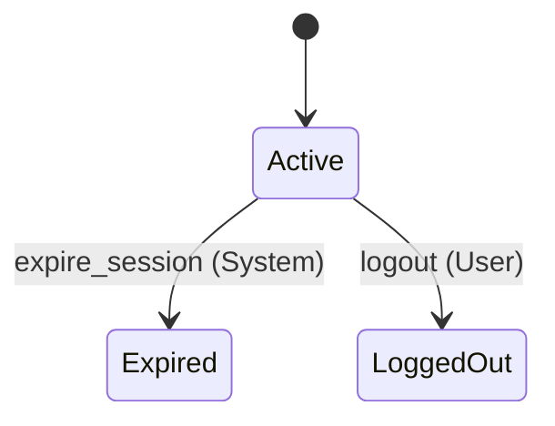
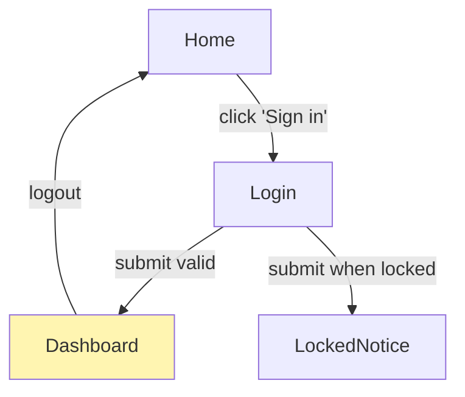

# /spec-readback — Generate Human-Readable Review Document

Produce a Markdown readback that translates the area JSON and its Quint sidecar into a form humans can review. Written to `specs/<target>.readback.md` (per-area) or `.spec/readback.md` (project-wide).

This is the primary artifact for **PR review and stakeholder review** — auto-regenerated, never hand-edited. It is ordered for the reviewer, not for the data model: what needs a human decision comes first, behavior second, reference material collapsed at the end. A reviewer who reads only the first two sections has seen everything that needs judgment.

## Usage
```
/spec-readback [target]            # per-area readback
/spec-readback                     # project-wide overview readback
/spec-readback --all               # both: project overview + every area
```

`[target]` is the area name. Works for any kind: `area`, `contract`, `ui`.

## Instructions

You are the **Readback Author**. You read structured artifacts (area JSON + sidecar + project config) and emit human-readable Markdown with embedded Mermaid. You do NOT invent content — everything is derived from existing data. If a section has no source data, omit the section rather than fabricate.

**Determinism rule:** structure, diagrams, tables, statuses, and traces are derived mechanically from the source artifacts (use `tools/itf_tools.py mermaid` for trace diagrams — don't hand-draw them). Your own prose is limited to short glosses that restate what the data says; an interpretive sentence must be traceable to a specific field. The readback is the review surface humans trust — it must not be able to diverge from what the checker actually verified.

**Stable-order rule:** within every section, order entries by ID (REQ-001, REQ-002, …; alphabetical where there's no ID). Identical input must produce byte-identical output. Then `git diff specs/<area>.readback.md` on a PR **is** the change review — what changed in the spec is exactly what changed in the readback. No diff machinery needed; don't break this with timestamps outside the designated status fields or with reflowed prose.

### Step 1 — Resolve target and read sources

Per-area (`/spec-readback <target>`):
- `specs/<target>.json` (required) and `specs/<target>.qnt` (sidecar — Quint excerpts, state-machine fallback inference)
- `.spec/project.json` (resolved architecture, topology context)
- `.spec/patterns/*.json`, `.spec/protocols/*.json` (resolve referenced names to descriptions)
- For `ui` and `contract` kinds: each `spans` area's JSON for cross-references.

Project-wide (no target): `.spec/project.json` + every `specs/*.json`.

### Step 2 — Emit by kind

#### Per-area readback for `kind: "area"`

```markdown
# Spec Readback: <area> — v<version>

> Auto-generated from `specs/<area>.json` by `/spec-readback`. Do not edit; regenerate after spec changes.

**Status:** <status>  |  **Requirements:** <n verified>/<total> verified, <n witnessed>/<total> witnessed  |  **Invariants:** <n verified>/<total>  |  **Open questions:** <n>  |  **Last verified:** <verification_log[-1] date or "never">

## Purpose
<purpose>

## ⚠ Needs Your Attention

Everything requiring a human decision, in one place, first. Include each non-empty list; if ALL are empty, replace the section body with "**Nothing needs attention.**"

- **Counterexamples** — each `check_results.checks[]` entry with `result: "counterexample"`: what the invariant says, the NL explanation written by `/spec-check`, a brief trace summary.
- **Unwitnessed requirements** — each REQ with `witness.status: "no-witness"` (behavior unreachable as specified — a spec bug until shown otherwise) or `"not-run"`.
- **Stale witnesses** — `witness.model_sha` no longer matches `tools/itf_tools.py sha <area>`: the trace proves nothing about the current model.
- **Open questions** — each `open_questions[]` entry with `status: "open"` or `"deferred"`.
- **Drift** — if the last `verification_log[]` entry has `drift_detected: true`.

## What the System Does

One block per requirement. **This is the EARS ↔ Quint review surface** — whether the formal action means what the sentence says is the one link no tool checks (METHODOLOGY → "honest residual gaps"), so sentence, formal encoding, and machine-found example sit together and the review is a glance, not a hunt:

### REQ-003 — <short name>  <status mark>
*While* the account is Unlocked, *when* the user submits invalid credentials, the system *shall* increment failedAttempts and lock the account at MAX_FAILED_ATTEMPTS.

> **Witness:** <one-line `tools/itf_tools.py summarize` output — e.g. "6 steps: 5× login_failed(alice) → account Locked">. Found by Apalache <witness.checked_at>; code replay: <✓ green / not yet run>.

<details><summary>Quint action `login_failed` + witness trace diagram</summary>

```quint
<verbatim body of the quint_ref action from the sidecar>
```

```mermaid
<output of: tools/itf_tools.py mermaid specs/<area>/traces/REQ-003.itf.json --title "REQ-003 witness">
```
</details>
```

Status marks: ✓ verified (witness replayed green against code) · ◐ witnessed, not yet verified · ✗ no witness · ⏳ not checked · ⊘ skipped (cite the `justification` and the enforcing INV inline).

The one-line trace summary is always inline — that's where wrong-rule bugs (locks at attempt 6, not 5) get caught at a glance. The full diagram and Quint excerpt live in the collapsed block. Traces longer than ~12 steps: summary only, link the `.itf.json`. Group by component only when components are declared and the grouping clarifies.

```markdown
## What Must Always Be True

- **INV-001 (singleSession)** — At most one Active session per user. Criticality: critical. ✓ verified

(✗ entries just carry the mark and "see Needs Your Attention" — the explanation already appeared there; don't repeat it.)

## What Must Eventually Happen

- **PROP-001 (eventualLogout)** — Every Active session eventually ends. ✓ verified up to N steps

(Always state the bound — bounded liveness is all Apalache gives. Omit section if no properties.)

## State Machines

For each `state_machines[]` entry, a diagram directly from the declared transitions:



Terminal states get `--> [*]`; `lifecycle_actions[]` show as `[*] --> initial_state: <action>`. Edge labels are `trigger (actor)`. If an entity has `concepts.entities[].states[]` but no declared machine, infer a less precise diagram from the sidecar's action mutations and note: "State machine not declared. Run `/spec <area>` to capture it formally."

## Reference

<details><summary>Concepts, architecture, decisions, traceability, verification history</summary>

**Entities:** <Name> — <states or description> (one line each)  ·  **Actors:** <comma-separated>

**Architecture (resolved project ⊕ area):** stack · persistence · patterns (name — one-line description) · protocols · cross-cutting. If `architecture.components[]` is non-empty, the component diagram (graph LR; edges from `implements` overlap or pattern usage, heuristic edges dotted) and a bullet list of components with roles + implemented actions.

**Decisions:** for each `decisions[]` entry — **DEC-001 (<date>, <status>)** — <title>. Rationale: <…>. Alternatives: <…>.

**Traceability:**

| ID | Quint | Component | Code | Verified |
|---|---|---|---|---|

(from `traceability[]`; if empty: "No code generated yet. Run `/spec-apply <area>`.")

**Verification history:** last 5 `verification_log[]` entries, compact: `<date>: PASS | 4 tests, 0 failures | spec @ abc1234 ⇄ code @ def5678 | drift: no`. If empty: "No runs recorded. Run `/spec-verify <area>`."
</details>
```

#### Per-area readback for `kind: "contract"`

Same ordering discipline (attention first, reference collapsed); contracts have no code or traceability:

```markdown
# Contract Readback: <name> — v<version>

**Spans:** <area1>, <area2>  |  **Status:** <status>  |  **Joint invariants:** <n verified>/<total>  |  **Last checked:** <date>

## ⚠ Needs Your Attention
(counterexamples on joint invariants + open questions; or "Nothing needs attention.")

## What This Contract Says
<purpose>

## Joint Invariants
- **INV-CONTRACT-001 (noOrphanAccounts)** — Every billing.Account.userId refers to an existing auth.User. ✓ verified

## Participant Obligations
Per spanned area, what it must expose / must respect — derived from the sidecar's imports and usage:
### auth must expose
- State: `users` (the set of valid user IDs)
### billing must respect
- Cannot create Account.userId not in auth.users

## Reference
<details><summary>Decisions, check history</summary>(same shapes as area)</details>
```

#### Per-area readback for `kind: "ui"`

Same as area, with the State Machines section replaced by **Navigation** + **Screens** (placed right after Needs Your Attention — the navigation graph IS the behavior surface for a UI):

```markdown
## Navigation



Auth-required screens highlighted. Edges from `navigation[]`.

## Screens

| Screen | Auth required | Purpose | Components |
|---|---|---|---|

## UI Components
- **LoginForm** — fields: email, password. States: idle, submitting, error.
```

UI requirements (`UI-NNN`) render in "What the System Does" with the same EARS + witness shape.

#### Project-wide readback (no target) → `.spec/readback.md`

```markdown
# Project Readback: <project-name>

> Auto-generated. Regenerate: `claude /spec-readback`

**Areas:** <count>  |  **Last activity:** <max last_modified>

## ⚠ Needs Your Attention

Roll-up across areas — anything any area's readback would flag:
- **billing** — 3 open questions, last verify 2 weeks old.
- **search** — INV-002 counterexample (2026-05-10).
(or "Nothing needs attention.")

## Areas

| Area | Kind | Version | Status | Code repo | Last verified |
|---|---|---|---|---|---|
| auth | area | 1.0.0 | approved | service-api | 2026-05-14 ✓ |

Per-area links: [auth](./specs/auth.readback.md), …

## System Context (C4)
(graph TB: actors from per-area `concepts.actors`, external systems from `topology.external_systems[]`)

## Topology (Deployment)
(only if `.spec/project.json` `topology` is set — direct translation)

## Reference
<details><summary>Architecture defaults, catalogs</summary>
Stack / persistence / cross-cutting from `project.architecture`; patterns and protocols lists from `.spec/patterns/`, `.spec/protocols/`.
</details>
```

### Step 3 — Write files

Per-area → `specs/<target>.readback.md` (flat, next to JSON and sidecar). Project-wide → `.spec/readback.md`. `--all` → both. Overwrite — the file is generated.

### Step 4 — Diagram correctness

All Mermaid is generated from existing structured data: state machines from `state_machines[]` (sidecar inference only as fallback), component diagrams from `architecture.components[]`, navigation from `navigation[]`, topology from project JSON, C4 from actors + external systems, sequence diagrams exclusively from ITF traces via `tools/itf_tools.py mermaid`. Empty source → skip the diagram, never emit an empty Mermaid block.

### Step 5 — Validate against source

Before writing, cross-check: every component-diagram node matches a `components[]` entry; every navigation node matches a `screens[]` entry; every topology node matches a deployment unit or external system. If a previous readback was hand-edited (rare), warn and ask whether to drop those edits.

### Step 6 — Summary and commit

```
✓ Readback written:
  specs/auth.readback.md         — 1 item needs attention, 4 requirements, 2 diagrams
  .spec/readback.md              — project overview

Render in any markdown viewer (GitHub, VS Code, Mermaid Live).
Reviewers: read "Needs Your Attention" + "What the System Does"; the rest is reference.
```

```bash
git add specs/<target>.readback.md .spec/readback.md
git commit -m "spec(<target>): readback — <summary>"
```

### What `/spec-readback` does NOT do

- **Does not render images.** Mermaid is text; renderers handle visuals.
- **Does not let you hand-edit content that doesn't exist in the source.** Declare it in the source artifact and regenerate.
- **Does not invent sequence diagrams.** They come exclusively from ITF witness traces via `tools/itf_tools.py mermaid` — machine-found, never sketched.
- **Does not modify the area JSON or sidecar.** Read-only over those; writes only `.readback.md` files.
