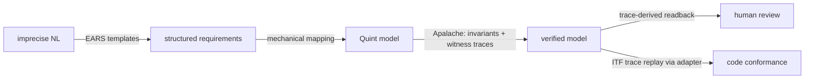

# Formal Specification Methodology

Transform imprecise requirements into verified formal specifications using Quint and Apalache, driven by AI agents. **One JSON file per area, one sidecar `.qnt` file per formal model, five commands total.** Git tracks changes; PRs gate approval; verification is continuous.

The chain from natural language to verified code is held by mechanisms, not by trust in the AI:



- **EARS** constrains each requirement to one of five sentence patterns, so "precise" is checkable (filled fields), not vibes.
- **Witness traces** prove every claimed behavior is actually reachable in the model — a verified-but-vacuous spec (invariants trivially true over an empty state space) cannot slip through.
- **Conformance replay** runs the model's own traces against the real code through a thin adapter — a requirement is *verified* only when its witness trace replays green.

> This document is part of a **template repository**. Projects are created by cloning the template, running `tools/bootstrap.sh` (strips template-only files), then running `/spec` to set up the project. Once bootstrapped, this `METHODOLOGY.md` lives at the root of your project as the canonical reference.

### Two tiers — the precision core stands alone

Most of the value in "vague → bulletproof" lands **before** the model checker. The framework is layered so you can stop at the first tier:

| Tier | What it gives | Tools needed | Commands |
|---|---|---|---|
| **1 — Precision core** | EARS-structured requirements (the 4 capture-time checks kill vagueness), state-machine + matrix completeness, the deterministic human-review **readback**, and `spec-lint` gating it all. | Python 3 only — **no Java/Apalache/Quint** | `/spec`, `/spec-readback`, `spec-lint` |
| **2 — Formal proof** | Quint model, Apalache invariants (bounded or inductive), machine-found witness traces, and conformance replay against code. | + Java 17, Quint, Apalache | `/spec-check`, `/spec-apply`, `/spec-verify` |

Tier 1 is a complete, useful workflow on its own: a team can distill requirements and ship the readback for review in minutes, with zero JVM on-ramp. Tier 2 is opt-in depth for the areas that earn it — the formal machinery proves *internal consistency, reachability, and code-conformance*, but it does **not** invent or correct intent. **The trust boundary is at elicitation** (NL → EARS fields): that step is human + AI judgment, backstopped mechanically by `spec-lint` (a functional requirement with no writable witness predicate FAILs past draft — see "EARS"), the matrix completeness gate, and the optional red-team. Everything downstream of a captured EARS field is mechanized; nothing upstream of it is. Know which tier a claim comes from.

---

## Core Concepts

A **spec area** is a JSON file at `specs/<name>.area.json` (or `specs/<name>.contract.json`) plus an optional sidecar `specs/<name>.qnt` holding the Quint formal model. The filename suffix encodes the `kind` and must match it (`spec-lint` enforces this). Two kinds of area, one schema:

- `kind: "area"` — functional area with code (login, billing, search). May declare **UI blocks** (`screens[]`, `ui_components[]`, `navigation[]`) to model an interactive surface — the sidecar then models navigation as a Quint state machine, and UI-specific lint, readback, and codegen activate on block presence.
- `kind: "contract"` — cross-area invariant carrier (no code; `spans: ["auth", "billing"]`); the sidecar imports the spanned areas' Quint modules and asserts joint invariants.

A **project** is `.spec/project.json` (areas index, code repo paths, architecture defaults, topology) plus per-area JSON files. Per-developer code-repo paths go in `.spec/local.json` (gitignored).

The pipeline runs: **elicit → vocab → structure → formalize → check → verify → apply**, but it's not a ceremony — each phase is a section of the area JSON that grows conversationally via `/spec`. There are no propose/approve/sync commands; git tracks change, PR review is approval, `/spec-verify` is the continuous gate.

---

## Quick Start

```bash
# Clone, bootstrap, set up the project
git clone <this-template-url> my-project
cd my-project
./tools/bootstrap.sh                 # strips template metadata

# Start in Claude Code
/spec                                # adaptive: detects state, walks setup
# (creates .spec/project.json, opens the first change, scaffolds the areas)
```

For an **existing codebase** (brownfield): the same `/spec auth` recognizes that no `specs/auth.area.json` exists but `src/auth/` has code, and walks extraction. No special command, no separate path.

---

## The Five Commands

| Command | What it does |
|---|---|
| `/spec [target]` | Adaptive entry point. Detects state (greenfield, brownfield, existing, drift) and walks the relevant phase conversationally: EARS elicitation, vocabulary, structure, formalize (incl. witness predicates), extract (brownfield), reconcile (drift), edit catalogs, manage project config. Writes `specs/<target>.*.json` and its sidecar `.qnt`. |
| `/spec-check [target]` | Runs Apalache on the area's sidecar `.qnt` (invariants), discharges witness obligations (per-REQ path-constrained witness traces via a generated `*.probes.qnt` module), then the state×event matrix pass (red-team only with `--reality`). Writes `check_results` and `witness` blocks back into the area JSON; saves ITF traces under `specs/<area>/traces/`. Cascades: on an area target, also checks every contract whose `spans` includes it. |
| `/spec-verify [target]` | Replays the witness traces against real code through the conformance adapter (a REQ is *verified* only when its trace replays green), runs the area's `test_command`, validates the `traceability[]` table maps to real code/test locations, detects drift (spec-traced files changed outside `/spec-apply`). Appends to `verification_log[]`. |
| `/spec-apply [target]` | Generates code from the architecture + formal model into the configured paths, plus the conformance adapter and trace-replay harness. Per-component when Layer 1 is declared. Writes `traceability[]` and `conformance`. Refuses on contract targets. |
| `/spec-readback [target]` | Runs `tools/spec-readback.py` — the readback is **generated by a tool, not authored by the agent**, so it cannot diverge from what the checker verified and identical input yields byte-identical output (`git diff` of the readback IS the review). Requirements render as journey slices (`specs/journeys/` — flows in temporal order) with EARS sentences (constraint values resolved inline), witness one-liners, and collapsed verbatim Quint + predicate + trace diagram with `file:line` and model-sha pins. Writes `specs/<target>.readback.md` per area, `specs/changes/<slug>.readback.md` per change, `.spec/readback.md` for the project. |

`[target]` is the area name (`auth`, `billing`, `auth-ui`, `user-permission`). Optional on every command — defaults to whatever's inferable from context or asks the user. There is no branch convention; use git however your team uses git.

---

## Repo Layout

```
<your-project>/
├── README.md
├── METHODOLOGY.md
├── .spec/
│   ├── project.json              ← project meta, areas index, repos, architecture defaults, topology
│   ├── local.json                ← per-dev code-repo paths + active change (gitignored)
│   ├── readback.md               ← /spec-readback _project generates the project overview here
│   ├── patterns/                 ← optional Layer 2 catalog (JSON files)
│   │   └── outbox.json
│   └── protocols/                ← optional Layer 5 catalog (JSON files)
│       └── api-envelope.json
├── specs/
│   ├── auth.area.json            ← one file per area (suffix = kind)
│   ├── auth.qnt                  ←   sidecar: the Quint formal model
│   ├── auth.probes.qnt           ←   generated witness/coverage probes (/spec-check)
│   ├── auth-ui.area.json         ← interactive surface: an area with screens[] + navigation[]
│   ├── auth-ui.qnt
│   ├── billing.area.json
│   ├── billing.qnt
│   ├── user-permission.contract.json ← contract: kind=contract, spans=[auth, billing]
│   ├── user-permission.qnt       ←   imports auth.qnt and billing.qnt
│   ├── auth.readback.md          ← /spec-readback generates this — Markdown + Mermaid
│   ├── auth-ui.readback.md
│   ├── billing.readback.md
│   ├── changes/                  ← change manifests: the unit of work (travels with the PR)
│   │   ├── billing-sso.change.json
│   │   └── billing-sso.readback.md   ← /spec-readback change generates the PR review surface
│   ├── journeys/                 ← use cases: qualified <area>.<ID> steps in temporal order
│   │   └── signup-and-buy.journey.json
│   ├── auth/                     ← OPTIONAL sidecar dir per area
│   │   ├── traces/               ←   ITF witness traces, one per REQ (committed)
│   │   │   └── REQ-003.itf.json
│   │   ├── gen/                  ←   regenerable artifacts (GITIGNORED):
│   │   │   ├── matrix.csv        ←     state×event matrix VIEW (decisions live in
│   │   │   │                            the area JSON's committed matrix_triage[])
│   │   │   ├── matrix-orphans.txt
│   │   │   └── redteam-backlog.md
│   │   └── components/           ←   per-component JSON if Layer 1 split into files
│   │       ├── api.json
│   │       └── worker.json
│   └── ...
├── schemas/
│   ├── area.schema.json
│   ├── change.schema.json
│   ├── journey.schema.json
│   ├── project.schema.json
│   ├── pattern.schema.json
│   └── protocol.schema.json
├── templates/
│   ├── spec.qnt.template         ← sidecar structure convention
│   └── probes.qnt.template       ← ghost instrumentation + witness probes
├── .github/workflows/
│   └── spec-ci.yml               ← lint → matrix --strict → quint typecheck → quint test
│                                    (Apalache + conformance replay are agent-driven, not CI)
└── tools/
    ├── spec-lint.py              ← consistency checker (incl. EARS + witness obligations)
    ├── spec-record.py            ← deterministic check+verify runner: quint verify, probes,
    │                                conformance replay, drift; writes all ledgers
    ├── spec-readback.py          ← deterministic readback generator (area/change/project)
    │                                + derived phase grid (`status <slug> --json`)
    ├── spec-matrix.py            ← state×event coverage matrix (--strict = CI gate;
    │                                --record stamps stats into check_results.matrix)
    ├── quint_ir.py               ← typed view of .qnt files (Quint IR, regex fallback)
    ├── itf_tools.py              ← ITF trace validate / summarize / Mermaid / status / sha
    └── bootstrap.sh              ← self-removes after first run
```

**All spec concerns collapse into one JSON per area** (plus the Quint sidecar). No per-concern files, no per-change folders (a change is one manifest file), no submodules. Change manifests and journeys are single overlay files under `specs/changes/` and `specs/journeys/` — references only, never spec content.

---

## Anatomy of a Spec Area

Required fields: `kind`, `area`, `version`. Everything else is optional and grows conversationally. A complete area looks like:

```json
{
  "$schema": "../schemas/area.schema.json",
  "kind": "area",
  "area": "auth",
  "version": "1.0.0",
  "status": "approved",
  "last_modified": "2026-05-14T10:00:00Z",

  "purpose": "Authenticates users; manages sessions; locks accounts after failed attempts.",

  "concepts": {
    "entities": [{ "name": "Session", "states": ["Active", "Expired", "LoggedOut"] }],
    "actors":   ["User", "System"],
    "verbs":    ["login", "logout", "expireSession", "lockAccount"]
  },

  "requirements": [
    {
      "id": "REQ-001",
      "description": "When a registered user submits valid credentials, the system shall create an Active session.",
      "status": "verified",
      "quint_ref": "login",
      "ears": { "trigger": "a registered user submits valid credentials", "response": "create an Active session" },
      "witness": { "predicate": "sessions.keys().exists(s => sessions.get(s) == Active)", "trace": "auth/traces/REQ-001.itf.json", "status": "witnessed", "checked_at": "2026-05-14T10:00:00Z" }
    }
  ],
  "invariants": [
    { "id": "INV-001", "description": "At most one Active session per user.", "quint_name": "singleSession", "formal_status": "verified", "criticality": "critical" }
  ],
  "constraints": [
    { "id": "CON-001", "name": "MAX_FAILED_ATTEMPTS", "value": 5 }
  ],
  "decisions": [
    { "id": "DEC-001", "kind": "architecture", "title": "JWT over session cookies", "decision": "Use RS256-signed JWTs for session tokens.", "rationale": "...", "alternatives_considered": [...], "status": "accepted" }
  ],

  "architecture": {
    "inherits_project": true,
    "stack":  { "language": "TypeScript", "framework": "Express", "test_framework": "Vitest" },
    "persistence": { "kind": "sql", "engine": "postgres", "client": "Prisma" },
    "patterns":  ["repository-pattern"],
    "protocols": ["api-envelope"],
    "components": [
      { "name": "api",    "role": "transport", "implements": ["login", "logout"] },
      { "name": "worker", "role": "async",     "implements": ["expireSession"] }
    ],
    "module_layout": {
      "service": "src/auth/authService.ts",
      "store":   "src/auth/authStore.ts",
      "tests":   "tests/auth/"
    }
  },

  "formal_model": {
    "quint_file":  "auth.qnt",
    "probes_file": "auth.probes.qnt"
  },

  "traceability": [
    { "id": "REQ-001", "quint": "action login",      "component": "api",    "code": "authService.ts:login",         "tests": ["authService.test.ts:loginSuccess"], "verified": true },
    { "id": "INV-001", "quint": "val singleSession", "component": "api",    "code": "authService.ts:login (guard)", "tests": ["invariants.test.ts:singleSession"], "verified": true }
  ],

  "open_questions": [
    { "id": "Q-001", "question": "Service accounts?", "status": "resolved", "resolution": "Out of scope." }
  ],

  "verification_log": [
    { "date": "2026-05-14T10:00:00Z", "spec_sha": "abc1234", "code_sha": "def5678", "status": "pass", "drift_detected": false, "summary": "4 scenarios, 0 failures" }
  ]
}
```

Sidecar `specs/auth.qnt` holds the actual Quint:

```quint
module auth {
  type AccountStatus = Unlocked | Locked
  type SessionStatus = Active | Expired | LoggedOut

  var sessions: SessionId -> (UserId, SessionStatus)
  var accounts: UserId -> AccountStatus

  action login(u: UserId, s: SessionId) = all { ... }
  val singleSession: bool = ...
  val noLockedSession: bool = ...

  run happyPath = init.then(login("alice", "s1")).then(logout("alice", "s1"))
}
```

---

## The Two Kinds of Area

### `kind: "area"` — functional area

Has code; the standard shape above. `architecture`, `traceability`, `verification_log` are all meaningful. `/spec-apply` generates code; `/spec-verify` runs tests. (Quint `run` scenarios live in the sidecar only — `quint_ir` discovers them; `traceability[]` maps them to tests.)

### `kind: "contract"` — cross-area agreement

Spec-only. Required: `spans: ["auth", "billing"]`. The sidecar imports the spanned areas:

```quint
module userPermissionContract {
  import auth.* from "./auth.qnt"
  import billing.* from "./billing.qnt"

  val noOrphanAccounts: bool =
    billing::accounts.keys().forall(uid => auth::users.keys().contains(uid))
}
```

`/spec-check` cascades automatically — running it on `auth` also checks every contract whose `spans` includes `auth`. A contract failure means an area change broke a joint invariant; either fix the area or evolve the contract (it's another spec change).

`/spec-apply` and `/spec-verify` refuse on contract targets (no code).

### UI blocks — interactive surfaces

An interactive surface is an ordinary `kind: "area"` that declares `screens[]`, `ui_components[]`, `navigation[]` — formally it is not a different object: the sidecar models navigation as a Quint state machine (`screens` become a variant type, `navigation` entries become actions, auth-required-style invariants are model-checked), exactly as any entity state machine. Everything UI-specific triggers on block presence:

- `spec-lint`: navigation endpoints reference declared screens, isolated screens flagged, screens without navigation FAIL;
- `/spec-readback`: Navigation graph + Screens table replace the State Machines section;
- `/spec-apply`: generates UI components (the `module_layout` is configured for component files).

Such areas typically have `spans: ["auth"]` when they depend on another area's state (e.g., authentication status); requirement IDs may use `UI-NNN`.

---

## EARS: How Imprecise Becomes Precise

Free-text requirements can't be checked for completeness — there's no defined notion of what's missing. So requirements past the `raw` stage are stored as **EARS** (Easy Approach to Requirements Syntax) structures: named fields, from which the classic EARS sentence is rendered. The fields are the source of truth; `description` is derived. There is no stored `pattern` value — **the pattern is a function of which fields are filled**, so pattern↔field contradictions are unrepresentable:

| Fields filled | Rendered sentence (EARS pattern) | Maps to Quint |
|---|---|---|
| `trigger` | When `<trigger>`, the system shall `<response>` (event-driven) | action + effect |
| `state` | While `<state>`, the system shall `<response>` (state-driven) | `require` guard + effect |
| `state` + `trigger` | While `<state>`, when `<trigger>`, … (complex) | guard + action |
| `trigger` + `unwanted: true` | If `<trigger>`, then the system shall `<response>` (unwanted behavior) | error/rejection action |
| `state` + `trigger` + `unwanted: true` | While `<state>`, if `<trigger>`, then the system shall `<response>` (unwanted, state-qualified) | guard + error/rejection action |
| `feature` | Where `<feature>`, the system shall `<response>` (optional) | conditional module |
| none | The system shall `<response>` (ubiquitous) | **an invariant — move it to `invariants[]`** |

`unwanted` is the one distinction not derivable from field presence: it marks error/abnormal-situation handling, the place most missed requirements live ("and if that goes wrong?").

Why this works as the precision mechanism:

- **The fields disambiguate.** "What triggers it? Only in some state? What exactly shall happen?" — exactly the questions free text leaves fuzzy.
- **NL→formal becomes template instantiation.** `trigger` → Quint action, `state` → `require` guard, `response` → effect. No creative translation step for the AI to get wrong.
- **Completeness is checkable.** Every `state`/`trigger` pair feeds the state×event matrix; every happy-path REQ prompts an unwanted counterpart.
- **Still plain English.** Stakeholders review the rendered sentence; no notation to learn.

`spec-lint` enforces the structural rules: `response` required; `unwanted` requires a `trigger`; no trigger/state/feature at all → WARN "that's an invariant, move it to `invariants[]`" (requirements are behaviors, each demonstrable by a witness trace; always-true statements are Apalache's job). Plus two precision lints:

- **Ambiguity** — untestable words in `response` ("gracefully", "appropriately", "as needed", "TBD", …) → WARN with "sharpen: what state results, visible where?". A response that can't name its resulting state can never get a witness predicate.
- **State binding** — `ears.state` that names no declared entity state ("the user is logged in" instead of "the Session is Active") → WARN. Phrasing preconditions with declared state names is what makes the requirement↔state-machine link checkable and matrix triage mechanical.

**Non-functional requirements** ("fast", "secure", "scalable") get no witness obligation — there's no reachable state change to demonstrate. Their precision mechanism is the **fit criterion**: `fit_criterion: { metric, target, measurement }`, all three required. `spec-lint` FAILs an NFR without one past raw status; the readback renders it in place of the witness line.

**Contradictory requirements need no special detector** — they surface mechanically: two requirements whose guards conflict make at least one of them unsatisfiable, and the unsatisfiable one comes back `no-witness` from `/spec-check`. Vacuity detection and conflict detection are the same machinery.

---

## Witness Obligations: Proof the Spec Isn't Vacuous

A model where every invariant verifies can still be garbage. One typo'd guard (`require(isLocked(u))` instead of `not(isLocked(u))`) can make `login` unreachable — then *no session ever exists* and "at most one active session per user" is **vacuously true** over an empty state space. Apalache reports all green; the spec is dead text.

The fix: invert the model checker. To prove behavior X is *reachable*, assert "X never happens" as an invariant — the checker's counterexample is a step-by-step trace **where X happens**: the **witness trace**.

Two refinements make the witness actually mean what the requirement says:

- **Path constraint.** The probe negates `predicate AND _lastAction == <quint_ref>` — the trace must reach the postcondition *via the requirement's own action*. Without this, a trace that locks the account through some unrelated mechanism would "witness" the lockout requirement.
- **Freshness pin.** The witness records `model_sha` (sha256 of `.qnt` + `.probes.qnt`, via `tools/itf_tools.py sha <area>`). If the model changes, the stamp no longer matches and `spec-lint`/`itf_tools status` FAIL the witness — a trace found against last month's model proves nothing about today's.

Each requirement carries a `witness` block:

```json
"witness": {
  "predicate": "accountStatus.keys().exists(u => accountStatus.get(u) == Locked)",
  "trace": "auth/traces/REQ-003.itf.json",
  "status": "witnessed",
  "checked_at": "2026-05-15T12:00:00Z",
  "model_sha": "ce84c1a2…"
}
```

`/spec-check` generates `specs/<area>.probes.qnt`: ghost vars (`_lastAction` plus param ghosts like `_lastUid` — underscore-prefixed so they can never collide with real model vars; the replay harness reads call arguments from these), `initP`/`stepP` wrappers, and the path-constrained witness probes. The runs themselves — and **all result bookkeeping** — are done by `tools/spec-record.py check <area>`: it executes every invariant check and witness probe, saves violation traces in ITF format under `specs/<area>/traces/`, and writes `check_results`, `formal_status`, and the `witness` blocks mechanically. The agent never hand-edits a verification verdict; mechanism-over-trust applies to the ledger too. Per-area obligations:

| Obligation | Mechanism | Failure means |
|---|---|---|
| Every INV holds | Apalache invariant check | counterexample — behavior violates a rule |
| Every REQ witnessed *via its own action* | path-constrained probe → counterexample = trace | `no-witness` — behavior unreachable as specified (vacuity) |
| Every witness fresh | `model_sha` stamp matches current model | stale trace — model changed since it was found |
| Every action fires somewhere | free: witnessed REQs prove their `quint_ref` fires; `spec-lint` flags unreferenced actions (`orphan-action`) | dead action — missing requirement or dead spec text |
| Every matrix cell triaged | `spec-matrix --strict` | silent state×event gap |

**Rejection requirements have no witness — by design.** "If the account is Locked, login shall be rejected" produces no state change; reachability probes can't demonstrate a non-event. The rule: encode the rejection as (or pair it with) the **invariant that stays true** (`noSessionWhileLocked`) and set `witness: { "status": "skipped", "justification": "rejection — enforced by INV-002" }`. Don't delete the requirement and don't force a meaningless predicate — the invariant carries the proof, the justification carries the trace back to it.

`spec-lint` enforces the bookkeeping, with no soft-pass paths: `status: approved` is blocked while any requirement is unwitnessed — including requirements whose witness block is empty or predicate-less (skipped-with-justification counts as discharged; skipped **without** justification is itself a FAIL). A recorded trace file that doesn't exist, is invalid ITF, whose `model_sha` is stale, **or that carries no `model_sha` at all** (freshness unverifiable) is a FAIL. If witnesses exist but the model files can't be hashed (probes file recorded but missing), every witness is suspect — FAIL.

Cost control: `spec-record` skips probes whose `model_sha` already matches (byte-identical model → existing trace still valid); `/spec-check` cascades only to contracts spanning changed areas.

One trace, three consumers:

1. **Reachability proof** — the requirement is demonstrably achievable in the model.
2. **Review artifact** — `/spec-readback` renders it as a Mermaid sequence diagram (via `tools/itf_tools.py mermaid`): stakeholders review a concrete machine-found example per requirement, not a prose paraphrase. Wrong-rule bugs (lockout at attempt 6 instead of 5) are visible at review, before code exists.
3. **Conformance test input** — see next section.

---

## Conformance: Code Verifiable Against Requirements, Mechanically

`/spec-check` proves the *model*; nothing about hand-written tests proves the *code matches the model* — an LLM writing both the spec and the tests that "verify" it is circular. The conformance step closes the loop with the model's own traces:

1. `/spec-apply` generates a **conformance adapter** (one method per Quint action calling the real API; one getter per Quint var returning the abstracted observable code state; a `reset()`) and a **replay harness**. It also generates **tampered self-test traces — one per observable Quint var** (`_selftest.tampered.<var>.itf.json`), each a copy of a witness trace with that var's final value deliberately corrupted; the harness must FAIL on every one. One tamper would only prove the harness catches divergence on the single var it flipped — a getter echoing expectations on a *different* var would slip through. A harness that passes any tampered trace has a broken adapter (getters echoing expectations, `reset()` not resetting) and all its green results are void.
2. `/spec-verify` replays every witness trace (refusing stale ones): drive the code step-by-step with the trace's actions and ghost-recorded parameters, after each step assert the code state equals the trace's model state under the adapter mapping.
3. **A requirement is `verified` if and only if its witness trace replays green against the implementation.**

Wire `conformance.command` into the **code repo's own CI** as well — the harness is an ordinary test file, so code changes that break model conformance fail on the code PR with no spec tooling installed.

Config lives in the area JSON:

```json
"conformance": {
  "adapter":    "src/auth/conformance/adapter.ts",
  "harness":    "tests/auth/conformance/replay.test.ts",
  "command":    "pnpm vitest run tests/auth/conformance",
  "traces_dir": "auth/traces"
}
```

The trust chain ends up: human approves EARS fields → mapping to Quint, reviewed via readback → Apalache produces traces (machine) → traces replay against code (machine, self-tested harness). The AI only does the two human-supervised steps; everything load-bearing is checked by a tool.

**Honest residual gaps** — two places remain human-reviewed rather than machine-checked, by construction: (1) whether the Quint action *semantically* matches its EARS fields (the readback shows them side by side to make that review a diff, not a hunt), and (2) whether the adapter's abstraction mapping is faithful (mitigated by the tampered-trace self-test, reviewed as ordinary code). Know where the trust boundary is; don't pretend it isn't there.

---

## State Machines and Completeness Validation

Stateful entities can have their state machine declared explicitly in `state_machines[]`. The Quint sidecar still encodes the behavioral semantics (Apalache verifies them), but the JSON gives `spec-lint` a structural picture it can validate in milliseconds — without needing to invoke the model checker.

```json
"state_machines": [
  {
    "entity": "Session",
    "quint_var":  "sessions",
    "quint_type": "SessionStatus",
    "initial_state": "Active",
    "states": [
      { "name": "Active",    "description": "Session is live." },
      { "name": "Expired",   "terminal": true, "description": "Timed out." },
      { "name": "LoggedOut", "terminal": true, "description": "User-initiated end." }
    ],
    "transitions": [
      { "from": "Active", "to": "Expired",   "trigger": "expire_session", "actor": "System", "quint_action": "expire_session" },
      { "from": "Active", "to": "LoggedOut", "trigger": "logout",         "actor": "User",   "quint_action": "logout"         }
    ]
  }
]
```

`from: "*"` means "any non-terminal state" — useful for sweeping admin transitions like "force-logout from any active state."

### What `spec-lint` checks (no Apalache needed)

| Severity | Check |
|---|---|
| FAIL | `initial_state` not in `states[]` |
| FAIL | A transition's `from` or `to` references an undeclared state |
| FAIL | A state marked `terminal: true` has an outgoing transition |
| FAIL | A transition's `quint_action` doesn't exist in the sidecar |
| WARN | A state is unreachable from `initial_state` (BFS over declared transitions) |
| WARN | A non-terminal state has no outgoing transitions (dangling — make it terminal or add a transition) |
| WARN | A sidecar action mutates `quint_var` but isn't listed as a transition (silent state change) |
| WARN | `entity` doesn't match any name in `concepts.entities[]` |

These run in `tools/spec-lint.py` against every area; structural errors get flagged before you ever invoke `/spec-check`.

### Apalache complements, doesn't replace

`spec-lint` catches **structural** issues (unreachable states, dangling states, JSON ↔ sidecar drift). `/spec-check` (Apalache) catches **behavioral** issues (invariant violations, liveness failures, counterexamples in reachable states). The two checks compose:

- `spec-lint` first — fast feedback during authoring; catches "you declared `Pending` but no transition produces it."
- `/spec-check` second — proves the invariants hold across all reachable states; finds the missing payment guard.

### UI areas: same idea, different fields

For areas with UI blocks, the navigation graph (`screens[]` + `navigation[]`) plays the same role. `spec-lint` enforces the parallel rules: every navigation endpoint references a declared screen, unreachable screens are flagged as isolated, auth-required screens are highlighted in the readback. The Quint sidecar still models the underlying state machine and Apalache verifies invariants like "Dashboard reachable only when authenticated."

### When to declare a state machine

Declare one whenever an entity has a `states[]` list in `concepts.entities[]` that you care enough about to spec formally. Don't declare one for trivial enum-typed fields with no transitions. Rule of thumb: if you'd draw the state machine on a whiteboard during design, write it down in `state_machines[]`.

---

## Architecture (Layers 0–6)

Architecture is **separate from behavior**. The spec says what the system does; architecture says how it's realized. Six layers compose by inheritance; each is optional.

| Layer | Captures | Where it lives | Required? |
|---|---|---|---|
| 0. Stack | Language, framework, persistence, patterns, layout | `architecture` section of area JSON; defaults in `.spec/project.json` | Recommended for any area with code |
| 1. Components | Per-area decomposition (api / worker / projection) | `architecture.components[]` in area JSON; optional `specs/<area>/components/<name>.json` for fuller per-component specs | When an area is internally complex |
| 2. Patterns | Reusable architectural patterns (Outbox, CQRS, Saga) | `.spec/patterns/<name>.json`; referenced from `architecture.patterns[]` | When a pattern recurs across areas |
| 3. ADRs | Architectural decisions with rationale and alternatives | `decisions[]` in area JSON with `kind: "architecture"` | Whenever a non-obvious choice is made |
| 4. Topology | Deployment units, components-to-units, network boundaries | `topology` in `.spec/project.json` | When there are 2+ deployment units |
| 5. Protocols | Named cross-boundary I/O conventions (envelopes, cursors, idempotency) | `.spec/protocols/<name>.json`; referenced from `architecture.protocols[]` | When conventions recur |
| 6. Readbacks | Human-readable Markdown review documents with embedded Mermaid (components, state-machine, navigation, topology, C4 context) — generated by `/spec-readback` | `specs/<area>.readback.md` per area; `.spec/readback.md` project-wide | For PR review and stakeholder review |

Resolution: for each architecture field, **per-component wins, then per-area, then project defaults**. `inherits_project: false` on an area makes that area standalone (rare — used for genuinely independent stacks).

Architecture changes are normal spec changes — edit the JSON, commit through your usual PR flow. The model checker (`/spec-check`) is unaffected by architecture changes because Quint doesn't care how the code is built.

---

## Multi-Repo: Config-Driven Paths

Spec and code can live in the same repo (single-repo) or in separate repos (multi-repo). No git submodules. Instead, `.spec/project.json` declares the logical repo names and the per-area mapping; each developer puts their local checkout paths in `.spec/local.json` (gitignored).

```json
// .spec/project.json
{
  "repos": {
    "service-api":      { "url": "git@github.com:org/service-api.git",      "default_branch": "main" },
    "service-pipeline": { "url": "git@github.com:org/service-pipeline.git", "default_branch": "main" }
  },
  "areas": [
    { "name": "auth",      "kind": "area", "code_repo": "service-api",      "code_path": "src/auth/",      "tests_path": "tests/auth/",      "test_command": "pnpm test auth" },
    { "name": "analytics", "kind": "area", "code_repo": "service-pipeline", "code_path": "pipelines/analytics/", "tests_path": "tests/analytics/", "test_command": "pytest tests/analytics/" }
  ]
}
```

```json
// .spec/local.json (gitignored)
{
  "repo_paths": {
    "service-api":      "/Users/alice/work/service-api",
    "service-pipeline": "/Users/alice/work/service-pipeline"
  },
  "last_change": "billing-sso"
}
```

`last_change` is the **active change** — see "Unit of Work: Changes" below. Per-developer state, which is why it lives in the gitignored `local.json` rather than `project.json`.

When `/spec-apply auth` runs, it resolves `repo_paths.service-api + areas[auth].code_path` → `/Users/alice/work/service-api/src/auth/` and generates code there. `/spec-verify auth` `cd`s into the repo and runs `test_command`.

Audit trail (which code SHA was verified against which spec): recorded in `verification_log[]` of the area JSON, not in git plumbing. Reproducible enough for most teams; teams that need git-level SHA pinning can opt into submodules separately, but they're not built into the methodology.

A **spec-only** project has no `repos` block. `/spec-apply` and `/spec-verify` aren't used; the spec is the deliverable (useful for protocols, formal-methods exercises, cross-team contracts).

---

## Unit of Work: Changes

**The change is the unit of work; the area is the unit of meaning.** Areas and contracts carve the domain into logical spec boundaries, but real work — "billing accounts authenticate via SSO sessions" — routinely cuts across several of them. A **change manifest** at `specs/changes/<slug>.change.json` (schema: `schemas/change.schema.json`) makes that unit first-class:

```json
// specs/changes/billing-sso.change.json
{
  "change": "billing-sso",
  "intent": "Billing accounts authenticate via SSO sessions",
  "status": "in-progress",
  "targets": [
    { "name": "auth",            "kind": "area",     "ids": ["REQ-012", "INV-004"] },
    { "name": "billing",         "kind": "area",     "ids": ["REQ-031"] },
    { "name": "user-permission", "kind": "contract", "auto": true, "ids": ["INV-CONTRACT-002"] }
  ]
}
```

The manifest is an **overlay, not a container**: it holds membership only — which targets, which IDs. The spec content stays in the area JSONs, which remain the single source of truth. Per-target phase status (checked / applied / verified) is **never stored** — it is derived from the area JSONs each time it's displayed, so it cannot go stale: *checked* = `check_results.ran_at` ≥ `last_modified` and every witness `model_sha` matches the current model; *applied* = the target's REQ/INV ids have `traceability[]` entries; *verified* = the latest `verification_log[]` entry passes and post-dates the spec. Delete every manifest and the specs are still complete — there is no drift surface, including the flags.

How it drives the commands:

- The **active change** is per-dev sticky state (`last_change` in `.spec/local.json`). `/spec change <slug>` opens or switches; every spec edit happens inside a change — project bootstrap ends by opening the first change (default `initial-spec`, targets = the declared areas), and starting an area edit with no active change auto-opens one (one prompt, Enter accepts the default name). A single-area tweak is just the degenerate case: a change with one target.
- Bare `/spec` shows the **change dashboard**: per-target phase grid (spec / checked / applied / verified, all computed) plus the suggested next step.
- Bare `/spec-check` checks **all** targets of the change, with the contract cascade deduplicated across the set — each contract runs once even when several of its spanned areas moved. Contracts spanning a touched area join `targets[]` automatically (`auto: true`).
- Bare `/spec-apply` / `/spec-verify` run every code-bearing target; contracts are skipped (spec-only).
- Bare `/spec-readback` regenerates the touched targets' readbacks plus a **change readback** (`specs/changes/<slug>.readback.md`) — intent, target table, the change's IDs rendered as EARS sentences. That one document is the PR review surface for a spanning change.
- Explicit targets always work as a one-off escape hatch and never alter the active change.

Lifecycle is git-shaped, no extra ceremony: slug ↔ suggested branch `change/<slug>`, commits scoped `spec(<slug>): …`, the manifest travels with the PR, and `status: "landed"` on merge turns it into a changelog entry. `landed`/`abandoned` clears the active change.

`spec-lint` validates manifests on every run (full or single-area): schema, slug↔filename, targets resolve to real specs, no dangling IDs, no stored phase flags (FAIL — status is derived, never stored). Landed/abandoned manifests are history and only need to parse — later changes may legitimately remove IDs they reference.

## Journeys: Use Cases in Temporal Order

A **journey** (`specs/journeys/<slug>.journey.json`, `schemas/journey.schema.json`) is the use-case mechanism: a named user-visible flow whose `steps[]` reference requirement IDs in qualified `<area>.<ID>` form, in the order the user experiences them. Most journeys live inside one area; some cross boundaries — same shape either way, so there is exactly one place flows live. Same overlay discipline as change manifests: references only, never content; delete every journey and the specs stay complete.

Captured for free during elicitation — one story walked with the user = one journey. Edited directly via `/spec _journeys/<name>`. A journey step with no matching REQ is an elicitation gap: capture the requirement in its owning area first.

Readbacks are where journeys pay off: the per-area "What the System Does" groups requirements as **journey slices** (this area's steps in flow order, foreign steps as one-line connectors), and the project-wide readback renders each journey as a step table with status marks and links — review reads as flows a human walks, not ID-sorted lists.

Journeys carry no formal verification obligation (v1 is a documentation/review layer); a joint-reachability witness across modules is a natural later extension. `spec-lint` validates them: unique names, every ref resolves, no duplicate steps.

---

## Pipeline (Conversational, Not Ceremonial)

The pipeline phases still exist conceptually. They're now **named beats inside `/spec` chat**, not separate commands:

```
elicit       — "what does this need to do?" — captured as EARS patterns (trigger/state/response)
vocabulary   — "what entities, actors, verbs?"
structure    — assign IDs (REQ-NNN, INV-NNN, ...), categorize, detect conflicts
formalize    — design the Quint module, write the sidecar, draft witness predicates
readback     — review document derived from the JSON + witness traces, presented for human review
check        — /spec-check runs Apalache + witness probes; counterexamples and no-witness
               results become Q-NNN open questions; traces saved to specs/<area>/traces/
verify       — /spec-verify replays witness traces against code (conformance) + runs tests,
               records to verification_log
apply        — /spec-apply generates/updates code + the conformance adapter/harness
```

Brownfield, drift codification, and contract authoring are not separate flows — `/spec` recognizes the state of `specs/<target>.*.json` (or its absence) and routes to the right beat.

You never have to remember which phase you're in. `/spec auth` always works — it figures out what's missing and asks.

---

## Git Conventions (Minimal)

The methodology doesn't dictate a branch model. Use whatever your team uses. Suggested conventions only:

- **Spec changes live in PRs** alongside code changes — reviewers see both diffs together.
- **Tag spec versions if you want auditability**: `git tag specs/auth/v1.0.0` whenever you bump `area.version` for an important milestone. Optional; nothing requires it.
- **Wire `conformance.command` into the code repo's own CI** — the replay harness is an ordinary test file, so model-conformance breakage fails code PRs with no spec tooling installed. Full `/spec-verify` runs (traceability, drift, log) are agent-driven: run before merge or on a schedule; spec-ci.yml deliberately carries only the cheap deterministic gates (lint, matrix, typecheck, quint test).
- **Branches are optional.** Work on main if your team works on main; work on branches if your team branches. The methodology doesn't care.

---

## Reference

### ID Prefixes

| Prefix | Meaning | Used in |
|---|---|---|
| `REQ-NNN` | Functional requirement | `requirements[]` |
| `UI-NNN` | UI behavior requirement | `requirements[]` in areas with UI blocks |
| `INV-NNN` | Safety invariant | `invariants[]` |
| `PROP-NNN` | Liveness property | `properties[]` |
| `CON-NNN` | Constraint / bound | `constraints[]` |
| `DEC-NNN` | Decision / ADR | `decisions[]` |
| `Q-NNN` | Open question | `open_questions[]` |
| `*-CONTRACT-NNN` | Contract-scoped variant | When `kind: contract` |

### Lifecycle Statuses

```
requirement.status:   raw → needs-validation → specified → verified
                                → deferred (removed)
                      ("verified" = witness trace replays green against code)
requirement.witness.status: not-run → witnessed | no-witness | skipped
invariant.formal_status: specified | not-run → verified            (bounded ✓ — valid to max_steps only)
                                  → verified-inductive   (proven over ALL reachable states; proof: inductive)
                                  → counterexample-found
                                  → accepted-risk
area.status:          raw → structured → formalized → in-review → approved
                      (approval blocked while any requirement is unwitnessed)
```

**`verified` is bounded, not proven.** Apalache by default checks invariants by bounded model checking to `apalache.max_steps` (default 10) — `formal_status: "verified"` means *no counterexample within N steps*, not a proof. The readback renders it honestly as `✓ (≤N steps)`, never a bare `✓`. To get an unbounded proof, mark the invariant `proof: "inductive"`: `spec-record` then runs `quint verify --inductive-invariant=<quint_name>` (base case + one-step preservation), and a pass becomes `verified-inductive`, rendered `✓ proven`. Inductive invariants must be constrained enough (each state var pinned to its domain) or quint reports an error — an honest non-proof, not a false green.

### What Apalache Verifies

| Property | Verified? |
|---|---|
| Safety invariant violations | **Bounded by default** (no counterexample to `max_steps`, rendered `✓ (≤N steps)`); **proven** only for invariants marked `proof: inductive` (rendered `✓ proven`). A bounded ✓ is not a proof — a violation at depth N+1 still ships green. Upgrade load-bearing invariants to inductive. |
| Behavior reachability (witnesses) | Yes (negated-predicate probes; counterexample = witness trace) |
| Liveness (eventually X) | **Bounded only.** Temporal checking frequently times out on real models; a PROP result is honest only with its bound stated. Prefer demoting liveness to a witnessed scenario (`run` demonstrating the eventuality once) plus a fairness note. |
| Action vacuity (dead actions) | Free: path-constrained witnesses prove referenced actions fire; `spec-lint` flags unreferenced ones statically |
| Unreachable declared states | No (vacuously satisfied; caught by `spec-lint` structurally) |
| Actor-permission completeness | No (caught by `spec-lint`) |
| Numeric threshold correctness | Yes (as guards in actions) |
| Code matches the model | No — that's `/spec-verify` conformance replay |

### spec-lint

`tools/spec-lint.py` checks each area for: missing required fields, ID format violations, broken cross-references (`auth.REQ-001` pointing at nonexistent IDs), EARS structure (pattern-required fields; WARN on unstructured requirements past `raw`; ambiguous-wording WARN on untestable responses; state-binding WARN when `ears.state` names no declared entity state), fit criteria (non-functional REQ without `fit_criterion` → FAIL past raw), witness obligations (no `witness.predicate` → WARN; recorded trace file missing/invalid → FAIL; stale or missing `model_sha` on a witnessed trace → FAIL; unjustified `skipped` → FAIL; `approved` with any unwitnessed requirement → FAIL; `no-witness` result → FAIL), unresolved open questions blocking approval, unverified critical invariants, components declared but not implemented, referenced patterns/protocols that don't exist, topology orphans, change manifests and journeys (validated on every invocation, including single-area runs), drift between architecture and `traceability[]`. When the `jsonschema` lib is missing, lint says so (WARN) instead of silently skipping schema validation. Runs as a pre-commit hook on changes under `specs/` and `.spec/`.

### spec-record

`tools/spec-record.py` is the deterministic ledger for both machine-checked phases — **no verification verdict in the area JSON is ever hand-edited**:

- `check <area>` — runs `quint verify` for every invariant, property, and witness probe, parses outcomes, saves ITF traces, and writes `check_results`, `formal_status`, and the `witness` blocks mechanically — with skip-if-fresh (`model_sha` match + valid trace → probe not re-run) and `--only` runs merging into the prior ledger rather than replacing it.
- `verify <area>` — witness preflight (refuses replay on any undischarged obligation), runs `conformance.command` and `test_command` from the code repo root, computes drift mechanically (failing run ∧ traced files changed since the last entry's `code_sha`), appends the `verification_log` entry with `git rev-parse` shas, and flips `requirements[].status: "verified"` / `traceability[].verified` only on a green replay. Log capped at the newest 50 entries, deterministically.

The agent's role in both phases is judgment only: predicates, probe-module generation, counterexample explanations (`nl_explanation` is the one field it writes in `check_results`), matrix triage, red-team, and the completeness/correctness/coherence reads of the code in `/spec-verify`.

### spec-readback

`tools/spec-readback.py` renders the readbacks deterministically — the document humans trust is produced by code, not by an agent following a style guide. `area <name>` / `change [slug]` / `project` / `all` emit the Markdown files; `status <slug> --json` emits the derived phase grid that drives the `/spec` change dashboard (the single implementation of the spec/checked/applied/verified rules). Highlights baked into the renderer: constraint values resolved inline in EARS sentences, witness one-liners with compressed action runs, verbatim Quint excerpts pinned by `file:line` + short model sha, `(failure path)` tags from `ears.unwanted`, fit criteria for NFRs, the Limits-and-Bounds table with per-constraint history from landed change manifests, and resolved questions in the Reference section.

Sidecar parsing goes through `tools/quint_ir.py`: the Quint compiler's typed JSON IR when the `quint` CLI is installed, a regex fallback otherwise — so lint never disagrees with the compiler about what's in the model when the CLI is present.

---

## Quint Sidecar Convention

Each area's formal model lives in `specs/<area>.qnt`. Why a sidecar instead of inline string in JSON?

- Editor support: any Quint-aware editor works on a `.qnt` file directly. JSON-embedded multi-line strings are painful to edit.
- Tool compatibility: `quint`, `apalache`, and IDE extensions all read `.qnt` files natively.
- Diffs: PR reviewers see actual Quint syntax highlighting, not escaped string changes.

`tools/quint_ir.py` is the single parser for sidecars: the Quint compiler's typed JSON IR when the CLI is installed, a regex fallback otherwise. Used by `/spec-check` (validate before Apalache), `spec-lint` (JSON ↔ sidecar consistency), and `spec-matrix` (action discovery).

The area JSON references the sidecar via `formal_model.quint_file` (typically just `<area>.qnt`). The two files travel together; renaming or moving requires updating both.
