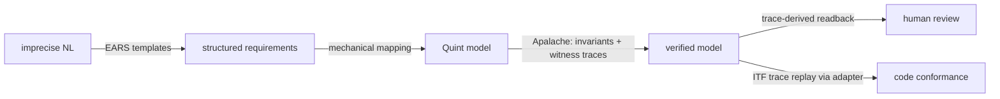

# Formal Specification Methodology

Transform imprecise requirements into verified formal specifications using Quint and Apalache, driven by AI agents. **One JSON file per area, one sidecar `.qnt` file per formal model, five commands total.** Git tracks changes; PRs gate approval; verification is continuous.

The chain from natural language to verified code is held by mechanisms, not by trust in the AI:


```mermaid
flowchart LR
    NL[imprecise NL] -->|EARS templates| REQ[structured requirements]
    REQ -->|mechanical mapping| QNT[Quint model]
    QNT -->|Apalache: invariants + witness traces| OK[verified model]
    OK -->|trace-derived readback| HUMAN[human review]
    OK -->|ITF trace replay via adapter| CODE[code conformance]
```

- **EARS** constrains each requirement to one of five sentence patterns, so "precise" is checkable (filled fields), not vibes.
- **Witness traces** prove every claimed behavior is actually reachable in the model — a verified-but-vacuous spec (invariants trivially true over an empty state space) cannot slip through.
- **Conformance replay** runs the model's own traces against the real code through a thin adapter — a requirement is *verified* only when its witness trace replays green.

### The arrows are dependencies, not a schedule

Read the diagram as *what rests on what*, never as an order you march through. The phases — **elicit → vocab → structure → formalize → check → generate → verify** — are **sections of one JSON file**, not stages of a process. A section exists or it doesn't; nothing is "in" a phase, so there is no phase to be blocked in.

**Do any part, in any order, at any time.** Formalize one requirement while nine others are still a sentence someone dictated. Run `/spec-check` on a model that covers a third of the area. Extract from code first and elicit afterwards. Jump back and sharpen a requirement you already verified — that just un-derives its witness, which the next check re-proves. `/spec` reads the state of the area and picks up wherever you actually are, which is why it is one adaptive command instead of seven phase commands.

Nothing gates entry to the next step, because there is no next step — only work that has enough inputs to be worth doing yet. The chain in the diagram tells you what those inputs are: you cannot witness a behavior before there is a model to find the trace in. That is a fact about the work, not a ceremony imposed on it.

And there is no workflow machinery on top: no propose, approve, or sync commands, no state field advanced by hand. **Git tracks the change, PR review is the approval, `/spec-code-verify` is the continuous gate.** An area is as good as what it currently proves — readable at any moment in the readback, whatever fraction is done.

> This document is part of a **template repository**. Projects are created by cloning the template, running `tools/bootstrap.sh` (strips template-only files), then running `/spec` to set up the project. Once bootstrapped, this `METHODOLOGY.md` lives at the root of your project as the canonical reference.

### Two tiers — the precision core stands alone

Most of the value in "vague → bulletproof" lands **before** the model checker. The framework is layered so you can stop at the first tier:

| Tier | What it gives | Tools needed | Commands |
|---|---|---|---|
| **1 — Precision core** | EARS-structured requirements (the 4 capture-time checks kill vagueness), a declared **scope** to be complete relative to, state×event **and** external×outcome completeness, closed-world entities, modality (must/may/forbidden), first-class assumptions, the deterministic human-review **readback**, the semantic **diff**, and `spec-lint` gating it all. | Python 3 only — **no Java/Apalache/Quint** | `/spec`, `/spec-readback` |
| **2 — Formal proof** | Quint model, Apalache invariants (bounded or inductive), machine-found witness traces, and conformance replay against code. Optional extra backends for other question classes: Alloy for structure, z3 for arithmetic. | + Java 17, Quint, Apalache (+ Alloy / z3 if used) | `/spec-check`, `/spec-code-generate`, `/spec-code-verify` |

Tier 1 is a complete, useful workflow on its own: a team can distill requirements and ship the readback for review in minutes, with zero JVM on-ramp. Tier 2 is opt-in depth for the areas that earn it — the formal machinery proves *internal consistency, reachability, and code-conformance*, but it does **not** invent or correct intent. **The trust boundary is at elicitation** (NL → EARS fields): that step is human + AI judgment, backstopped mechanically by `spec-lint` (a functional requirement with no writable witness predicate FAILs past draft — see "EARS"), the matrix completeness gate, and the optional red-team. Everything downstream of a captured EARS field is mechanized; nothing upstream of it is. Know which tier a claim comes from.

---

## Core Concepts

A **spec area** is a JSON file at `specs/<name>.area.json` (or `specs/<name>.contract.json`) plus an optional sidecar `specs/<name>.qnt` holding the Quint formal model. The filename suffix encodes the `kind` and must match it (`spec-lint` enforces this). Two kinds share the one schema — `area` (functional, has code) and `contract` (a cross-area agreement, spec-only) — and an interactive surface is an ordinary `area`, not a third kind. What each carries, and what the tooling does differently for them, is in "The Two Kinds of Area".

A **project** is `.spec/project.json` (areas index, code repo paths, architecture defaults, topology) plus per-area JSON files. Per-developer code-repo paths go in `.spec/local.json` (gitignored).

---

## Quick Start

```bash
# Clone, bootstrap, set up the project
git clone <this-template-url> my-project
cd my-project
./tools/bootstrap.sh                 # strips template metadata

# Start in Claude Code
/spec                                # adaptive: detects state, walks setup
# (creates .spec/project.json, opens the first change, scaffolds the areas)
```

For an **existing codebase** (brownfield): the same `/spec auth` recognizes that no `specs/auth.area.json` exists but `src/auth/` has code, and walks extraction. No special command, no separate path — but a longer beat, because the code can answer questions a user cannot, and because fidelity can be measured rather than asserted. See "Brownfield: Keeping the Spec True to the Code".

---

## The Five Commands

| Command | What it does |
|---|---|
| `/spec [target]` | Adaptive entry point. Detects state (greenfield, brownfield, existing, drift) and walks the relevant phase conversationally: EARS elicitation, vocabulary, structure, formalize (incl. witness predicates), extract (brownfield), reconcile (drift), edit catalogs, manage project config. Writes `specs/<target>.*.json` and its sidecar `.qnt`. |
| `/spec-check [target]` | Runs Apalache on the area's sidecar `.qnt` (invariants), discharges witness obligations (per-REQ path-constrained witness traces via a generated `*.probes.qnt` module), then the state×event and external×outcome matrix passes (red-team only with `--reality`). Writes `check_results` and `witness` blocks back into the area JSON; saves ITF traces under `specs/<area>/traces/`. Cascades: on an area target, also checks every contract whose `spans` includes it. |
| `/spec-code-verify [target]` | Replays the witness traces against real code through the conformance adapter (a REQ is *verified* only when its trace replays green), runs the area's `test_command`, validates the `traceability[]` table maps to real code/test locations, detects drift (spec-traced files changed outside `/spec-code-generate`). Appends to `verification_log[]`. |
| `/spec-code-generate [target]` | Generates code from the architecture + formal model into the configured paths, plus the conformance adapter and trace-replay harness. Per-component when Layer 1 is declared. Writes `traceability[]` and `conformance`. Refuses on contract targets. |
| `/spec-readback [target]` | Runs `tools/spec-readback.py` — the readback is **generated by a tool, not authored by the agent**, so it cannot diverge from what the checker verified and identical input yields byte-identical output (`git diff` of the readback IS the review). Requirements render as journey slices (`specs/journeys/` — flows in temporal order) with EARS sentences (constraint values resolved inline), witness one-liners, and collapsed verbatim Quint + predicate + trace diagram with `file:line` and model-sha pins. Writes `specs/<target>.readback.md` per area, `specs/changes/<slug>.readback.md` per change, `.spec/readback.md` for the project. |

`[target]` is the area name (`auth`, `billing`, `auth-ui`, `user-permission`). Optional on every command — defaults to whatever's inferable from context or asks the user. There is no branch convention; use git however your team uses git.

---

## Repo Layout

```
<your-project>/
├── README.md
├── METHODOLOGY.md
├── .spec/
│   ├── project.json              ← project meta, areas index, repos, architecture defaults, topology
│   ├── local.json                ← per-dev code-repo paths + active change (gitignored)
│   ├── readback.md               ← /spec-readback _project generates the project overview here
│   ├── patterns/                 ← optional Layer 2 catalog (JSON files)
│   │   └── outbox.json
│   └── protocols/                ← optional Layer 5 catalog (JSON files)
│       └── api-envelope.json
├── specs/
│   ├── auth.area.json            ← one file per area (suffix = kind)
│   ├── auth.qnt                  ←   sidecar: the Quint formal model
│   ├── auth.probes.qnt           ←   generated witness/coverage probes (/spec-check)
│   ├── session-ownership.contract.json ← contract using the OPTIONAL structural backend
│   ├── session-ownership.als     ←   Alloy sidecar: relational checks, scope-bounded
│   ├── auth-ui.area.json         ← interactive surface: an area with screens[] + navigation[]
│   ├── auth-ui.qnt
│   ├── billing.area.json
│   ├── billing.qnt
│   ├── user-permission.contract.json ← contract: kind=contract, spans=[auth, billing]
│   ├── user-permission.qnt       ←   imports auth.qnt and billing.qnt
│   ├── auth.readback.md          ← /spec-readback generates this — Markdown + Mermaid
│   ├── auth-ui.readback.md
│   ├── billing.readback.md
│   ├── changes/                  ← change manifests: the unit of work (travels with the PR)
│   │   ├── billing-sso.change.json
│   │   └── billing-sso.readback.md   ← /spec-readback change generates the PR review surface
│   ├── journeys/                 ← use cases: qualified <area>.<ID> steps in temporal order
│   │   └── signup-and-buy.journey.json
│   ├── auth/                     ← OPTIONAL sidecar dir per area
│   │   ├── traces/               ←   ITF witness traces, one per REQ (committed)
│   │   │   └── REQ-003.itf.json
│   │   ├── gen/                  ←   regenerable artifacts (GITIGNORED):
│   │   │   ├── matrix.csv        ←     state×event matrix VIEW (decisions live in
│   │   │   │                            the area JSON's committed matrix_triage[])
│   │   │   ├── outcomes.csv     ←     external×outcome view (decisions live in
│   │   │   │                          the area JSON's committed outcome_triage[])
│   │   │   ├── matrix-orphans.txt
│   │   │   └── redteam-backlog.md
│   │   └── components/           ←   per-component JSON if Layer 1 split into files
│   │       ├── api.json
│   │       └── worker.json
│   └── ...
├── schemas/
│   ├── area.schema.json
│   ├── change.schema.json
│   ├── journey.schema.json
│   ├── project.schema.json
│   ├── pattern.schema.json
│   └── protocol.schema.json
├── templates/
│   ├── spec.qnt.template         ← sidecar structure convention
│   ├── probes.qnt.template       ← reference shape; tools/spec-probes.py
│   │                                generates the real thing
│   └── contract.als.template     ← OPTIONAL Alloy structural sidecar
├── .github/workflows/
│   └── spec-ci.yml               ← lint → matrix --strict → quint typecheck → quint test (rust)
│                                    (Apalache + conformance replay are agent-driven, not CI)
└── tools/
    ├── spec-lint.py              ← consistency checker (incl. EARS + witness obligations)
    ├── spec-probes.py            ← generates the witness probe module from the area
    │                                JSON + sidecar IR; --check gates staleness
    ├── spec-record.py            ← deterministic check+verify runner: quint run pre-gate,
    │                                quint verify (batched, then per-id), --temporal for
    │                                liveness, probes, conformance replay, drift; writes
    │                                all ledgers
    ├── migrate-quint-config.py   ← one-shot: seeds .spec/project.json's `quint` block and
    │                                flags property verdicts predating the --temporal fix
    ├── spec-readback.py          ← deterministic readback generator (area/change/project)
    │                                + derived phase grid (`status <slug> --json`)
    ├── spec-extract-audit.py      ← code→spec coverage: every decision site accounted for
    ├── spec-mutate.py             ← mutate the implementation; check the gates turn red
    ├── spec-separation.py         ← refuse commits that move claims and code together
    ├── spec-diff.py               ← semantic diff between two revisions of the specs
    │                                (behavior / domain / boundary / evidence + obligations)
    ├── spec-matrix.py            ← state×event coverage matrix, and external×outcome
    │                                with --outcomes (--strict = CI gate; --record stamps
    │                                stats into check_results.matrix / .outcomes)
    ├── quint_ir.py               ← typed view of .qnt files (Quint IR, regex fallback)
    ├── itf_tools.py              ← ITF trace validate / summarize / Mermaid / status / sha
    └── bootstrap.sh              ← self-removes after first run
```

**All spec concerns collapse into one JSON per area** (plus the Quint sidecar). No per-concern files, no per-change folders (a change is one manifest file), no submodules. Change manifests and journeys are single overlay files under `specs/changes/` and `specs/journeys/` — references only, never spec content.

---

## Anatomy of a Spec Area

Required fields: `kind`, `area`, `version`. Everything else is optional and grows conversationally. A complete area looks like:

```json
{
  "$schema": "../schemas/area.schema.json",
  "kind": "area",
  "area": "auth",
  "version": "1.0.0",
  "status": "approved",
  "last_modified": "2026-05-14T10:00:00Z",

  "purpose": "Authenticates users; manages sessions; locks accounts after failed attempts.",

  "concepts": {
    "entities": [{ "name": "Session", "states": ["Active", "Expired", "LoggedOut"] }],
    "actors":   ["User", "System"],
    "verbs":    ["login", "logout", "expireSession", "lockAccount"]
  },

  "requirements": [
    {
      "id": "REQ-001",
      "description": "When a registered user submits valid credentials, the system shall create an Active session.",
      "status": "verified",
      "quint_ref": "login",
      "ears": { "trigger": "a registered user submits valid credentials", "response": "create an Active session" },
      "witness": { "predicate": "sessions.keys().exists(s => sessions.get(s) == Active)", "trace": "auth/traces/REQ-001.itf.json", "status": "witnessed", "checked_at": "2026-05-14T10:00:00Z" }
    }
  ],
  "invariants": [
    { "id": "INV-001", "description": "At most one Active session per user.", "quint_name": "singleSession", "formal_status": "verified", "criticality": "critical" }
  ],
  "constraints": [
    { "id": "CON-001", "name": "MAX_FAILED_ATTEMPTS", "value": 5 }
  ],
  "decisions": [
    { "id": "DEC-001", "kind": "architecture", "title": "JWT over session cookies", "decision": "Use RS256-signed JWTs for session tokens.", "rationale": "...", "alternatives_considered": [...], "status": "accepted" }
  ],

  "architecture": {
    "inherits_project": true,
    "stack":  { "language": "TypeScript", "framework": "Express", "test_framework": "Vitest" },
    "persistence": { "kind": "sql", "engine": "postgres", "client": "Prisma" },
    "patterns":  ["repository-pattern"],
    "protocols": ["api-envelope"],
    "components": [
      { "name": "api",    "role": "transport", "implements": ["login", "logout"] },
      { "name": "worker", "role": "async",     "implements": ["expireSession"] }
    ],
    "module_layout": {
      "service": "src/auth/authService.ts",
      "store":   "src/auth/authStore.ts",
      "tests":   "tests/auth/"
    }
  },

  "formal_model": {
    "quint_file":  "auth.qnt",
    "probes_file": "auth.probes.qnt"
  },

  "traceability": [
    { "id": "REQ-001", "quint": "action login",      "component": "api",    "code": "authService.ts:login",         "tests": ["authService.test.ts:loginSuccess"], "verified": true },
    { "id": "INV-001", "quint": "val singleSession", "component": "api",    "code": "authService.ts:login (guard)", "tests": ["invariants.test.ts:singleSession"], "verified": true }
  ],

  "open_questions": [
    { "id": "Q-001", "question": "Service accounts?", "status": "resolved", "resolution": "Out of scope." }
  ],

  "verification_log": [
    { "date": "2026-05-14T10:00:00Z", "spec_sha": "abc1234", "code_sha": "def5678", "status": "pass", "drift_detected": false, "summary": "4 scenarios, 0 failures" }
  ]
}
```

Sidecar `specs/auth.qnt` holds the actual Quint:

```quint
module auth {
  type AccountStatus = Unlocked | Locked
  type SessionStatus = Active | Expired | LoggedOut

  var sessions: SessionId -> (UserId, SessionStatus)
  var accounts: UserId -> AccountStatus

  action login(u: UserId, s: SessionId) = all { ... }
  val singleSession: bool = ...
  val noLockedSession: bool = ...

  run happyPath = init.then(login("alice", "s1")).then(logout("alice", "s1"))
}
```

---

## The Two Kinds of Area

### `kind: "area"` — functional area

A unit of behavior with code behind it — login, billing, search. Has the standard shape above. `architecture`, `traceability`, `verification_log` are all meaningful. `/spec-code-generate` generates code; `/spec-code-verify` runs tests. (Quint `run` scenarios live in the sidecar only — `quint_ir` discovers them; `traceability[]` maps them to tests.)

### `kind: "contract"` — cross-area agreement

Spec-only. Required: `spans: ["auth", "billing"]`. The sidecar imports the spanned areas:

```quint
module userPermissionContract {
  import auth.* from "./auth.qnt"
  import billing.* from "./billing.qnt"

  val noOrphanAccounts: bool =
    billing::accounts.keys().forall(uid => auth::users.keys().contains(uid))
}
```

`/spec-check` cascades automatically — running it on `auth` also checks every contract whose `spans` includes `auth`. A contract failure means an area change broke a joint invariant; either fix the area or evolve the contract (it's another spec change).

`/spec-code-generate` and `/spec-code-verify` refuse on contract targets (no code).

A contract whose obligations are **relational rather than temporal** ("every Account has an owner", "no two Sessions share an Account") pays a state-space product in Apalache for a fact that has nothing to do with time. Such invariants can opt into the structural backend instead — see "The Structural Backend: Alloy (Optional)". Off by default; most projects never need it.

### UI blocks — interactive surfaces

An interactive surface is an ordinary `kind: "area"` that declares `screens[]`, `ui_components[]`, `navigation[]` — formally it is not a different object: the sidecar models navigation as a Quint state machine (`screens` become a variant type, `navigation` entries become actions, auth-required-style invariants are model-checked), exactly as any entity state machine. Everything UI-specific triggers on block presence:

- `spec-lint`: navigation endpoints reference declared screens, isolated screens flagged, screens without navigation FAIL;
- `/spec-readback`: Navigation graph + Screens table replace the State Machines section;
- `/spec-code-generate`: generates UI components (the `module_layout` is configured for component files).

Such areas typically have `spans: ["auth"]` when they depend on another area's state (e.g., authentication status); requirement IDs may use `UI-NNN`.

---

## EARS: How Imprecise Becomes Precise

Free-text requirements can't be checked for completeness — there's no defined notion of what's missing. So requirements past the `raw` stage are stored as **EARS** (Easy Approach to Requirements Syntax) structures: named fields, from which the classic EARS sentence is rendered. The fields are the source of truth; `description` is derived. There is no stored `pattern` value — **the pattern is a function of which fields are filled**, so pattern↔field contradictions are unrepresentable:

| Fields filled | Rendered sentence (EARS pattern) | Maps to Quint |
|---|---|---|
| `trigger` | When `<trigger>`, the system shall `<response>` (event-driven) | action + effect |
| `state` | While `<state>`, the system shall `<response>` (state-driven) | `require` guard + effect |
| `state` + `trigger` | While `<state>`, when `<trigger>`, … (complex) | guard + action |
| `trigger` + `unwanted: true` | If `<trigger>`, then the system shall `<response>` (unwanted behavior) | error/rejection action |
| `state` + `trigger` + `unwanted: true` | While `<state>`, if `<trigger>`, then the system shall `<response>` (unwanted, state-qualified) | guard + error/rejection action |
| `feature` | Where `<feature>`, the system shall `<response>` (optional) | conditional module |
| none | The system shall `<response>` (ubiquitous) | **an invariant — move it to `invariants[]`** |

`unwanted` is the one distinction not derivable from field presence: it marks error/abnormal-situation handling, the place most missed requirements live ("and if that goes wrong?").

Why this works as the precision mechanism:

- **The fields disambiguate.** "What triggers it? Only in some state? What exactly shall happen?" — exactly the questions free text leaves fuzzy.
- **NL→formal becomes template instantiation.** `trigger` → Quint action, `state` → `require` guard, `response` → effect. No creative translation step for the AI to get wrong.
- **Completeness is checkable.** Every `state`/`trigger` pair feeds the state×event matrix; every happy-path REQ prompts an unwanted counterpart.
- **Still plain English.** Stakeholders review the rendered sentence; no notation to learn.

`spec-lint` enforces the structural rules: `response` required; `unwanted` requires a `trigger`; no trigger/state/feature at all → WARN "that's an invariant, move it to `invariants[]`" (requirements are behaviors, each demonstrable by a witness trace; always-true statements are Apalache's job). Plus two precision lints:

- **Ambiguity** — untestable words in `response` ("gracefully", "appropriately", "as needed", "TBD", …) → WARN with "sharpen: what state results, visible where?". A response that can't name its resulting state can never get a witness predicate.
- **State binding** — `ears.state` that names no declared entity state ("the user is logged in" instead of "the Session is Active") → WARN. Phrasing preconditions with declared state names is what makes the requirement↔state-machine link checkable and matrix triage mechanical.

### The Meaning: what the requirement says, in plain words

EARS fields speak the system's vocabulary. That is what makes them translate into Quint — but it also means they will name identifiers, fields and exception classes, and a requirement carried by those names is not review material:

> If an update request carries a `serviceLevelPolicyId` different from the persisted one, then the system shall refuse with `NonMatchingTopologyException` on `serviceLevelPolicyId`.

Every noun in that sentence is a thing only the implementation can check. A reviewer nodding at it is nodding at a name. So each requirement carries its behavior twice: `ears`, for the model and the code, and `meaning.text`, for the human:

> If an update asks for a different service-level policy than the one already stored, the system refuses the change and leaves the stored policy in place.

The readback leads with the meaning and moves the EARS sentence into the collapsed details, so what was actually specified stays one click away and the distillation can be checked against it. Constraint values resolve inline in either wording.

**Distilling is a judgement, so it is authored, not derived.** No pattern match can decide what `NonMatchingTopologyException` amounts to — only something that read the requirement can. That makes it prose, and prose gets the same treatment every other unverifiable claim gets in this methodology: a **freshness pin**, per requirement. `meaning.written_against` records the sha of the requirement it restates (`tools/itf_tools.py meaning-sha <area> [--req <ID>]`), covering the EARS fields, modality, determinism, type and fit criterion — the things a meaning could be wrong about — and nothing else, so re-running the checker never unpins prose it cannot have affected. Editing one requirement unpins that requirement's meaning and no other's.

A **stale** meaning is not rendered. The headline falls back to the EARS sentence and the page says the summary went stale and what it used to say — a distillation of an earlier version of the requirement is worse than the mechanical sentence, because it reads like it was reviewed. `spec-lint` grades both a missing and a stale meaning like every other precision lint: WARN while authoring, FAIL from `in-review` on (`raw` requirements are exempt — they have no fields to distil yet).

### Modality: MUST, MAY, FORBIDDEN

EARS says what happens. **Modality says with what force** — and the force decides what counts as evidence:

| `modality` | Means | Evidence required |
|---|---|---|
| `must` (default) | Exactly this outcome is required. | One witness trace, as always. |
| `may` | Several outcomes are permitted and the choice is **not the spec's to make**. | One witness **per permitted outcome** (`witness.outcomes[]`). |
| `forbidden` | The behavior must never occur. | No trace can exist for a non-event — it names the invariant that carries the proof (`witness.enforced_by`). |

The `may` rule exists because of a specific, common failure: a spec permits two behaviors, one witness trace is found for whichever the author happened to think of first, and the permission silently becomes a requirement. Everyone downstream then treats the other legal outcome as a bug. Requiring a witness per outcome makes latitude survive contact with verification — `spec-lint` FAILs a `may` with fewer than two outcomes, and `spec-record` runs a separate probe for each.

`forbidden` replaces prose with a reference. The old escape hatch — `witness: { status: "skipped", justification: "rejection — enforced by INV-002" }` — still works, but a sentence cannot be checked and an ID can: `enforced_by: "INV-002"` FAILs when the invariant does not exist, and the readback prints the link instead of the excuse. At review time `spec-lint` WARNs on the untyped form and points at the typed one.

`determinism` is the orthogonal axis: `deterministic` claims equivalent inputs in equivalent states produce one observable result, `nondeterministic` says the latitude is intentional, `unspecified` says nobody has decided — fine early, a gap later. `may` + `deterministic` is a contradiction and FAILs.

**Non-functional requirements** ("fast", "secure", "scalable") get no witness obligation — there's no reachable state change to demonstrate. Their precision mechanism is the **fit criterion**: `fit_criterion: { metric, target, measurement }`, all three required. `spec-lint` FAILs an NFR without one past raw status; the readback renders it in place of the witness line.

**Contradictory requirements need no special detector** — they surface mechanically: two requirements whose guards conflict make at least one of them unsatisfiable, and the unsatisfiable one comes back `no-witness` from `/spec-check`. Vacuity detection and conflict detection are the same machinery.

---

## Witness Obligations: Proof the Spec Isn't Vacuous

A model where every invariant verifies can still be garbage. One typo'd guard (`require(isLocked(u))` instead of `not(isLocked(u))`) can make `login` unreachable — then *no session ever exists* and "at most one active session per user" is **vacuously true** over an empty state space. Apalache reports all green; the spec is dead text.

The fix: invert the model checker. To prove behavior X is *reachable*, assert "X never happens" as an invariant — the checker's counterexample is a step-by-step trace **where X happens**: the **witness trace**.

Two refinements make the witness actually mean what the requirement says:

- **Path constraint.** The probe negates `predicate AND _lastAction == <quint_ref>` — the trace must reach the postcondition *via the requirement's own action*. Without this, a trace that locks the account through some unrelated mechanism would "witness" the lockout requirement.
- **Freshness pin.** The witness records `model_sha` (sha256 of `.qnt` + `.probes.qnt`, via `tools/itf_tools.py sha <area>`). If the model changes, the stamp no longer matches and `spec-lint`/`itf_tools status` FAIL the witness — a trace found against last month's model proves nothing about today's.

Each requirement carries a `witness` block:

```json
"witness": {
  "predicate": "accountStatus.keys().exists(u => accountStatus.get(u) == Locked)",
  "trace": "auth/traces/REQ-003.itf.json",
  "status": "witnessed",
  "checked_at": "2026-05-15T12:00:00Z",
  "model_sha": "ce84c1a2…"
}
```

`/spec-check` generates `specs/<area>.probes.qnt`: ghost vars (`_lastAction` plus param ghosts like `_lastUid` — underscore-prefixed so they can never collide with real model vars; the replay harness reads call arguments from these), `initP`/`stepP` wrappers, and the path-constrained witness probes. The runs themselves — and **all result bookkeeping** — are done by `tools/spec-record.py check <area>`: it executes every invariant check and witness probe, saves violation traces in ITF format under `specs/<area>/traces/`, and writes `check_results`, `formal_status`, and the `witness` blocks mechanically. The agent never hand-edits a verification verdict; mechanism-over-trust applies to the ledger too. Per-area obligations:

| Obligation | Mechanism | Failure means |
|---|---|---|
| Every INV holds | Apalache invariant check | counterexample — behavior violates a rule |
| Every REQ witnessed *via its own action* | path-constrained probe → counterexample = trace | `no-witness` — behavior unreachable as specified (vacuity) |
| Every witness fresh | `model_sha` stamp matches current model | stale trace — model changed since it was found |
| Every action fires somewhere | free: witnessed REQs prove their `quint_ref` fires; `spec-lint` flags **unreachable** actions (`orphan-action`) — reachability from `init`/`step` and the JSON's own references, so a wrapper the model dispatches to is live even though no requirement names it | dead action — missing requirement or dead spec text |
| Every matrix cell triaged | `spec-matrix --strict` | silent state×event gap |
| Every witness bound to its call | `spec-lint` (param ghosts vs `action_params`) | the postcondition may hold of state another call produced |
| Every witness carries a delta | `spec-lint` + the probe's third conjunct | the step may have changed nothing |
| Every numeric bound two-sided | `constraints[].paired_invariant` | the threshold could fire early and nothing would notice |
| Every rejection has an artifact | `spec-record verify` preflight | replay covers no prohibition |

**Rejection requirements have no witness — by design.** "If the account is Locked, login shall be rejected" produces no state change; reachability probes can't demonstrate a non-event. The rule: encode the rejection as (or pair it with) the **invariant that stays true** (`noSessionWhileLocked`), set `modality: "forbidden"` and point `witness.enforced_by` at that invariant. `/spec-check`'s recorder then writes `status: "skipped"` for you — the skip is a *result*, not something you author. Don't delete the requirement and don't force a meaningless predicate: the invariant carries the proof, `enforced_by` carries the checkable link back to it. The prose form (`justification: "rejection — enforced by INV-002"`) still discharges the gate, but only the typed form FAILs when the invariant it names does not exist.

`spec-lint` enforces the bookkeeping, with no soft-pass paths: `status: approved` is blocked while any requirement is unwitnessed — including requirements whose witness block is empty or predicate-less (a skip counts as discharged when it carries `witness.enforced_by` or a `justification`; a skip with **neither** is itself a FAIL). A recorded trace file that doesn't exist, is invalid ITF, whose `model_sha` is stale, **or that carries no `model_sha` at all** (freshness unverifiable) is a FAIL. If witnesses exist but the model files can't be hashed (probes file recorded but missing), every witness is suspect — FAIL.

Cost control: `spec-record` skips probes whose `model_sha` already matches (byte-identical model → existing trace still valid); `/spec-check` cascades only to contracts spanning changed areas.

One trace, three consumers:

1. **Reachability proof** — the requirement is demonstrably achievable in the model.
2. **Review artifact** — `/spec-readback` renders it as a Mermaid sequence diagram (via `tools/itf_tools.py mermaid`): stakeholders review a concrete machine-found example per requirement, not a prose paraphrase. Wrong-rule bugs (lockout at attempt 6 instead of 5) are visible at review, before code exists.
3. **Conformance test input** — see next section.

---

## Witness Soundness: Three Conjuncts, Not One

**A fourth failure, caught by the trace rather than the predicate: the hollow
witness.** A probe asserts `not(predicate)` and the checker returns the
*shortest* counterexample, so a counterexample of ONE state means the
predicate was already satisfied before anything ran. No action fired, nothing
moved, and the "witness" is a photograph of the starting position. These come
back in seconds, which is exactly why they read as healthy.

The detector is structural and needs no Quint evaluator: `itf_tools.is_hollow`
asks whether the trace contains a step. It is enforced in three places, and
that repetition is the point — a false proof that reaches the ledger is
indistinguishable from a real one to everything downstream:

| Where | When it fires |
|---|---|
| `spec-record check` | at mint time — stamps `witness.status: "hollow"`, refuses the `model_sha`, fails the run |
| `itf_tools.witness_status` | retroactively — a stamped `witnessed` whose trace has one state reads as HOLLOW, so witnesses minted before this gate, or hand-edited, cannot keep a proof the evidence never supported |
| `spec-lint` | `witness-hollow` FAIL, so it blocks approval and shows in CI |

The remedy is a `witness.delta` (the probe then has to show the state *moving*
over the `_prev*` ghosts) and usually a predicate that was too weak to tell
before from after. The check is deliberately independent of whether a delta is
declared: a delta whose `pre` also holds at init still yields a one-state
trace, and the trace is the evidence, not the field.

A witness proves a behavior is reachable. It does not automatically prove *the behavior the requirement describes* — and the gap between those two is where a green chain hides a wrong implementation. Each probe therefore carries three conjuncts, and each closes a distinct way a witness can prove strictly less than it appears to.

### 1. Argument binding — the postcondition must hold of what this call touched

The path constraint (`_lastAction == quint_ref`) pins **which action ran last**. It does not pin that *this call* produced the postcondition. So a bare existential:

```quint
sessions.keys().exists(s => sessions.get(s) == Active)
```

is satisfied by a session some unrelated earlier `login` created. The requirement goes green while its own action misbehaves — exactly the failure the path constraint was introduced to prevent, and does not.

Predicates are written over the **param ghosts** instead:

```quint
statusOf(sessions, _lastSid) == Active and activeSessionsOf(_lastUid).contains(_lastSid)
```

`quint_ir` exposes each action's parameters (`action_params`), so `spec-lint` can check the binding: a predicate for an action with parameters that mentions none of `_last<Param>` is flagged. The ghost naming convention is fixed (`uid` → `_lastUid`) precisely so a generated probe and a hand-written predicate agree without consulting each other.

### 2. Delta — the step must move the state, not find it already moved

A postcondition alone proves reachability, not causation. The methodology already covers a guard too **strong** to fire — that is the vacuity case, and the witness comes back `no-witness`. Its mirror image is a guard that **already implies its own postcondition**: the action becomes a no-op that can only fire once its result holds, the probe finds a state where the postcondition is true and that action ran, and dead text witnesses green.

So a witness declares the pre-state it must start from:

```json
"delta": { "pre": "not(_prevSessions.keys().contains(_lastSid))" }
```

The probe module snapshots pre-state into `_prev*` ghosts and conjoins it. `spec-lint` checks two things: that the delta exists, and that the **generated probe actually kept it** — a recorded delta the probe dropped is worse than none, because the JSON then claims a check the model does not make.

A `may` requirement declares its delta **per permitted outcome**, in `witness.outcomes[].delta`, alongside that outcome's predicate — each outcome is proven by its own probe, so each names its own pre-state. There is no delta on the witness itself.

### 3. Boundaries — reachability is one-sided

A witness can show a threshold *can* fire. Nothing in it can show the threshold does not fire *early*. With `MAX_FAILED_ATTEMPTS = 5`, loosening the guard to `>= 1` leaves every invariant holding, the witness still found (in one step, which nothing looks at), and lint clean. Nothing in the chain notices.

Every numeric constant an action reads therefore names a paired invariant:

```json
{ "id": "CON-001", "name": "MAX_FAILED_ATTEMPTS", "value": 5, "paired_invariant": "INV-004" }
```

```quint
val noEarlyLockout: bool =
  failedAttempts.keys().forall(uid =>
    (attemptsOf(uid) < MAX_FAILED_ATTEMPTS) implies not(isLocked(uid)))
```

One bounds the threshold from above (it fires), the other from below (it does not fire early). Neither alone pins the number.

---

## Conformance: Code Verifiable Against Requirements, Mechanically

`/spec-check` proves the *model*; nothing about hand-written tests proves the *code matches the model* — an LLM writing both the spec and the tests that "verify" it is circular. The conformance step closes the loop with the model's own traces:

1. `/spec-code-generate` generates a **conformance adapter** (one method per Quint action calling the real API; one getter per Quint var returning the abstracted observable code state; a `reset()`) and a **replay harness**. It also generates **tampered self-test traces — one per observable Quint var** (`_selftest.tampered.<var>.itf.json`), each a copy of a witness trace with that var's final value deliberately corrupted; the harness must FAIL on every one. One tamper would only prove the harness catches divergence on the single var it flipped — a getter echoing expectations on a *different* var would slip through. A harness that passes any tampered trace has a broken adapter (getters echoing expectations, `reset()` not resetting) and all its green results are void.
2. `/spec-code-verify` replays every witness trace (refusing stale ones): drive the code step-by-step with the trace's actions and ghost-recorded parameters, after each step assert the code state equals the trace's model state under the adapter mapping.
3. **A requirement is `verified` if and only if its witness trace replays green against the implementation.**

Wire `conformance.command` into the **code repo's own CI** as well — the harness is an ordinary test file, so code changes that break model conformance fail on the code PR with no spec tooling installed.

Config lives in the area JSON:

```json
"conformance": {
  "adapter":    "src/auth/conformance/adapter.ts",
  "harness":    "tests/auth/conformance/replay.test.ts",
  "command":    "pnpm vitest run tests/auth/conformance",
  "traces_dir": "auth/traces"
}
```

The trust chain ends up: human approves EARS fields → mapping to Quint, reviewed via readback → Apalache produces traces (machine) → traces replay against code (machine, self-tested harness). The AI only does the two human-supervised steps; everything load-bearing is checked by a tool.

**Honest residual gaps** — two places remain human-reviewed rather than machine-checked, by construction: (1) whether the Quint action *semantically* matches its EARS fields, and (2) whether the adapter's abstraction mapping is faithful (mitigated by the tampered-trace self-test, reviewed as ordinary code). Know where the trust boundary is; don't pretend it isn't there.

Gap (1) is **narrower than it used to be, and will never close.** No tool can decide whether a sentence and a formula mean the same thing — that is not a tooling limit, it is what natural language is. What *is* decidable is whether they can possibly agree, and `spec-lint` now answers that much from the typed IR alone (see "The EARS↔model bridge"): a precondition the action never reads, a response promising a state the action never writes, a response naming a state the action's own assignment never builds. Those are contradictions, not judgements, and they are caught mechanically. What remains — whether the right guard and the right postcondition were chosen at all — stays a human read, and the readback still shows the sentence and the Quint side by side to make it a diff rather than a hunt.

---

## Refusal Artifacts: Code-Side Evidence for Prohibitions

A rejection produces no state change, so it correctly has **no witness trace** — and conformance replay only replays witness traces. The consequence is uncomfortable and was true until now: **the requirement class most likely to be wrong in the implementation had zero code-side evidence.**

Concretely: a `login()` written with no locked-account check replays every happy-path trace green, passes every tampered self-test, and `/spec-code-verify` reports pass. The model-side proof (`INV-002 noSessionWhileLocked`) says the *model* forbids it. Nothing said the code did.

A refusal artifact is the missing half:

```json
"refusal": {
  "artifact": "tests/auth/refusal/locked-login.test.ts",
  "blocking_state": "accountStatus[uid] == Locked",
  "unchanged": ["sessions", "userActiveSession", "failedAttempts"]
}
```

It drives the code into the blocking state, attempts the call, and asserts **both** halves: that it is refused, **and** that no observable var moved. The second half is not decoration — a rejection that throws after incrementing the counter is not a rejection.

**Keyed on a deliberately skipped witness, not on `ears.unwanted`.** Much unwanted-behavior handling *does* change state — a timeout that moves the order to `PENDING` is witnessable and already covered by replay. The distinguishing property of a refusal is that there is nothing to witness. `is_rejection()` lives in `itf_tools.py` so lint, `spec-record` and the readback cannot drift apart about which requirements owe an artifact.

`spec-record verify` refuses to report success while a rejection has no artifact on disk, and marks `refusal.status` from the conformance run. That is **file-granular**: a green suite means the artifact ran green along with everything else. Recorded as such rather than pretending to per-requirement resolution.

### The property-based tier

Apalache returns the *shortest* counterexample, and `stepP` nondets over a handful of users, so replay is a few traces of a few steps — each requirement exercised once, along one path. The adapter `/spec-code-generate` already generates is one method per action, one getter per var, and a `reset()`: that is exactly a stateful property-based-testing interface. `conformance.pbt_command` runs it. The zero-new-code option is quint's own simulator:

```
quint run --mbt --n-traces=1000 --out-itf=traces/pbt/out.itf.json specs/<area>.qnt
```

`--mbt` adds two fields to every state — `mbt::actionTaken` (which action produced it) and `mbt::nondetPicks` (what each nondet choice was bound to). That is the same action-plus-arguments the probe module's `_last*` ghosts carry, which is why the existing adapter consumes these traces unchanged: `itf_tools.action_params()` reads both conventions, so a witness one-liner renders `login(bob, s1)` whichever tool produced the trace. (`--mbt` is a **simulator** flag. Apalache has no equivalent, which is exactly why the probe module instruments the model with ghosts — the two mechanisms are complements, not duplicates.) fast-check/Hypothesis against the same adapter is the other option. Either way it complements replay and never replaces it — replay checks the model's own traces, PBT explores beyond them.

### Where this leaves codegen

`/spec-code-generate` writes the code that `/spec-code-verify` then checks against the same model. A faithful translation passes by construction, so the check largely tests the translator. **Conformance strength is inversely proportional to how much of the implementation was generated** — the strongest configuration is brownfield, where the code was written independently and the spec has something to disagree with. This is not a caveat to bury: it decides how much a green `/spec-code-verify` is worth on any given area.

---

## Scope: The Boundary Completeness Is Relative To

No specification is complete in an unrestricted sense, and claiming otherwise is how "complete" stops meaning anything. What *is* achievable: **complete relative to a declared boundary**. So the boundary gets declared.

```json
"scope": {
  "included": ["cancellation", "billing suppression", "access until period end"],
  "excluded": [
    { "item": "refunds",     "reason": "Product policy: no refunds for the unused period (DEC-001)." },
    { "item": "reactivation", "reason": "Resubscribing creates a new subscription.", "owner": "signup" }
  ]
}
```

Two things change once it exists:

- **The ship verdict says what it is relative to.** `✓ READY — … — scope: cancellation, billing suppression, access until period end`. With no scope declared the verdict says so explicitly, because READY with no boundary is a claim about nothing in particular.
- **OUT-OF-SCOPE stops being a free pass.** It is the one triage verdict that can absorb any awkward cell, so it must cite the exclusion covering it: `scope_ref: "reactivation"`. A dangling `scope_ref` FAILs; a missing one WARNs while authoring and FAILs at review. "Out of scope" becomes a reference to a boundary someone agreed to, rather than an assertion.

An exclusion needs a `reason`. Without one it is indistinguishable from an oversight — which is exactly the thing the framework exists to catch.

---

## External Systems, Failure Behavior, and Assumptions

Integration failures are where real-world semantics most often go missing — not because anyone decides to ignore a timeout, but because nothing in the process ever asks. Three declarations make the asking mechanical.

### Externals: every outcome, including the unwelcome ones

```json
"externals": [{
  "name": "BillingProvider",
  "outcomes": [
    { "name": "SUCCESS" }, { "name": "DECLINED" },
    { "name": "TIMEOUT" }, { "name": "NETWORK_ERROR" }
  ]
}]
```

An external with no declared outcomes is an **idealized dependency**: a service that always answers, always succeeds, and never partially applies anything. Writing the outcomes down is what makes the idealization visible.

### Error outcomes: the second completeness axis

Each declared outcome becomes a cell in an **external × outcome matrix**, the failure-behavior twin of state × event. A cell is covered when some requirement says what happens:

```json
"error_outcomes": [
  { "external": "BillingProvider", "outcome": "TIMEOUT",
    "effect": "NO_CHANGE — the subscription stays Active and billable; retry",
    "idempotent": true }
]
```

Coverage is **effect-precise**, exactly as the state × event axis is transition-precise: a requirement that merely mentions the dependency covers nothing. `tools/spec-matrix.py <area> --outcomes --strict` is the gate — every declared outcome is handled by a requirement or triaged in `outcome_triage[]` with the same four verdicts. It runs in CI beside the state × event gate. `idempotent` is where "is a retry safe here?" stops being tribal knowledge.

### Assumptions: what the spec relies on but does not establish

```json
"assumptions": [{
  "id": "ASM-001",
  "statement": "BillingProvider eventually responds, within at most three retry windows.",
  "external": "BillingProvider",
  "affects": ["INV-003", "REQ-004"],
  "discharged_by": "Synthetic cancellation probe every 5 minutes; pages after 15."
}]
```

`affects[]` is the load-bearing field: every mark whose ID appears there renders **`✓ (≤10 steps) · under ASM-001`** instead of a bare ✓. A result that depends on an unstated assumption overclaims; one that depends on a stated assumption should still not read as unconditional.

Two deliberate design points:

- **The link runs one way.** Invariants do not list their assumptions; assumptions list what they bear on. One source of truth, one place to edit.
- **There is no `verified-under-assumptions` status.** Statuses are written mechanically by `spec-record` from what a checker returned, and no checker knows about assumptions. Assumption-dependence is a *declared* fact, so it is applied at render time. Making it a status would mean the runner writing a verdict it cannot derive — the exact thing the ledger discipline exists to prevent.

`discharged_by` records how the assumption is monitored in production. Absent, the readback prints *"Believed, not checked."* An `open` assumption blocks approval, like an open question.

---

## Worked Examples: Seeds and Regressions, Never Proof

`examples[]` holds author-written scenarios in `given → when → expect` form, compiled to a Quint `run` and replayed through the same conformance harness as witness traces.

```json
{
  "id": "EX-001", "title": "Cancel mid-period: billing stops, access stays",
  "given":  { "status": "Active", "billingEnabled": true },
  "when":   { "action": "cancel_subscription", "args": { "c": "alice" } },
  "expect": { "status": "Cancelled", "billingEnabled": false, "accessUntilPeriodEnd": true },
  "refs": ["REQ-001", "REQ-002"], "quint_run": "cancelHappyPath"
}
```

**They are not the proof, and the distinction matters.** A witness trace is *found by the checker* and demonstrates that a behavior is reachable at all; an example only asserts the one case somebody thought of. A spec whose evidence is examples is a spec tested against its author's imagination.

What they are genuinely good for:

- **Brownfield capture.** Production behavior is known long before a model exists. An example records it in a form that survives being formalized later.
- **Regression pinning.** A counterexample that once shipped becomes `EX-00N` with `source: "regression-for-REQ-004"`, and stays checkable.
- **Review.** A stakeholder who bounces off EARS will read `withdraw(40) → balance 60`.

`spec-lint` holds the references: the action must exist in the sidecar, `quint_run` must exist, `refs[]` must resolve, and an example with an empty `expect` WARNs — it exercises the action while claiming nothing.

---

## State Machines and Completeness Validation

Stateful entities can have their state machine declared explicitly in `state_machines[]`. The Quint sidecar still encodes the behavioral semantics (Apalache verifies them), but the JSON gives `spec-lint` a structural picture it can validate in milliseconds — without needing to invoke the model checker.

```json
"state_machines": [
  {
    "entity": "Session",
    "quint_var":  "sessions",
    "quint_type": "SessionStatus",
    "initial_state": "Active",
    "states": [
      { "name": "Active",    "description": "Session is live." },
      { "name": "Expired",   "terminal": true, "description": "Timed out." },
      { "name": "LoggedOut", "terminal": true, "description": "User-initiated end." }
    ],
    "transitions": [
      { "from": "Active", "to": "Expired",   "trigger": "expire_session", "actor": "System", "quint_action": "expire_session" },
      { "from": "Active", "to": "LoggedOut", "trigger": "logout",         "actor": "User",   "quint_action": "logout"         }
    ]
  }
]
```

`from: "*"` means "any non-terminal state" — useful for sweeping admin transitions like "force-logout from any active state."

### What `spec-lint` checks (no Apalache needed)

| Severity | Check |
|---|---|
| FAIL | `initial_state` not in `states[]` |
| FAIL | A transition's `from` or `to` references an undeclared state |
| FAIL | A state marked `terminal: true` has an outgoing transition |
| FAIL | A transition's `quint_action` doesn't exist in the sidecar |
| WARN | A state is unreachable from `initial_state` (BFS over declared transitions) |
| WARN | A non-terminal state has no outgoing transitions (dangling — make it terminal or add a transition) |
| WARN | A sidecar action mutates `quint_var` but isn't listed as a transition (silent state change) |
| WARN | `entity` doesn't match any name in `concepts.entities[]` |
| WARN | A declared state no assignment in the sidecar ever builds (`state-never-produced`) — nothing can enter it, so every requirement and invariant naming it holds vacuously |

And across the prose↔model seam, from the same typed IR (see "The EARS↔Model Bridge"), FAIL from `in-review` on and WARN while authoring:

| Severity | Check |
|---|---|
| FAIL/WARN | `ears.state` names a declared state the requirement's own action never reads (`guard-not-in-action`) — the model does not gate on the precondition the sentence states |
| FAIL/WARN | `ears.response` names a state the action never writes (`effect-not-in-action`), or writes the right var to a different variant (`effect-wrong-variant`) |
| FAIL/WARN | A response promising no change ("shall LEAVE it Active") over an action that assigns the var (`effect-contradicts-action`) |

These run in `tools/spec-lint.py` against every area; structural errors get flagged before you ever invoke `/spec-check`.

### Apalache complements, doesn't replace

`spec-lint` catches **structural** issues (unreachable states, dangling states, JSON ↔ sidecar drift). `/spec-check` (Apalache) catches **behavioral** issues (invariant violations, liveness failures, counterexamples in reachable states). The two checks compose:

- `spec-lint` first — fast feedback during authoring; catches "you declared `Pending` but no transition produces it."
- `/spec-check` second — proves the invariants hold across all reachable states; finds the missing payment guard.

### UI areas: same idea, different fields

For areas with UI blocks, the navigation graph (`screens[]` + `navigation[]`) plays the same role. `spec-lint` enforces the parallel rules: every navigation endpoint references a declared screen, unreachable screens are flagged as isolated, auth-required screens are highlighted in the readback. The Quint sidecar still models the underlying state machine and Apalache verifies invariants like "Dashboard reachable only when authenticated."

### Closed worlds: states nobody may invent

An entity can declare its state list **exhaustive**:

```json
{ "name": "Subscription", "states": ["Active", "Cancelled", "Expired"], "closed": true }
```

`closed: true` is a claim the tooling then enforces: `spec-lint` reads the sidecar's variant type through `quint_ir` and requires the constructors to match the declared list **exactly** — no extra, none missing. An extra state in the model FAILs with both lists printed.

This exists because of a specific drift pattern. Asked to formalize or implement a subscription, a generative tool will cheerfully add `Paused`, or `PendingCancellation`, or `Suspended` — plausible states nobody asked for, which then acquire behavior nobody specified. The marker is what turns that from a silent addition into a failing check. It is equally a guard on human drift: a state added to the model during a late fix, and never reflected back into the spec, fails the same way.

Leave `closed` off when the set is genuinely open to extension. An open world is a legitimate choice; the completeness grid marks it as undeclared rather than as a defect. What it flags instead is the **half-pinned** case — some entities closed, some not — which usually means someone started and stopped.

### Deliberate no-ops are a verdict, not a silence

Triage has four verdicts, not three:

| Verdict | Means |
|---|---|
| `GAP` | A real hole. Tracked by a `Q-NNN`. Blocks approval. |
| `IMPOSSIBLE` | The cell cannot occur — a guard forbids it. |
| `NO-OP` | The event **can** occur here and deliberately changes nothing. |
| `OUT-OF-SCOPE` | Outside the declared boundary; must cite the `scope.excluded[]` entry. |

`NO-OP` is the one most often left implicit, and the most damaging when it is: "cancelling an already-cancelled subscription" and "the provider timed out" both belong to it. Without the verdict, such cells get forced into `IMPOSSIBLE` (wrong — they happen) or left untriaged (wrong — they are decided). A `NO-OP` must give its `reason`, naming the requirement that decided it, or `spec-lint` FAILs: a deliberate no-op is a decision, and an undocumented decision is indistinguishable from an oversight.

### When to declare a state machine

Declare one whenever an entity has a `states[]` list in `concepts.entities[]` that you care enough about to spec formally. Don't declare one for trivial enum-typed fields with no transitions. Rule of thumb: if you'd draw the state machine on a whiteboard during design, write it down in `state_machines[]`.

---

## The Structural Backend: Alloy (Optional)

**Off by default, and most projects should leave it off.** Apalache answers "over all reachable *traces*, does this hold?" Alloy answers "over all *structures* of this size, does this hold?" Those are different questions, and the second one only becomes expensive enough to be worth a second tool when a project accumulates real relational obligations — which in practice means **cross-area contracts**.

### The gate — when to turn it on

Turn Alloy on only when both are true:

1. You have **contracts carrying relational obligations** — referential integrity ("every `billing.Account.userId` exists in `auth.users`"), cardinality ("no account has two active sessions"), ownership and role structure, containment hierarchies. One such contract does not pay for a second sidecar language; several do.
2. Those obligations are **costing you in Apalache** — a contract sidecar importing two areas makes Apalache explore the *product* of two state machines to establish a fact that has nothing to do with time.

If a typical project here has zero or one contract, Alloy is dead weight. Say so and skip it; the framework is complete without it.

### The division of labour — one backend per question class

| | Quint + Apalache | Alloy |
|---|---|---|
| Question | over all reachable **traces** | over all **structures** in scope N |
| Native to | state machines, actions, guards, counters | cardinality, referential integrity, ownership, transitive closure |
| Output | ITF trace (a run) | instance (a snapshot) |
| Bound | step depth (`≤N steps`) or inductive (proven) | finite scope (`scope: 3 Account, 3 User`) |

**Behaviour stays in Quint. Structure goes to Alloy. Never both on the same claim** — two models of the same thing produce two answers, and then the spec has no single source of truth. Alloy 6 *can* model mutable state and temporal properties; do not use it for that here.

Two things Alloy is deliberately **not** wired into:

- **Witness obligations.** An Alloy instance is a snapshot, not a trace — there is no step sequence, so nothing demonstrates a behaviour happening. Every requirement's witness stays Quint's job.
- **Conformance replay.** The harness drives code step by step from a trace's actions and ghost-recorded parameters. A snapshot cannot drive anything.

So the Alloy backend strengthens the *invariant* half of a contract only. That is the whole of its remit.

### How it is wired

An invariant opts in with `proof: "structural"` and names the Alloy `check` that carries it:

```json
{
  "id": "INV-CONTRACT-001",
  "description": "No two sessions belong to the same account.",
  "proof": "structural",
  "alloy_command": "noSharedSessions",
  "criticality": "critical"
}
```

with the area pointing at its structural sidecar (alongside the Quint one, or instead of it for a purely relational contract):

```json
"formal_model": { "alloy_file": "session-ownership.als" }
```

and the sidecar declaring the check with an **explicit scope**:

```alloy
assert noSharedSessions {
  all disj s1, s2: Session | s1.owner != s2.owner
}
check noSharedSessions for 4 Session, 4 Account expect 0
```

`spec-record check` then runs `alloy exec -c noSharedSessions -t xml -s <solver>` and reads the verdict from the run's `receipt.json` — the CLI's own structured output, never from stdout text, the same discipline the Quint path follows by detecting violations through the ITF file's presence. An empty `solution[]` means no counterexample exists **within the declared scope**; the invariant is stamped `verified-in-scope` and the scope string is recorded with it.

Project config pins the jar and the solver (a scope-bounded verdict is only reproducible against a named solver):

```json
// .spec/project.json
"alloy": { "jar_path": "/opt/alloy/org.alloytools.alloy.dist.jar", "solver": "sat4j", "timeout_seconds": 300 }
```

`ALLOY_JAR` in the environment overrides `jar_path`, which is where a machine-specific path belongs. Requires **Alloy 6.2+** — its command-line interface was introduced there — and the same **JVM 17+** Apalache already needs, so the only new artifact is the jar. `tools/check-tooling.sh` reports it, never as missing: it is optional by construction.

### A scope-bounded ✓ is a third kind of ✓

The readback never collapses the three:

| Mark | Means |
|---|---|
| `✓ proven` | inductive — holds in ALL reachable states |
| `✓ (≤N steps)` | bounded model check to depth N — not a proof. N is **per invariant** (`check_results.checks[].steps`), not per run: the checker runs a shallow pass first and deepens only what the run budget allows, so a smaller N beside a larger one is a weaker claim, not a different kind of one. |
| `✓ (scope: 4 Session, 4 Account)` | no counterexample among structures **that size** — not a proof |

Alloy's small-scope hypothesis (most bugs show up in small instances) is a good heuristic, not a theorem. Widening the scope in the `.als` strengthens the claim; the scope travels next to the mark so the claim and its bound are never separated.

### What lint enforces (no jar needed)

Tier 1 stays Python-only, so `spec-lint` reads the `.als` with a regex scanner and gates the wiring:

| Severity | Check |
|---|---|
| FAIL | `proof: "structural"` with no `alloy_command` — nothing to run |
| FAIL | `proof: "structural"` with no `formal_model.alloy_file` — nowhere to run it |
| FAIL | `alloy_command` names no check in the `.als` |
| FAIL | `alloy_command` names a `run` rather than a `check` — a `run` reports the opposite verdict |
| WARN → FAIL at `in-review`/`approved` | the check declares no `for` scope, so Alloy silently uses 3 — a bound nobody wrote down is a bound nobody reviewed |
| WARN | `alloy_file` declared but no invariant routes to it |

Not checked, and deliberately: whether the Alloy assertion *means* what the invariant's prose says. That is the same human-reviewed step the Quint mapping has — the readback puts them side by side to make it a diff rather than a hunt. Know where the trust boundary is.

### The instance is not committed

Counterexample instances are written to `specs/<area>/gen/alloy/<command>/` — **gitignored**. Alloy returns one satisfying instance out of many and that choice is not guaranteed stable across solver or tool versions; committing it would churn diffs and imply a canonicity the tool does not provide. The verdict, its scope and its solver are committed instead — enough to re-derive the run. This is the one place the Alloy path deliberately differs from the Quint path, where ITF traces *are* committed because they are load-bearing (witnesses, replay input).

### The SMT backend: z3 (also optional)

A third question class, gated the same way. Some invariants are neither about traces nor about structure but about **arithmetic and data**: a balance never goes negative under any sequence of arbitrary-precision amounts; two encodings agree on every input. Those are SMT questions.

An invariant opts in with `proof: "smt"` and an `smt_file` holding an SMT-LIB2 query that asserts its **negation**:

| z3 says | Means | Recorded as |
|---|---|---|
| `unsat` | No violating assignment exists | `verified-smt`, rendered `✓ (smt)` |
| `sat` | The model is a counterexample | `counterexample-found`, model saved under gitignored `gen/smt/` |
| `unknown` | The solver declined to decide | `not-checkable`, rendered `⊘ not checkable by this backend` |

That last row is the point of having the category at all. `unknown` is an **absent answer**, and the taxonomy exists precisely so an absent answer cannot quietly wear the same mark as a proof. The verdict is read from z3's first status token rather than by searching its output, so an error message mentioning "unsat" cannot be misread as success.

Configuration mirrors Alloy's: `z3: { binary, timeout_seconds }` in `.spec/project.json`, `Z3_BIN` overriding per developer, `spec-record` enforcing the wall clock.

### Known rough edges

The Alloy CLI is younger than the rest of this chain (introduced 6.2.0, January 2025) and lightly exercised. Two consequences the runner already handles, worth knowing about:

- **No timeout flag.** The wall-clock cap is enforced by `spec-record`, exactly as it already is for `quint`.
- **`-y/--ymmetry` is ignored** and `-d/--depth` silently changes symmetry breaking too (the option reads `depth()` in the 6.2 CLI source). The runner passes neither and takes the defaults, which keeps runs reproducible.


---

## Provenance: Which Spec, Which Code

`verification_log[]` records that a spec commit and a code commit were once
**checked together**. That is not the same as recording what the code was
**built to**, or what the spec was **read from** — different facts,
established at different moments, and the ones that answer "what has moved
since". Two optional blocks carry them, both written mechanically:

| Block | Written by | Answers |
|---|---|---|
| `generated_from` | `spec-record stamp <area> --generated`, at the end of `/spec-code-generate` | which spec version this code was built to |
| `extracted_from` | `spec-record stamp <area> --extracted`, after a brownfield extraction or re-extraction | which code version this spec was read out of |

**`generated_from` pins the claims, not just the commit.** It stores
`spec_sha` (git) *and* `spec_content_sha` — `itf_tools.compute_spec_sha`, a
hash of what the area *claims*: EARS fields, modality, invariant and property
statements, constraint values, entity states, scope. The git sha moves on
every commit to the spec repo, including ones that changed nothing this area
says; the content hash moves only when the meaning moves. So `spec-lint`
compares the content hash and emits `generated-from-stale` — WARN, because a
spec moving after generation is the normal case the moment anyone edits a
requirement. It means "this code predates the current claims", which is worth
knowing before trusting a green `/spec-code-verify`, not worth blocking a
commit over. The blocking question is conformance replay's, and it is asked
there.

**`extracted_from` exists to give re-extraction a commit range.** Site
identity stays with the fingerprints in `extraction_triage[]` — those survive
reformatting, rebases and squashes, which a sha does not, and that is exactly
why they are content-addressed. But a set of fingerprints can only ever say
*which sites are new*. It cannot say what a changed guard used to be, or how
many commits ago it moved, because the previous text is not in the ledger.
`spec-record changed <area>` supplies that narrative:

```
> tools/spec-record.py changed auth
auth: 3 file(s) changed in ../auth-svc since extracted_from @ 081a752
      (the code this spec was read from) -> HEAD @ ed36df8

In the extracted subtree (src/auth) — 1:
  src/auth/login.js

Touching a traced file (1 of 1 traced) — these are the ones a requirement
claims to describe:
  src/auth/login.js
```

Run it *before* `spec-extract-audit`, not instead of it: the diff says what
moved, the fingerprints say which decision sites are new. Baselines are tried
most-specific first — `extracted_from`, then `generated_from`, then the newest
`verification_log` entry — and the fallback is named in the output rather than
applied silently, because each is a weaker answer to the question than the one
before it.

**Absent means unknown, never current.** Neither block can be backfilled: no
tool can discover after the fact which commit generated code that shipped
months ago. Areas predating this stay unstamped, and the readback renders
provenance as absent rather than omitting the section. Two failure modes are
refused outright rather than answered: `stamp` with no git repo (a block
holding no sha reads as "recorded" while answering nothing), and `changed`
against a baseline git cannot resolve — a rebase or squash can delete the
commit a stamp points at, and diffing from nothing would report the entire
tree as changed, which reads as catastrophic drift.

## The EARS↔Model Bridge: What Can Be Checked Mechanically

The trust boundary is elicitation — NL in, EARS fields out, human judgement
throughout. Everything downstream of a captured field is mechanized. The
seam between them is the one place where a *prose* claim and a *formal*
artifact sit next to each other, and it used to be checked on one side only:
`state-not-bound` asks whether `ears.state` names a declared state, never
whether the model gates on it.

**Translation cannot be verified. Contradiction can.** Nothing decides
whether "the account locks after too many failures" and a Quint action mean
the same thing — locks before or after the Nth attempt, does a live session
survive, is the counter per-account or per-IP. Those are decisions. But
whether the two can *possibly* agree is a structural question, and the typed
IR already carries the facts needed to answer it.

Three joins, all from `quint_ir.py`, none needing new authoring:

| | The sentence says | The model must | Finding |
|---|---|---|---|
| Guard | `ears.state` names a declared state | its `quint_ref` action READS the var holding that state | `guard-not-in-action` |
| Effect | `ears.response` names a declared state | its action WRITES that var — and, where the parser can tell, builds that variant | `effect-not-in-action`, `effect-wrong-variant` |
| Reachability | a state is declared at all | some assignment somewhere BUILDS it | `state-never-produced` |

The var behind a state name is derived, never written down: `type_variants`
says `AccountStatus` declares `Locked`, `var_types` says
`var accountStatus: UserId -> AccountStatus`, so "the account is Locked"
resolves to `accountStatus` on its own.

Three details that decide whether the checks are usable:

- **Guards reach through helpers.** `not(isLocked(uid))` never names
  `accountStatus`; the helper does. `action_reads` is closed transitively
  over the module's own defs, because writing guards through helpers is the
  idiom here and a check that punished it would be worse than none.
- **Identity assignment is a fact, not noise.** `x' = x` is Quint's
  no-change idiom, and `action_mutations` drops it — correctly, since Quint
  requires every var assigned in every action. But a requirement whose
  response is a *preservation* ("shall LEAVE the subscription Active") is
  implemented by exactly that, so `action_preserves` records it. The
  preservation case is then **verified rather than skipped**: the sentence
  promises no change, so the model must hold the var constant, and a model
  that assigns it instead is reported (`effect-contradicts-action`). The
  change/preservation split is read from a wordlist — the one soft edge,
  and the reason a miss reads as a finding about the sentence.
- **Precision follows the parser.** Variant-level effect checking and the
  guard check both need the CLI parser's expression tree; the regex fallback
  misses a var reached through a helper and a variant built across a
  continuation line. Under it the effect check drops to var-level and the
  guard check stands down entirely. Weaker, never wrong — the same
  discipline as `QUINT_IR_ENGINE=cli` everywhere else.

**What this does not do.** It never says the requirement is right, or that
the action is the right action. It says the sentence and the formula are not
talking about different variables. That is a small claim, made exactly, at
the one seam where nothing exact was being said before.

The next step up would be typed EARS slots — `{"var": "accountStatus", "is":
"Locked"}` alongside the prose — which would let the witness predicate be
*generated* instead of hand-written, shrinking the human read from "does
this paragraph mean this Quint" to "is this slot right". Not implemented;
noted because it is where this goes.

## Architecture (Layers 0–6)

Architecture is **separate from behavior**. The spec says what the system does; architecture says how it's realized. Six layers compose by inheritance; each is optional.

| Layer | Captures | Where it lives | Required? |
|---|---|---|---|
| 0. Stack | Language, framework, persistence, patterns, layout | `architecture` section of area JSON; defaults in `.spec/project.json` | Recommended for any area with code |
| 1. Components | Per-area decomposition (api / worker / projection) | `architecture.components[]` in area JSON; optional `specs/<area>/components/<name>.json` for fuller per-component specs | When an area is internally complex |
| 2. Patterns | Reusable architectural patterns (Outbox, CQRS, Saga) | `.spec/patterns/<name>.json`; referenced from `architecture.patterns[]` | When a pattern recurs across areas |
| 3. ADRs | Architectural decisions with rationale and alternatives | `decisions[]` in area JSON with `kind: "architecture"` | Whenever a non-obvious choice is made |
| 4. Topology | Deployment units, components-to-units, network boundaries | `topology` in `.spec/project.json` | When there are 2+ deployment units |
| 5. Protocols | Named cross-boundary I/O conventions (envelopes, cursors, idempotency) | `.spec/protocols/<name>.json`; referenced from `architecture.protocols[]` | When conventions recur |
| 6. Readbacks | Human-readable Markdown review documents with embedded Mermaid (components, state-machine, navigation, topology, C4 context) — generated by `/spec-readback` | `specs/<area>.readback.md` per area; `.spec/readback.md` project-wide | For PR review and stakeholder review |

Resolution: for each architecture field, **per-component wins, then per-area, then project defaults**. `inherits_project: false` on an area makes that area standalone (rare — used for genuinely independent stacks).

Architecture changes are normal spec changes — edit the JSON, commit through your usual PR flow. The model checker (`/spec-check`) is unaffected by architecture changes because Quint doesn't care how the code is built.

---

## Multi-Repo: Config-Driven Paths

Spec and code can live in the same repo (single-repo) or in separate repos (multi-repo). No git submodules. Instead, `.spec/project.json` declares the logical repo names and the per-area mapping; each developer puts their local checkout paths in `.spec/local.json` (gitignored).

```json
// .spec/project.json
{
  "repos": {
    "service-api":      { "url": "git@github.com:org/service-api.git",      "default_branch": "main" },
    "service-pipeline": { "url": "git@github.com:org/service-pipeline.git", "default_branch": "main" }
  },
  "areas": [
    { "name": "auth",      "kind": "area", "code_repo": "service-api",      "code_path": "src/auth/",      "tests_path": "tests/auth/",      "test_command": "pnpm test auth" },
    { "name": "analytics", "kind": "area", "code_repo": "service-pipeline", "code_path": "pipelines/analytics/", "tests_path": "tests/analytics/", "test_command": "pytest tests/analytics/" }
  ]
}
```

```json
// .spec/local.json (gitignored)
{
  "repo_paths": {
    "service-api":      "/Users/alice/work/service-api",
    "service-pipeline": "/Users/alice/work/service-pipeline"
  },
  "last_change": "billing-sso"
}
```

`last_change` is the **active change** — see "Unit of Work: Changes" below. Per-developer state, which is why it lives in the gitignored `local.json` rather than `project.json`.

When `/spec-code-generate auth` runs, it resolves `repo_paths.service-api + areas[auth].code_path` → `/Users/alice/work/service-api/src/auth/` and generates code there. `/spec-code-verify auth` `cd`s into the repo and runs `test_command`.

Audit trail (which code SHA was verified against which spec): recorded in `verification_log[]` of the area JSON, not in git plumbing. Reproducible enough for most teams; teams that need git-level SHA pinning can opt into submodules separately, but they're not built into the methodology.

A **spec-only** project has no `repos` block. `/spec-code-generate` and `/spec-code-verify` aren't used; the spec is the deliverable (useful for protocols, formal-methods exercises, cross-team contracts).

---

## Unit of Work: Changes

**The change is the unit of work; the area is the unit of meaning.** Areas and contracts carve the domain into logical spec boundaries, but real work — "billing accounts authenticate via SSO sessions" — routinely cuts across several of them. A **change manifest** at `specs/changes/<slug>.change.json` (schema: `schemas/change.schema.json`) makes that unit first-class:

```json
// specs/changes/billing-sso.change.json
{
  "change": "billing-sso",
  "intent": "Billing accounts authenticate via SSO sessions",
  "status": "in-progress",
  "targets": [
    { "name": "auth",            "kind": "area",     "ids": ["REQ-012", "INV-004"] },
    { "name": "billing",         "kind": "area",     "ids": ["REQ-031"] },
    { "name": "user-permission", "kind": "contract", "auto": true, "ids": ["INV-CONTRACT-002"] }
  ]
}
```

The manifest is an **overlay, not a container**: it holds membership only — which targets, which IDs. The spec content stays in the area JSONs, which remain the single source of truth. Per-target phase status (checked / applied / verified) is **never stored** — it is derived from the area JSONs each time it's displayed, so it cannot go stale: *checked* = `check_results.ran_at` ≥ `last_modified` and every witness `model_sha` matches the current model; *applied* = the target's REQ/INV ids have `traceability[]` entries; *verified* = the latest `verification_log[]` entry passes and post-dates the spec. Delete every manifest and the specs are still complete — there is no drift surface, including the flags.

How it drives the commands:

- The **active change** is per-dev sticky state (`last_change` in `.spec/local.json`). `/spec change <slug>` opens or switches; every spec edit happens inside a change — project bootstrap ends by opening the first change (default `initial-spec`, targets = the declared areas), and starting an area edit with no active change auto-opens one (one prompt, Enter accepts the default name). A single-area tweak is just the degenerate case: a change with one target.
- Bare `/spec` shows the **change dashboard**: per-target phase grid (spec / checked / applied / verified, all computed) plus the suggested next step.
- Bare `/spec-check` checks **all** targets of the change, with the contract cascade deduplicated across the set — each contract runs once even when several of its spanned areas moved. Contracts spanning a touched area join `targets[]` automatically (`auto: true`).
- Bare `/spec-code-generate` / `/spec-code-verify` run every code-bearing target; contracts are skipped (spec-only).
- Bare `/spec-readback` regenerates the touched targets' readbacks plus a **change readback** (`specs/changes/<slug>.readback.md`) — intent, target table, the change's IDs rendered as EARS sentences. That one document is the PR review surface for a spanning change.
- Explicit targets always work as a one-off escape hatch and never alter the active change.

Lifecycle is git-shaped, no extra ceremony: slug ↔ suggested branch `change/<slug>`, commits scoped `spec(<slug>): …`, the manifest travels with the PR, and `status: "landed"` on merge turns it into a changelog entry. `landed`/`abandoned` clears the active change.

`spec-lint` validates manifests on every run (full or single-area): schema, slug↔filename, targets resolve to real specs, no dangling IDs, no stored phase flags (FAIL — status is derived, never stored). Landed/abandoned manifests are history and only need to parse — later changes may legitimately remove IDs they reference.

## Journeys: Use Cases in Temporal Order

A **journey** (`specs/journeys/<slug>.journey.json`, `schemas/journey.schema.json`) is the use-case mechanism: a named user-visible flow whose `steps[]` reference requirement IDs in qualified `<area>.<ID>` form, in the order the user experiences them. Most journeys live inside one area; some cross boundaries — same shape either way, so there is exactly one place flows live. Same overlay discipline as change manifests: references only, never content; delete every journey and the specs stay complete.

**Journeys are born at capture time, in both directions.** In greenfield elicitation, one story told is one journey file — the story already arrives with a name and an order, so writing it down costs nothing and reconstructing it later from a flat ID list is guesswork. In brownfield, the order is in the call graph instead of in someone's memory: `/spec` deduces one journey per reachable entry point (route handler, CLI command, public method, queue consumer) as part of reverse engineering, with the extracted requirements as steps in call order, and **updates** those journeys on re-extraction rather than duplicating them — added, removed and reordered steps land in the extraction diff, and a journey whose entry point is gone is reported, not deleted. Journeys are also edited directly via `/spec _journeys/<name>`. A journey step with no matching REQ is a gap: capture the requirement in its owning area first.

Readbacks are where journeys pay off: the per-area "What the System Does" groups requirements as **journey slices** — a who/story/route card per journey (the route is the whole flow as marked, linked hops, so the shape is visible before any requirement is read), then this area's steps in flow order under a `Step n of m` marker, foreign steps as one-line connectors into their own area, and the project-wide readback renders each journey as a step table with status marks and links — review reads as flows a human walks, not ID-sorted lists.

Journeys carry no formal verification obligation (v1 is a documentation/review layer); a joint-reachability witness across modules is a natural later extension. `spec-lint` validates them: unique names, every ref resolves, no duplicate steps.

---

## Pipeline (Conversational, Not Ceremonial)

The pipeline phases still exist conceptually. They're now **named beats inside `/spec` chat**, not separate commands:

```
elicit       — "what does this need to do?" — captured as EARS patterns (trigger/state/response)
vocabulary   — "what entities, actors, verbs?"
structure    — assign IDs (REQ-NNN, INV-NNN, ...), categorize, detect conflicts
formalize    — design the Quint module, write the sidecar, draft witness predicates
readback     — review document derived from the JSON + witness traces, presented for human review
check        — /spec-check runs Apalache + witness probes; counterexamples and no-witness
               results become Q-NNN open questions; traces saved to specs/<area>/traces/
verify       — /spec-code-verify replays witness traces against code (conformance) + runs tests,
               records to verification_log
apply        — /spec-code-generate generates/updates code + the conformance adapter/harness
```

Brownfield, drift codification, and contract authoring are not separate flows — `/spec` recognizes the state of `specs/<target>.*.json` (or its absence) and routes to the right beat.

You never have to remember which phase you're in. `/spec auth` always works — it figures out what's missing and asks.

---

## Semantic Diff: What Actually Changed

A text diff says a line changed. It does not say that an operation's domain just widened, that three requirements lost their proof, or that the decision being reversed has fourteen obligations hanging off it. Those are the reviewer's real questions, and they are all derivable from the spec JSONs — so `tools/spec-diff.py` derives them.

```
tools/spec-diff.py HEAD~1                 # that revision vs the working tree
tools/spec-diff.py v1.2.0 HEAD            # between two revisions
tools/spec-diff.py HEAD~1 --markdown      # the embeddable section
```

Instead of:

```diff
- "value": 5
+ "value": 7
```

it reports:

```
[auth]
  DOMAIN CHANGE
  CON-001 — was: MAX_FAILED_ATTEMPTS = 5 · now: MAX_FAILED_ATTEMPTS = 7 (widened)
     [every requirement and invariant referencing it changes meaning]

  DECISION BLAST RADIUS
  DEC-005 — was: accepted: lock at 5 · now: accepted: lock at 7
     → affects: CON-001, REQ-003, INV-002

  NEW VERIFICATION OBLIGATIONS
  CON-001: re-run the model — guards using it moved
```

Six categories: **BEHAVIOR** (requirements added, removed, or changed in meaning — including a MAY narrowed to a MUST, which removes permitted outcomes), **DOMAIN** (constraint values widened or narrowed, states added to a closed entity, external outcomes appearing), **BOUNDARY** (scope and triage verdicts moving), **EVIDENCE** (witnesses lost, verdicts lost, proof modes downgraded), **OBLIGATIONS** (what must be re-established), and **BLAST RADIUS** (decisions whose `affects[]` point at anything that moved — including decisions whose own text did not change, because the ground under them did).

It exits 1 when there is semantic change, so CI can require that a spec change ships with a refreshed readback.

`/spec-readback change <slug> --since <ref>` embeds the output as a **What Changed** section in the change readback — the PR review surface. The flag is opt-in on purpose: the readback's guarantee is that identical input yields byte-identical output, and a diff depends on a second input. Naming the ref keeps the guarantee rather than making the document depend on ambient repo state.

This is where `decisions[].affects[]` earns its keep. It is the blast radius: when DEC-017 flips, these are the obligations back in play. A dangling entry FAILs, because a radius that is already wrong is worse than none.

---

## Brownfield: Keeping the Spec True to the Code

Greenfield elicitation has only the user's memory to work from. Brownfield has a running implementation that answers any question you ask it — every threshold, every branch, every error path already decided and readable. Extraction should therefore produce a **stronger** spec than elicitation, and the framework should ask more of it, not less.

**The point of extracting a spec from code is to have a spec that is true of the code — and stays true.** Not to prepare a rewrite. An accurate spec is what lets a team review behavior they never wrote down, reason about a change before making it, and see in a readback what the system actually does today. That value is immediate and it is the whole return; nothing has to be regenerated for it to be real.

Which means extraction is not a one-time onboarding event. Code moves. A spec extracted last quarter and never revisited is a document about a system that no longer exists, and it is worse than no spec, because it still reads as authoritative. Re-extraction is a routine you run whenever the code has moved on — see "5. Keep it true as the code moves" below.

Measuring how completely the extraction captured the code *is* possible here, and it is worth doing when you are actually rewriting the thing. That machinery is real and it is kept — in "Optional: measuring extraction fidelity" at the end of this chapter. It is a confidence measurement for a specific job, not the reason to extract.

### 1. Read fields out of the code, not prose


The code already made every decision an elicitation session would have to ask about. Extract **fields**:

| In the code | Becomes |
|---|---|
| literal in a guard | `CON-NNN` + `paired_invariant` |
| branch condition | `ears.state` / `ears.trigger` |
| `catch` per dependency | `externals[].outcomes[]` + `error_outcomes[]` |
| enum / status column | entity `states[]` + `closed: true` |
| early return / throw | `modality: "forbidden"` + `refusal.artifact` |
| an observable choice already made | `DEC-NNN` with `affects[]` |
| a genuinely free choice | `modality: "may"`, one outcome per branch |

The four capture-time checks get asked **of the code**: it knows whether the comparison is `>=` or `>`, and `Map<UserId, int>` answers the quantifier question that stalls a greenfield conversation.

Each extracted item records where it came from:

```json
"extraction": { "evidence": "cart.js:31-35", "confidence": "high", "inferred_by": "agent" }
```

`confidence: "low"` is the honest label for ambiguous code, and the readback prints it as a warning rather than letting a guess read like a reading.

### 2. Account for the code you did NOT specify


`tools/spec-extract-audit.py` is the only check in the framework that runs **code → spec**. It enumerates decision sites — branches, guard literals, error handlers, early exits — and requires each to be claimed in `extraction_triage[]`:

| Verdict | Means |
|---|---|
| `MAPPED` | realizes these spec ids |
| `NOT-BEHAVIOR` | logging, metrics, tracing |
| `DEFENSIVE` | unreachable by construction, kept as a belt |
| `DEAD` | unreachable — a finding about the CODE |
| `GAP` | real behavior nobody specified. The extraction hole |
| `OUT-OF-SCOPE` | outside the boundary; cites `scope.excluded` |

This matters more than it sounds. **The reason a regenerated implementation diverges is almost always a branch nobody wrote down** — and no spec-shaped check can look for a branch the spec does not mention. Every other gate in this framework is blind to it by construction.

Sites are keyed by a fingerprint of their normalized text plus their enclosing declaration, never by line number: a ledger keyed on line numbers rots on the first reformat, and a rotted ledger is worse than none because it still looks complete. A ledger entry matching no current site is reported too — the code moved out from under a decision.

### 3. Harvest examples instead of inventing them


Real call sequences — from logs, from existing tests — become `examples[]` with `source: "extracted-from-production"` and a `trace` pointing at the recording. Greenfield examples are guesses about what matters; harvested ones are evidence.

### 4. Keep it true as the code moves

An extracted spec starts accurate and decays from there. `/spec <area>` on an area that already has a spec whose `code_path` has changed since the last extraction routes to **re-extract**: it re-reads the code, diffs what it finds against the current spec, and walks you through the differences — new decision sites the audit ledger has never seen, guard literals that moved away from their `CON-NNN`, branches that disappeared, error paths that appeared.

Each difference resolves the same three ways, and which one it is matters:

| The code changed and the spec did not | Resolve as |
|---|---|
| deliberate behavior change nobody wrote down | update the spec, record a `DEC-NNN` if a decision moved with it |
| the spec was always wrong about this | correct the spec; the extraction was incomplete, not the code |
| the code is wrong | leave the spec, file the finding against the code |

This is deliberately reachable without `/spec-code-verify`, `traceability[]`, a conformance adapter or a test command. Those are how you check code against a spec; this is how you keep the spec describing the code, and needing the full verification chain first is exactly what would stop anyone from doing it. Drift codification is the same reconciliation arriving from the other direction — when `/spec-code-verify` has already run and found the mismatch for you.

### Optional: measuring extraction fidelity

Everything above produces a spec that describes the code. A separate question is whether it describes the code *completely enough to rebuild from* — and there is a way to measure that rather than assert it. Do this when a rewrite, a re-platform or a language port is the actual plan. It is expensive, it needs a boundary declared, and skipping it costs you nothing if you are not rebuilding.

#### The target is substitutability, not identical code


The tempting goal is a spec so complete that regenerating from it reproduces the original line for line. That goal is a trap. A spec that determines the implementation uniquely **is** the implementation in a worse notation: `Traces(Impl) = Traces(Spec)`, refinement collapses to equality, and the spec can no longer disagree with the code — so it inherits every bug as truth. You would have written the program twice and verified nothing.

The achievable and useful target:

> A regenerated implementation is **substitutable** for the original at a declared boundary — indistinguishable through the interfaces anyone depends on, free in everything else.

Which is why `boundary` names what is **free** as well as what is preserved. An area whose boundary pins everything has stopped being a specification.

#### Declare the boundary


```json
"boundary": {
  "entry_points":     ["addItem(cartId, sku, qty)", "checkout(cartId)"],
  "observable_state": ["cart.status", "cart.items (sku → qty)"],
  "persistence_contract": "The store's cart shape IS the contract — existing carts must stay readable.",
  "free": ["file layout", "log wording", "how items are looked up", "error class names"]
}
```

`scope` says what the area is responsible for. `boundary` says what *the same* means. Without it, "the regenerated code matches" has no referent and the differential comparator has nothing to diff. Persistence is the line people forget: behavior can match perfectly while a regenerated schema orphans every existing row.

#### Then measure, instead of asserting


```
/spec-code-generate <area> --parallel     regenerate BESIDE the original
spec-record equiv <area>          drive BOTH through the same sequences
```

The comparator instantiates the same conformance adapter twice — over the original and over the regenerated implementation — and diffs `boundary.observable_state` after every step, across witness traces, harvested traces and randomized sequences. Refusals count: an action that throws on one side and returns on the other is a divergence even when the end state matches.

Two rules make the result mean something. The parallel implementation is generated **from the spec alone** — consulting the original turns the experiment into a copy and guarantees a false pass. And `parallel_path` may never fall inside the original's `code_path`, which `spec-record equiv` enforces: the oracle has to survive the experiment.

Every divergence is one of two things: a **missing spec element** (capture it, regenerate) or an **intentional difference** (record a `DEC-NNN` so the next run does not re-litigate it).

The verdict is `equivalent-in-sequences` and always carries the sequence count. No number of sequences proves equivalence, and a verdict that hid the number would claim more than it checked.

### What this replaces

| Question | Before | Now |
|---|---|---|
| Does the code do what the spec says? | conformance replay | unchanged |
| Does the spec describe everything the code does? | nothing | extraction audit |
| Does the spec still describe the code it was extracted from? | nothing | re-extract |
| Is the spec enough to rebuild from? | a human's judgement | differential run (when you are rebuilding) |

The middle two rows are what make a brownfield spec worth keeping: one says the extraction was complete, the other says it stayed complete. The last row answers a different question, and only some projects are asking it.

## Mutation and Separation: Two Gates on the Gates

### spec-mutate — would any of this notice?

Three questions, and until now only two had an answer:

| Question | Answered by |
|---|---|
| Is the model safe? | Apalache invariant checking |
| Is the model vacuous? | Witness probes |
| **Would the gates catch a wrong implementation?** | **`tools/spec-mutate.py`** |

A green `/spec-code-verify` says the implementation passed the checks that exist. It says nothing about whether those checks are *capable of failing*. `spec-mutate` answers that by breaking the implementation on purpose — boundary shifts, comparison and logic inversion, literal bumps, deleted `throw`/`raise` — and checking the area's own gates turn red.

Discipline, because it edits real source: only files named in `traceability[]`, one mutant at a time, always restored (in a `finally`, so Ctrl-C and crashes still put the source back), refuses a dirty working tree so a failed restore shows up as an ordinary diff, and never mutates inside comments or string literals.

**Survivors are the finding. Kills are an upper bound** — a mutant that fails to compile also turns the gate red, and that is not the gate noticing a behavior change.

### spec-separation — claims and code, not both at once

`spec-record` removed hand-written verdicts from the ledger. It did not remove the other direction: **weakening a claim until the existing implementation satisfies it.** Loosening a witness predicate, dropping a conjunct from an invariant, widening a constraint — each is legal, each leaves every gate green, and lint catches only the crudest forms.

The one reliable signal is timing. A commit that moves a claim *and* the code it judges has, in that commit, no independent check left. `tools/spec-separation.py` refuses it, as a pre-commit hook and on any revision or range.

What counts as a claim change is deliberately narrow: parsed **values**, not text. Reformatting, key reordering, and everything the tools write themselves (`check_results`, `verification_log`, witness status/trace/model_sha, `formal_status`, `last_modified`) are not claim changes — otherwise the rule would fire on every `/spec-check` and become something people route around. `QUINT_ALLOW_MIXED_COMMIT=1` exists for genuinely mixed changes; the point is that they are opted into rather than arrived at.

Separating them does not prove either side is right. It makes the adjustment visible as its own reviewable step.

---

## Git Conventions (Minimal)

The methodology doesn't dictate a branch model. Use whatever your team uses. Suggested conventions only:

- **Spec changes live in PRs** alongside code changes — reviewers see both diffs together.
- **Tag spec versions if you want auditability**: `git tag specs/auth/v1.0.0` whenever you bump `area.version` for an important milestone. Optional; nothing requires it.
- **Wire `conformance.command` into the code repo's own CI** — the replay harness is an ordinary test file, so model-conformance breakage fails code PRs with no spec tooling installed. Full `/spec-code-verify` runs (traceability, drift, log) are agent-driven: run before merge or on a schedule; spec-ci.yml deliberately carries only the cheap deterministic gates (lint, matrix, typecheck, quint test).
- **Branches are optional.** Work on main if your team works on main; work on branches if your team branches. The methodology doesn't care.

---

## Reference

### ID Prefixes

| Prefix | Meaning | Used in |
|---|---|---|
| `REQ-NNN` | Functional requirement | `requirements[]` |
| `UI-NNN` | UI behavior requirement | `requirements[]` in areas with UI blocks |
| `INV-NNN` | Safety invariant | `invariants[]` |
| `PROP-NNN` | Liveness property | `properties[]` |
| `CON-NNN` | Constraint / bound | `constraints[]` |
| `DEC-NNN` | Decision / ADR | `decisions[]` |
| `Q-NNN` | Open question | `open_questions[]` |
| `ASM-NNN` | Assumption the spec relies on | `assumptions[]` |
| `EX-NNN` | Worked example | `examples[]` |
| `*-CONTRACT-NNN` | Contract-scoped variant | When `kind: contract` |

### Lifecycle Statuses

```
requirement.status:   raw → needs-validation → specified → verified
                                → deferred (removed)
                      ("verified" = witness trace replays green against code)
requirement.witness.status: not-run → witnessed | no-witness | skipped
                      (modality "may": witnessed only when EVERY witness.outcomes[] entry is)
requirement.modality: must (default) | may | forbidden
requirement.refusal.status: not-run → passing | failing   (code-side evidence for a prohibition)
invariant.formal_status: specified | not-run → verified            (bounded ✓ — valid only to this
                                                          check's own checks[].steps)
                                  → verified-inductive   (proven over ALL reachable states; proof: inductive)
                                  → verified-in-scope    (Alloy: no counterexample within the declared
                                                          finite scope; proof: structural — not a proof)
                                  → verified-smt         (z3: negation unsatisfiable; proof: smt)
                                  → not-checkable        (the backend returned no verdict — z3 'unknown';
                                                          an absent answer, never a pass)
                                  → counterexample-found
                                  → accepted-risk
area.status:          raw → structured → formalized → in-review → approved
                      (approval blocked while any requirement is unwitnessed)
```

**`verified` is bounded, not proven.** Apalache by default checks invariants by bounded model checking — `formal_status: "verified"` means *no counterexample within N steps*, not a proof. N is recorded per check in `check_results.checks[].steps`, because `spec-record` runs a **two-pass ladder**: every bounded check first at `apalache.shallow_steps` (default 3), then only the clean ones again at `apalache.max_steps` (default 10), for as long as `apalache.budget_seconds` (default 900) lasts. A counterexample is shallow — the simulator pre-gate falsifies invariants in milliseconds — while depth is only needed to *fail* to find one, so spending the deep pass on checks already known to be red buys nothing. A check the budget stopped keeps its shallow verdict and records why it was not deepened; a shallow pass is never silently upgraded to a deep one, and `check_results.max_steps` is the configured ceiling rather than a claim that anything reached it. The readback renders it honestly as `✓ (≤N steps)`, never a bare `✓`. To get an unbounded proof, mark the invariant `proof: "inductive"`: `spec-record` then runs `quint verify --inductive-invariant=<quint_name>` (base case + one-step preservation), and a pass becomes `verified-inductive`, rendered `✓ proven`. Inductive invariants must be constrained enough (each state var pinned to its domain) or quint reports an error — an honest non-proof, not a false green.

### Transition properties: invariants over the probe module

An invariant is a predicate over *one* state, so "a group's policy never
changes" has no invariant form: it needs the state before as well as the state
after. The probe module already has that — the `_prev*` ghosts snapshot the
pre-state so witness deltas can require the state to move — but the invariant
loop ran the main module with its own `init`/`step`, where those ghosts do not
exist. A whole class of requirements therefore had no checkable form and fell
back to prose.

`over: "probes"` on an invariant fixes that: `spec-record` runs it against the
probe module with `--init=initP --step=stepP`, and the transition property
becomes an ordinary state predicate over `_prevGroups`. Same bound —
bounded or `proof: "inductive"` exactly as on the model path; the module
changes, the honesty of the verdict does not.

Three consequences worth knowing:

- Probe-module invariants are **excluded from the batched run**. A batch is one
  `quint verify` over one file, and quietly including them would check them
  against the wrong module.
- `spec-lint` looks their `quint_name` up in the **probe module**, not the
  sidecar — that is where a val reading `_prev*` has to live — and FAILs
  `invariant-over-probes-unparseable` when there is no probe module to check
  against, rather than passing over nothing.
- The readback marks them, because a ✓ checked over `initP/stepP` and a ✓
  checked over the model are answers to different questions.

### What Apalache Verifies

| Property | Verified? |
|---|---|
| Safety invariant violations | **Bounded by default** (no counterexample to the depth *that check* reached, rendered `✓ (≤N steps)`); **proven** only for invariants marked `proof: inductive` (rendered `✓ proven`). A bounded ✓ is not a proof — a violation at depth N+1 still ships green. Upgrade load-bearing invariants to inductive. |
| Behavior reachability (witnesses) | Yes (negated-predicate probes; counterexample = witness trace) |
| Liveness (eventually X) | **Not by Apalache.** A `properties[]` entry is a temporal formula, so it runs as `quint verify --temporal=<quint_name>` — and quint checks temporal properties on **TLC** (`--backend=tlc`, the default for this path in `quint.temporal_backend`); Apalache's temporal support is partial. TLC enumerates explicitly: a pass is exhaustive over the model's own finite state space, with no step bound, but also no instance larger than the model declares, and TLC writes no ITF, so a liveness `✗` arrives without a trace to diagram. Rendered `✓ (TLC)`, distinct from a bounded `✓`. State explosion is the failure mode — when it bites, demoting to a witnessed scenario (`run` demonstrating the eventuality once) plus a fairness note is still the honest fallback. |
| Action vacuity (dead actions) | Free: path-constrained witnesses prove referenced actions fire; `spec-lint` flags unreferenced ones statically |
| Unreachable declared states | No (vacuously satisfied). Caught by `spec-lint` structurally, from two directions: reachability over the declared `state_machines` graph, and `state-never-produced` — a declared state that no assignment anywhere in the sidecar builds, so nothing can enter it. |
| Actor-permission completeness | No (caught by `spec-lint`) |
| Numeric threshold correctness | Yes (as guards in actions) |
| Code matches the model | No — that's `/spec-code-verify` conformance replay |

### spec-lint

`tools/spec-lint.py` checks each area for: missing required fields, ID format violations, broken cross-references (`auth.REQ-001` pointing at nonexistent IDs), EARS structure (pattern-required fields; WARN on unstructured requirements past `raw`; ambiguous-wording and state-binding on `ears.state`/`response`, and a missing or stale per-requirement `meaning` — **WARN while authoring, FAIL once the area is `in-review`/`approved`**, so "approved" means precise, not precise-ish), fit criteria (non-functional REQ without `fit_criterion` → FAIL past raw), witness obligations (no `witness.predicate` on a functional REQ past draft → **FAIL** — the mechanized vagueness gate: a response you can't write a boolean witness for is too vague to verify; a **constant** predicate (`true`) or one **naming no state variable** → FAIL — it witnesses nothing, degrading "every claim a witness" to "every action fires"; a predicate naming no var its own `quint_ref` action assigns → WARN; recorded trace file missing/invalid → FAIL; stale or missing `model_sha` on a witnessed trace → FAIL; a `skipped` witness carrying neither `enforced_by` nor a `justification` → FAIL, while a prohibition's typed `enforced_by` discharges it and is exempt from the predicate gate — a non-event has nothing to witness; `approved` with any unwitnessed requirement → FAIL; `no-witness` result → FAIL), unresolved open questions blocking approval, unverified critical invariants, sidecar actions unreachable from `init`/`step` and the area's own references (`orphan-action`, WARN), a `formal_model.quint_file` aimed at a sidecar that is missing or carries no module declaration (WARN while authoring, FAIL from `in-review` on), the EARS↔model bridge (a precondition the action never reads, a response promising a state the action never writes or never builds, a declared state no assignment can produce — see "The EARS↔Model Bridge"), components declared but not implemented, referenced patterns/protocols that don't exist, topology orphans, change manifests and journeys (validated on every invocation, including single-area runs), drift between architecture and `traceability[]`. When the `jsonschema` lib is missing, lint says so (WARN) instead of silently skipping schema validation, and when `QUINT_IR_ENGINE=cli` is set but the Quint CLI is absent it FAILs `quint/engine-unavailable` — without that, every sidecar parses as "no module" and every check reading one passes without being computed. `spec-matrix` and `spec-record` refuse outright in that state: an empty event axis would make `--strict` exit 0 over a matrix with no cells in it, and the recorder would write a ledger of verdicts nothing computed. A sidecar that exists but yields no module is always a FAIL (`sidecar-unparseable`), never graded by authoring status — unlike one that has simply not been written yet. Runs as a pre-commit hook on changes under `specs/` and `.spec/`.

### spec-record

`tools/spec-record.py` is the deterministic ledger for both machine-checked phases — **no verification verdict in the area JSON is ever hand-edited**:

- `check <area>` — runs `quint verify` for every invariant, property, and witness probe (and, for invariants marked `proof: "structural"`, `alloy exec` instead — verdict read from the run's `receipt.json`), parses outcomes, saves ITF traces, and writes `check_results`, `formal_status`, and the `witness` blocks mechanically — with skip-if-fresh (`model_sha` match + valid trace → probe not re-run) and `--only` runs merging into the prior ledger rather than replacing it.
  - **Before** the model checker, an advisory **simulator pre-gate**: `quint run` over the same invariants, and `--witnesses` over the probes. Seconds, not minutes — quint's own recommended workflow is simulate first, model-check the survivors. It writes `check_results.simulation` and **never** a `formal_status`: `[ok] No violation found` means "not in the executions I explored", which is not a verdict. Its two payoffs are a shallow bug reported at the top of a run instead of after it, and a witness that 0 of 10 000 random traces reach — the vacuity red flag, found cheap. `--only-simulate` runs just this (and deliberately leaves `check_results.ran_at` alone, so an advisory run cannot make an area read as checked); `--no-simulate` skips it.
  - Bounded invariants are tried **batched first** (`quint verify --invariants=a --invariants=b …`): each `quint verify` pays a JVM start and an Apalache compile, so the green path collapses from N of those to one. A batch that is not clean falls through to the per-id loop, which produces exactly the verdicts and traces it always did — the optimisation can cost one extra run, never change an outcome. Off with `quint.batch_invariants: false`.
  - Flags that arrived in later quint releases (`run --backend`, `run --witnesses`, `verify --invariants`) are **probed** via `--help` before use, so an older quint runs the command line it always ran instead of failing on an unknown flag.
- `verify <area>` — witness preflight (refuses replay on any undischarged obligation), runs `conformance.command` and `test_command` from the code repo root, computes drift mechanically (failing run ∧ traced files changed since the last entry's `code_sha`), appends the `verification_log` entry with `git rev-parse` shas, and flips `requirements[].status: "verified"` / `traceability[].verified` only on a green replay. Log capped at the newest 50 entries, deterministically.
- `stamp <area> --generated|--extracted` — writes the spec↔code provenance block (see "Provenance: Which Spec, Which Code"). Reads the shas from git itself; an agent never types one, for the same reason it never types a verdict.
- `changed <area>` — what moved in the code since the spec was read out of it. Diffs the recorded baseline against HEAD, through two lenses: the extracted subtree, and the files a requirement claims to describe via `traceability[]`.

The agent's role in both phases is judgment only: predicates, probe-module generation, counterexample explanations (`nl_explanation` is the one field it writes in `check_results`), matrix triage, red-team, and the completeness/correctness/coherence reads of the code in `/spec-code-verify`.

### spec-probes

`tools/spec-probes.py <area>` generates the witness probe module from the area
JSON and the sidecar's typed IR. Before it, there was a template and an
instruction to "generate/refresh the probe module", which meant hand-rolling
it every time — with two silent failure modes:

- the module goes **stale** against the model (an action gains a parameter,
  `stepP` still calls it with the old arity);
- an action is **left out** of `stepP`, so every probe whose requirement points
  at it can never fire — and the run still looks healthy.

Both are mechanical properties of the generated text, so both are checked
rather than hoped for: every declared action gets a branch or generation
FAILS, and nothing partial is ever written. `--check` is the CI gate for
staleness; `--stdout` prints without writing.

What it will not do is guess `nondet uid = oneOf(...)`. How much of the state
space the probes explore is a scope decision — too small and a probe cannot
fire, too large and every check pays for it — so it is declared in
`formal_model.probe_domains`, keyed by TYPE (types are stable; parameter names
vary per action). A missing one is a setup error that prints the exact JSON to
add. Ghost initial values are synthesized from the declared types (str, int,
bool, maps, sets, lists, through plain aliases); a type it cannot answer for
is an error rather than a guess.

Adopting it on an area that already has a hand-written module regenerates that
module, which changes `model_sha` and therefore stales every witness trace —
correctly, since the model those traces were found against has changed. Budget
one `/spec-check` run for the switch.

### spec-extract-audit

`tools/spec-extract-audit.py <area>` enumerates the decision sites in the traced implementation and requires each to be claimed in `extraction_triage[]`. `--emit` prints paste-ready triage stubs, `--record` stamps `check_results.extraction`, `--strict` gates. The only check that runs code → spec. A regex scan under-counts exotic control flow, so a clean run means nothing OBVIOUS is unclaimed — never that the spec is complete.

**Always `--record`, and it runs on every `/spec-check`, not just at extraction.** Without the flag the audit prints to a terminal and nothing is written down, so `check_results.extraction` stays absent — and an absent number is not a neutral state, because four surfaces read it. This is not hypothetical: an area reached 24 witnessed requirements, 18 verified invariants, zero untriaged matrix cells and zero lint failures with 79% of its code unaccounted for, because the documented flow said `--emit` and never `--record`. Every mechanism already existed; nothing invoked it.

So the number is now load-bearing in four places, and none of them can render an absent audit as a clean one:

| Surface | With code, never audited | Sites unaccounted | No code |
|---|---|---|---|
| Ship verdict | `⚠ NOT READY — code never audited` | `⚠ NOT READY — 270 of 341 code site(s) unaccounted` | silent |
| Header bar | `Extraction: not audited` | `Extraction: 71/341 sites accounted, 270 unclaimed` | `Extraction: n/a (no code)` |
| Needs Your Attention | `Code never audited` | `Unaccounted code` | silent |
| Completeness grid | `!` | `!` | `—` |
| `spec-lint` | `extraction-audit-missing` / `extraction-audit-never-recorded` | `extraction-sites-unclaimed` | silent |

Lint grades these the way every other precision lint is graded: WARN while authoring, FAIL from `in-review` on. "Has code" is decided identically by lint and the readback — traceability entries naming files, a triage ledger, or a requirement carrying `extraction.evidence` — so the two cannot disagree about the same area.

**The general rule, worth applying to anything added later:** no completeness number may live only in terminal scrollback, and no surface may render *not measured* the same as *measured clean*. The state×event and outcome passes got both right, which is why they never silently regressed. The extraction audit — the only check that can find behavior the spec never mentions, and therefore the one that matters most on brownfield — got neither.

### spec-record equiv

`tools/spec-record.py equiv <area>` runs the differential comparator: the original implementation and the regenerated one, driven through identical sequences, diffed at `boundary.observable_state`. Preflight refuses a verdict without an observation boundary, without a comparator command, or when `parallel_path` sits inside the original's code path. Writes `check_results.differential` mechanically, always with the sequence count.

### spec-mutate

`tools/spec-mutate.py <area>` mutates the traced implementation and checks the area's gates turn red. `--dry-run` lists mutants, `--operators cmp,lit,logic,throw` selects them, `--limit` caps the run, `--command` overrides the gate. Exit 1 when any mutant survives. Survivors are the finding; kills are an upper bound. See "Mutation and Separation".

### spec-separation

`tools/spec-separation.py` refuses a change that moves spec claims and traced implementation together. Runs on the staged set (pre-commit), `--rev` for one commit, `--range A..B` for many. Compares parsed claim VALUES, so bookkeeping and reformats are invisible to it. `QUINT_ALLOW_MIXED_COMMIT=1` opts out.

### spec-diff

`tools/spec-diff.py <ref> [<ref>]` renders the semantic diff described above — behavior, domain, boundary and evidence changes plus the obligations they create, and the decision blast radius. `--markdown` emits the embeddable section, `--json` the raw report, `--area` narrows to one area. Exit 1 on semantic change so CI can require a refreshed readback. See "Semantic Diff: What Actually Changed".

### spec-readback

### The Brief: one authored section, pinned like a witness

Everything in a readback is derived, which is what makes its git diff the review — and it is also why the document opens with a one-line purpose and then drops straight into Quint excerpts and witness predicates. Derived sections can state what is true; they cannot orient a reader who does not yet know the shape of the area.

So the area JSON carries a **`brief`**: a few paragraphs, plus three optional facets — *how it fits together*, *why it is this way*, *what to watch out for*. It is the one long-form thing an agent writes into the readback. Determinism survives because the brief is an **input**, rendered verbatim, never composed at render time: identical input still yields byte-identical output.

Prose cannot be checked the way a witness can, so it gets the same treatment a witness trace gets — **a freshness pin**. `brief.written_against` records `tools/itf_tools.py spec-sha <area>`, a hash of the semantic content the brief describes: EARS fields, modality, invariants, constraint values, entity states, scope, externals. Bookkeeping is deliberately excluded, so re-running the checker never invalidates prose it cannot have affected.

Once the spec moves past its pin, `spec-lint` reports `brief-stale` — WARN while authoring, **FAIL from `in-review` on** — and the readback prints the brief under "⚠ This brief may be out of date" instead of letting it read with the same authority as the derived sections below it. An orientation written for a previous version of the area is worse than none, because nothing else in the document can contradict it.

The same pin, one level down: **`requirements[].meaning`** — the plain-words sentence the readback leads with, pinned per requirement against the requirement it restates (see "The Meaning"). The brief orients; the meaning translates. Both are authored inputs, both render verbatim, both go stale loudly rather than quietly.

The rest of the digestibility work is layering, not prose: a **Shape** diagram (entities with their state counts, the externals depended on, the areas spanned — all derived), and an **At a Glance** table indexing every requirement with its status mark before the per-requirement detail begins. A reader descends to the depth they need rather than meeting the deepest layer first.

`tools/spec-readback.py` renders the readbacks deterministically — the document humans trust is produced by code, not by an agent following a style guide. `area <name>` / `change [slug]` / `project` / `all` emit the Markdown files; `status <slug> --json` emits the derived phase grid that drives the `/spec` change dashboard (the single implementation of the spec/checked/applied/verified rules). Sections it renders beyond the core: **Scope** (what completeness is relative to), **What the Outside World Can Do** (every external outcome with what the system does about it, plus the assumptions results rest on), **Worked Examples**, and **Completeness by Dimension** — a per-dimension grid where ✓ means obligations discharged, ! means outstanding, and — means *nothing declared to measure*, which never renders as a pass. Highlights baked into the renderer: a one-line **ship verdict** at the top (`✓ READY` / `⚠ NOT READY — <blockers>` / `⏳ EMPTY`) so go/no-go is a glance, not arithmetic on the stats bar; the **Needs Your Attention** entries render each requirement's sentence inline — its plain-words meaning where one is pinned and current, the EARS sentence otherwise (no scrolling to learn what `UI-001` is); honest invariant marks (`✓ proven` inductive vs `✓ (≤N steps)` bounded — never a bare `✓`); constraint values resolved inline in EARS sentences, witness one-liners with compressed action runs, verbatim Quint excerpts pinned by `file:line` + short model sha, `(failure path)` tags from `ears.unwanted`, fit criteria for NFRs, the Limits-and-Bounds table with per-constraint history from landed change manifests, and resolved questions in the Reference section.

**Lists are rendered, not joined.** `render_list()` decides between an inline `**Label:** a, b, c` and one bullet per item, and the rule that matters is not length: **any item containing a comma goes to bullets, at any size.** A comma-joined list stops being a list the moment one of its items has a comma in it — "Protection Group lifecycle: create, update, soft delete" is *one* scope item that reads as three, and nothing in the rendered text tells a reviewer where it ends. Bullets also win past three items or 72 characters. Entities render one per line for the same reason (each carries a prose description, and a middle dot between them is an invisible separator), and the ship verdict keeps its scope clause short — a long scope list belongs in the Scope section, not inlined where it would bury the go/no-go. The decision is a function of the items alone, so identical input still yields identical output: the readback is reviewed as a `git diff`, and a layout that drifted with anything else would make that diff unreadable.

Sidecar parsing goes through `tools/quint_ir.py`: the Quint compiler's typed JSON IR when the `quint` CLI is installed, a regex fallback otherwise — so lint never disagrees with the compiler about what's in the model when the CLI is present.

---

## Quint Sidecar Convention

Each area's formal model lives in `specs/<area>.qnt`. Why a sidecar instead of inline string in JSON?

- Editor support: any Quint-aware editor works on a `.qnt` file directly. JSON-embedded multi-line strings are painful to edit.
- Tool compatibility: `quint`, `apalache`, and IDE extensions all read `.qnt` files natively.
- Diffs: PR reviewers see actual Quint syntax highlighting, not escaped string changes.

`tools/quint_ir.py` is the single parser for sidecars: the Quint compiler's typed JSON IR when the CLI is installed, a regex fallback otherwise. Used by `/spec-check` (validate before Apalache), `spec-lint` (JSON ↔ sidecar consistency), and `spec-matrix` (action discovery).

The area JSON references the sidecar via `formal_model.quint_file` (typically just `<area>.qnt`). The two files travel together; renaming or moving requires updating both. The pointer is aimed before the file exists — `/spec` scaffolds it at bootstrap, `/spec-check` writes the sidecar — so lint grades the gap the same way it grades the precision lints: **WARN while the area is being authored, FAIL from `in-review` on**, where an aimed pointer with no module means the area is up for review claiming a formal model it does not have.
