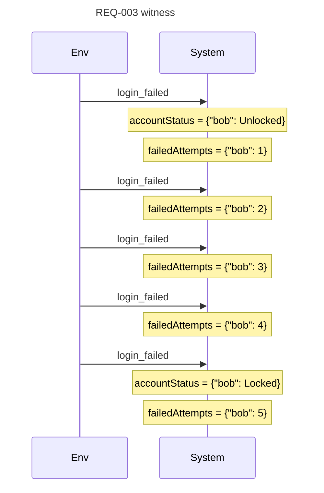
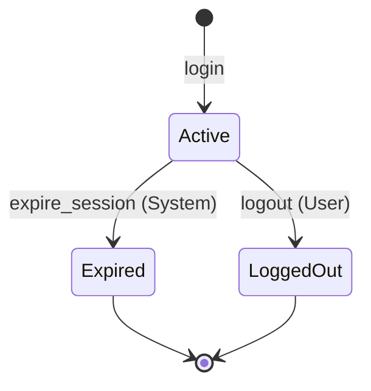
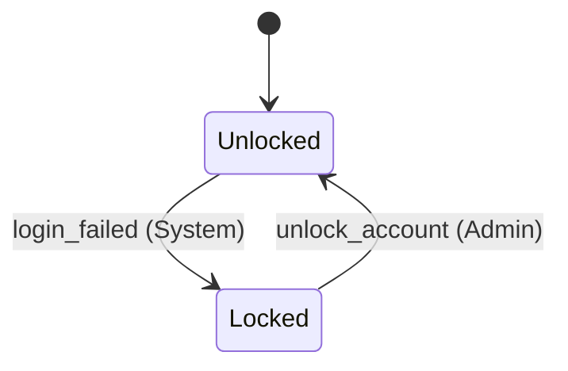

# Spec Readback: auth — v0.2.0

> Auto-generated by `tools/spec-readback.py` from `specs/auth.area.json`. Do not edit; regenerate after spec changes.

**Status:** formalized  |  **Requirements:** 0/4 verified, 1/4 witnessed  |  **Invariants:** 0/3 verified  |  **Coverage:** 13 cells, 4 covered, 9 triaged, 0 untriaged  |  **Open questions:** 3  |  **Last verified:** never

*Legend: ✓ verified — witness trace replayed green against real code · ◐ witnessed — proven possible in the model, not yet demonstrated in code · ✗ no witness — claimed behavior is UNREACHABLE in the model · ⏳ not checked yet · ⊘ skipped with justification (rejection-style requirement; an invariant carries the proof)*

## Purpose

Authenticate users; manage session lifecycle; lock accounts after repeated failed attempts.

## ⚠ Needs Your Attention

- **Unchecked requirement** — REQ-001
- **Unchecked requirement** — REQ-002
- **Unchecked requirement** — REQ-004
- **Open coverage GAPs** — Q-003 (spec is silent on triaged-real cells).
- **Open question** — Q-001: Should unlock_account be available to a self-service flow (e.g. password reset) or only to Admin?
- **Open question** — Q-002: Session expiration: is it strictly time-based (inactivity timeout), or also bounded by absolute session age?
- **Open question** — Q-003: State×event gap: when Account=Locked and login_failed fires, the spec is silent (REQ-003 covers Unlocked only). Should attempts against a locked account be counted toward anything, ignored, or raise an alert? _(source: matrix)_

## What the System Does

### Sign in — *User — User opens the login screen, signs in, and lands on the Dashboard — including the lockout failure branch.*

*(step 1: [auth-ui.UI-001](auth-ui.readback.md#ui-001) — see [auth-ui](auth-ui.readback.md))*

#### REQ-001

⏳ When a registered user submits valid credentials, the system shall create an Active session owned by that user.

<details><summary>Quint action `login`, witness predicate + trace</summary>

`specs/auth.qnt:L58-L70` · model `a3a842ed9cb7`

```quint
  action login(uid: UserId, sid: SessionId): bool = all {
    require(not(isLocked(uid))),
    require(not(sessions.keys().contains(sid))),
    require(activeSessionsOf(uid).size() == 0),  // INV-001 guard
    sessions'          = sessions.put(sid, Active),
    sessionOwner'      = sessionOwner.put(sid, uid),
    accountStatus'     = accountStatus,
    failedAttempts'    = failedAttempts.put(uid, 0),
    userActiveSession' = userActiveSession.put(
      uid,
      activeSessionsOf(uid).union(Set(sid))
    ),
  }
```

**Witness predicate:** `sessions.keys().exists(sid => sessions.get(sid) == Active)` — true exactly when the behavior has happened.

</details>

*(step 3: [auth-ui.UI-002](auth-ui.readback.md#ui-002) — see [auth-ui](auth-ui.readback.md))*

*step 4 — failure branch: repeated bad credentials lock the account:*

#### REQ-003

◐  *(failure path)* While the account is Unlocked, if a login attempt fails, then the system shall increment failedAttempts and lock the account when it reaches MAX_FAILED_ATTEMPTS (= 5, CON-001).

> **Witness:** 6 steps: login_failed(bob) ×5 → accountStatus = {"bob": Locked}; failedAttempts = {"bob": 5}

<details><summary>Quint action `login_failed`, witness predicate + trace</summary>

`specs/auth.qnt:L90-L102` · model `a3a842ed9cb7`

```quint
  action login_failed(uid: UserId): bool = {
    require(not(isLocked(uid)))
    val cur = failedAttempts.getOrElse(uid, 0)
    val next = cur + 1
    val newStatus = if (next >= MAX_FAILED_ATTEMPTS) Locked else Unlocked
    all {
      sessions'          = sessions,
      sessionOwner'      = sessionOwner,
      accountStatus'     = accountStatus.put(uid, newStatus),
      failedAttempts'    = failedAttempts.put(uid, next),
      userActiveSession' = userActiveSession,
    }
  }
```

**Witness predicate:** `accountStatus.keys().exists(uid => accountStatus.get(uid) == Locked)` — true exactly when the behavior has happened.



</details>

*(step 5: [auth-ui.UI-003](auth-ui.readback.md#ui-003) — locked-account counterpart of the submit step — see [auth-ui](auth-ui.readback.md))*

### Other behaviors

#### REQ-002

⏳ While the user's session is Active, when the user requests logout, the system shall transition that session to LoggedOut.

<details><summary>Quint action `logout`, witness predicate + trace</summary>

`specs/auth.qnt:L73-L87` · model `a3a842ed9cb7`

```quint
  action logout(sid: SessionId): bool = {
    require(sessions.keys().contains(sid))
    require(isActive(sid))
    val uid = sessionOwner.get(sid)
    all {
      sessions'          = sessions.put(sid, LoggedOut),
      sessionOwner'      = sessionOwner,
      accountStatus'     = accountStatus,
      failedAttempts'    = failedAttempts,
      userActiveSession' = userActiveSession.put(
        uid,
        activeSessionsOf(uid).exclude(Set(sid))
      ),
    }
  }
```

**Witness predicate:** `sessions.keys().exists(sid => sessions.get(sid) == LoggedOut)` — true exactly when the behavior has happened.

</details>

#### REQ-004

⏳ While the session is Active and has been inactive for longer than MAX_SESSION_AGE (= 24 step-units, CON-002), the system shall transition it to Expired.

<details><summary>Quint action `expire_session`, witness predicate + trace</summary>

`specs/auth.qnt:L105-L119` · model `a3a842ed9cb7`

```quint
  action expire_session(sid: SessionId): bool = {
    require(sessions.keys().contains(sid))
    require(isActive(sid))
    val uid = sessionOwner.get(sid)
    all {
      sessions'          = sessions.put(sid, Expired),
      sessionOwner'      = sessionOwner,
      accountStatus'     = accountStatus,
      failedAttempts'    = failedAttempts,
      userActiveSession' = userActiveSession.put(
        uid,
        activeSessionsOf(uid).exclude(Set(sid))
      ),
    }
  }
```

**Witness predicate:** `sessions.keys().exists(sid => sessions.get(sid) == Expired)` — true exactly when the behavior has happened.

</details>

## What Must Always Be True

- **INV-001** (`atMostOneActiveSession`) — At most one Active session per user. Criticality: critical. ⏳
- **INV-002** (`noSessionWhileLocked`) — A Locked account has no Active session. Criticality: critical. ⏳
- **INV-003** (`noAccessWithInvalidToken`) — Expired/LoggedOut sessions never appear in any user's active set. Criticality: high. ⏳

## Limits and Bounds

| ID | Name | Value | Unit | What it is | Referenced by | History |
|---|---|---|---|---|---|---|
| CON-001 | `MAX_FAILED_ATTEMPTS` | 5 | — | Failed-login threshold before locking. | REQ-003 | initial-auth |
| CON-002 | `MAX_SESSION_AGE` | 24 | step-units | Modeled as a step counter for bounded checking. | REQ-004 | initial-auth |

_Confirm every number AND its boundary semantics (on the Nth, or after N?) — off-by-one is the classic wrong-rule bug; the witness one-liners above show the machine-found count._

## State Machines

### Session



### Account



## Reference

<details><summary>Concepts, architecture, decisions, resolved questions, traceability, verification history</summary>

**Entities:** **User** — Registered actor with login credentials. · **Session** (Active / Expired / LoggedOut) — A logged-in instance of a User. · **Account** (Unlocked / Locked) — Lockout state derived from failed attempts.

**Actors:** User, System, Admin

**Architecture (resolved project ⊕ area):** TypeScript 5.4 Node.js 20 Express Vitest pnpm · persistence: sql postgres Prisma

**Components:** **service** (transport) implements login, logout, login_failed, unlock_account · **worker** (async) implements expire_session

**Decisions:**

- **DEC-001** (accepted, 2026-04-12) — JWT (RS256) over session cookies. Use JWT signed with RS256 for session tokens. Rationale: Asymmetric signing lets the edge verify with the public key; private key stays in the auth service. Alternatives: Cookie-based sessions (rejected: Edge can't validate without a network hop.); Opaque tokens with introspection (rejected: Extra request per call adds latency and ops cost.).

_No code generated yet. Run /spec-apply._

_Approval lives in PR history — audit trail: `git log --follow specs/auth.area.json`_

</details>
