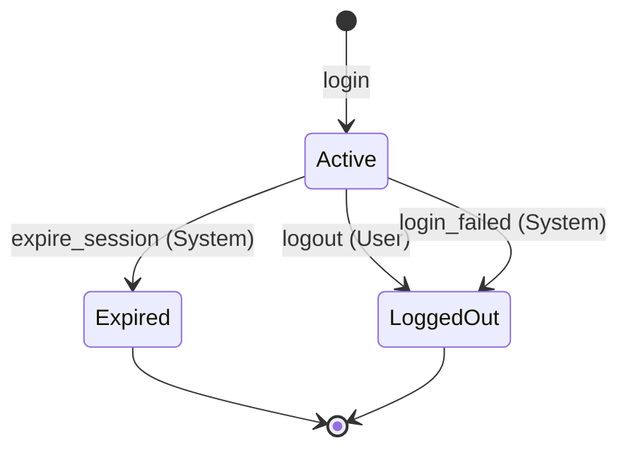
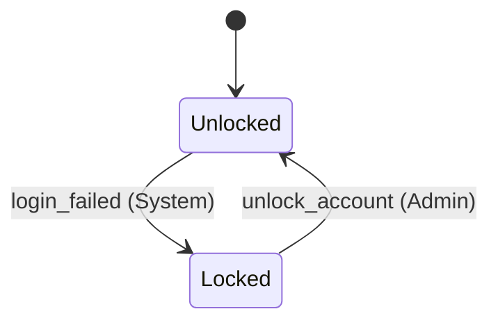

# Spec Readback: auth — v0.3.0

> Auto-generated by `tools/spec-readback.py` from `specs/auth.area.json`. Do not edit; regenerate after spec changes.

**⚠ NOT READY** — 5 of 5 requirement(s) not verified against code; 4 of 4 invariant(s) not holding; 3 open question(s).

**Status:** formalized  |  **Requirements:** 0/5 verified, 0/5 witnessed  |  **Invariants:** 0 proven + 0 bounded / 4  |  **Coverage:** 13 cells, 4 covered, 9 triaged, 0 untriaged  |  **Open questions:** 3  |  **Last verified:** never

*Legend: ✓ verified — witness trace replayed green against real code · ◐ witnessed — proven possible in the model, not yet demonstrated in code · ✗ no witness — claimed behavior is UNREACHABLE in the model · ⏳ not checked yet · ⊘ skipped with justification (rejection-style requirement; an invariant carries the proof)*

## Purpose

Authenticate users; manage session lifecycle; lock accounts after repeated failed attempts.

## Scope

**In scope:** password login, session lifecycle, account lockout

**Deliberately out of scope** — these are decisions, not oversights:

- **service-accounts** — Machine identities authenticate via mTLS, not passwords; resolved in Q-001. _(owned by platform)_
- **password-reset** — Owned by the account-recovery area; this area only consumes the resulting credential change.
- **mfa** — Deferred until after the first release; no requirement here may assume a second factor.

## ⚠ Needs Your Attention

- **Unchecked requirement** — REQ-001: When a registered user submits valid credentials, the system shall create an Active session owned by that user.
- **Unchecked requirement** — REQ-002: While the user's session is Active, when the user requests logout, the system shall transition that session to LoggedOut.
- **Unchecked requirement** — REQ-003: While the account is Unlocked, if a login attempt fails, then the system shall increment failedAttempts and lock the account when it reaches MAX_FAILED_ATTEMPTS (= 5, CON-001).
- **Unchecked requirement** — REQ-004: While the session is Active and has been inactive for longer than MAX_SESSION_AGE (= 24 step-units, CON-002), the system shall transition it to Expired.
- **Open coverage GAPs** — Q-003 (spec is silent on triaged-real cells).
- **Open question** — Q-001: Should unlock_account be available to a self-service flow (e.g. password reset) or only to Admin?
- **Open question** — Q-002: Session expiration: is it strictly time-based (inactivity timeout), or also bounded by absolute session age?
- **Open question** — Q-003: State×event gap: when Account=Locked and login_failed fires, the spec is silent (REQ-003 covers Unlocked only). Should attempts against a locked account be counted toward anything, ignored, or raise an alert? _(source: matrix)_

## What the System Does

### Sign in — *User — User opens the login screen, signs in, and lands on the Dashboard — including the lockout failure branch.*

*(step 1: [auth-ui.UI-001](auth-ui.readback.md#ui-001) — see [auth-ui](auth-ui.readback.md))*

#### REQ-001

⏳ When a registered user submits valid credentials, the system shall create an Active session owned by that user.

<details><summary>Quint action `login`, witness predicate + trace</summary>

`specs/auth.qnt:L75-L87` · model `ff015ad88937`

```quint
  action login(uid: UserId, sid: SessionId): bool = all {
    not(isLocked(uid)),
    not(sessions.keys().contains(sid)),
    activeSessionsOf(uid).size() == 0,          // INV-001 guard
    sessions'          = sessions.put(sid, Active),
    sessionOwner'      = sessionOwner.put(sid, uid),
    accountStatus'     = accountStatus,
    failedAttempts'    = failedAttempts.put(uid, 0),
    userActiveSession' = userActiveSession.put(
      uid,
      activeSessionsOf(uid).union(Set(sid))
    ),
  }
```

**Witness predicate:** `sessions.keys().contains(_lastSid) and statusOf(sessions, _lastSid) == Active and activeSessionsOf(_lastUid).contains(_lastSid)` — true exactly when the behavior has happened.

</details>

*(step 3: [auth-ui.UI-002](auth-ui.readback.md#ui-002) — see [auth-ui](auth-ui.readback.md))*

*step 4 — failure branch: repeated bad credentials lock the account:*

#### REQ-003

⏳  *(failure path)* While the account is Unlocked, if a login attempt fails, then the system shall increment failedAttempts and lock the account when it reaches MAX_FAILED_ATTEMPTS (= 5, CON-001).

<details><summary>Quint action `login_failed`, witness predicate + trace</summary>

`specs/auth.qnt:L112-L128` · model `ff015ad88937`

```quint
  action login_failed(uid: UserId): bool = {
    val next = attemptsOf(uid) + 1
    val locking = next >= MAX_FAILED_ATTEMPTS
    val doomed = activeSessionsOf(uid)
    all {
      not(isLocked(uid)),
      sessions' = if (locking)
                    doomed.fold(sessions, (acc, s) => acc.put(s, LoggedOut))
                  else sessions,
      sessionOwner'      = sessionOwner,
      accountStatus'     = accountStatus.put(uid, if (locking) Locked else Unlocked),
      failedAttempts'    = failedAttempts.put(uid, next),
      userActiveSession' = if (locking)
                             userActiveSession.put(uid, Set())
                           else userActiveSession,
    }
  }
```

**Witness predicate:** `accountStatus.keys().contains(_lastUid) and accountStatus.get(_lastUid) == Locked` — true exactly when the behavior has happened.

</details>

*(step 5: [auth-ui.UI-003](auth-ui.readback.md#ui-003) — locked-account counterpart of the submit step — see [auth-ui](auth-ui.readback.md))*

### Other behaviors

#### REQ-002

⏳ While the user's session is Active, when the user requests logout, the system shall transition that session to LoggedOut.

<details><summary>Quint action `logout`, witness predicate + trace</summary>

`specs/auth.qnt:L90-L104` · model `ff015ad88937`

```quint
  action logout(sid: SessionId): bool = {
    val uid = if (sessionOwner.keys().contains(sid)) sessionOwner.get(sid) else ""
    all {
      sessions.keys().contains(sid),
      isActive(sid),
      sessions'          = sessions.put(sid, LoggedOut),
      sessionOwner'      = sessionOwner,
      accountStatus'     = accountStatus,
      failedAttempts'    = failedAttempts,
      userActiveSession' = userActiveSession.put(
        uid,
        activeSessionsOf(uid).exclude(Set(sid))
      ),
    }
  }
```

**Witness predicate:** `statusOf(sessions, _lastSid) == LoggedOut` — true exactly when the behavior has happened.

</details>

#### REQ-004

⏳ While the session is Active and has been inactive for longer than MAX_SESSION_AGE (= 24 step-units, CON-002), the system shall transition it to Expired.

<details><summary>Quint action `expire_session`, witness predicate + trace</summary>

`specs/auth.qnt:L131-L145` · model `ff015ad88937`

```quint
  action expire_session(sid: SessionId): bool = {
    val uid = if (sessionOwner.keys().contains(sid)) sessionOwner.get(sid) else ""
    all {
      sessions.keys().contains(sid),
      isActive(sid),
      sessions'          = sessions.put(sid, Expired),
      sessionOwner'      = sessionOwner,
      accountStatus'     = accountStatus,
      failedAttempts'    = failedAttempts,
      userActiveSession' = userActiveSession.put(
        uid,
        activeSessionsOf(uid).exclude(Set(sid))
      ),
    }
  }
```

**Witness predicate:** `statusOf(sessions, _lastSid) == Expired` — true exactly when the behavior has happened.

</details>

#### REQ-005

⊘  *(failure path)* While the Account is Locked, if the user submits valid credentials, then the system shall refuse the login and leave every session and counter untouched.

> **Forbidden** — this must never happen, so there is no trace to find. The proof is the invariant that stays true: **INV-002**.

> **Refusal check:** ⏳ `tests/auth/refusal/locked-login.test.ts` — drives the code into accountStatus[uid] == Locked, attempts the call, asserts it is refused and that `sessions`, `userActiveSession`, `failedAttempts` did not move.
> _Replay cannot cover this: a rejection has no trace to replay._

> **Witness skipped:** A prohibition has no reachable state to witness — there is no step in which 'the login did not happen' becomes visible. INV-002 (noSessionWhileLocked) carries the model-side proof.

<details><summary>Quint action `login`, witness predicate + trace</summary>

`specs/auth.qnt:L75-L87` · model `ff015ad88937`

```quint
  action login(uid: UserId, sid: SessionId): bool = all {
    not(isLocked(uid)),
    not(sessions.keys().contains(sid)),
    activeSessionsOf(uid).size() == 0,          // INV-001 guard
    sessions'          = sessions.put(sid, Active),
    sessionOwner'      = sessionOwner.put(sid, uid),
    accountStatus'     = accountStatus,
    failedAttempts'    = failedAttempts.put(uid, 0),
    userActiveSession' = userActiveSession.put(
      uid,
      activeSessionsOf(uid).union(Set(sid))
    ),
  }
```

</details>

## What Must Always Be True

_Invariant legend: ✓ proven — inductive, holds in ALL reachable states · ✓ (≤N steps) — bounded model check to depth N; no counterexample found within N, NOT a proof · ✗ counterexample · ⚠ accepted-risk · ⏳ not checked. Upgrade a bounded ✓ by raising the bound or marking the invariant `proof: inductive`._

- **INV-001** (`atMostOneActiveSession`) — At most one Active session per user. Criticality: critical. ⏳
- **INV-002** (`noSessionWhileLocked`) — A Locked account has no Active session. Criticality: critical. ⏳
- **INV-003** (`noAccessWithInvalidToken`) — Expired/LoggedOut sessions never appear in any user's active set. Criticality: high. ⏳
- **INV-004** (`noEarlyLockout`) — Below MAX_FAILED_ATTEMPTS, the account stays unlocked. Criticality: high. ⏳

## Limits and Bounds

| ID | Name | Value | Unit | What it is | Referenced by | History |
|---|---|---|---|---|---|---|
| CON-001 | `MAX_FAILED_ATTEMPTS` | 5 | — | Failed-login threshold before locking. | REQ-003, INV-004 | initial-auth |
| CON-002 | `MAX_SESSION_AGE` | 24 | step-units | Modeled as a step counter for bounded checking. | REQ-004 | initial-auth |

_Confirm every number AND its boundary semantics (on the Nth, or after N?) — off-by-one is the classic wrong-rule bug; the witness one-liners above show the machine-found count._

## State Machines

### Session


```mermaid
stateDiagram-v2
  [*] --> Active: login
  Active --> Expired: expire_session (System)
  Active --> LoggedOut: logout (User)
  Active --> LoggedOut: login_failed (System)
  Expired --> [*]
  LoggedOut --> [*]
```

### Account


```mermaid
stateDiagram-v2
  [*] --> Unlocked
  Unlocked --> Locked: login_failed (System)
  Locked --> Unlocked: unlock_account (Admin)
```

## Completeness by Dimension

_One number would hide which half is missing. Each row is derived from declared obligations: ✓ discharged, ! outstanding, — nothing declared (which may itself be the gap)._

| Dimension | | Obligations |
|---|---|---|
| Data model | — | 3 entities, 2 stateful, 0 closed |
| State space | ✓ | 4/13 cells covered, 9 triaged, 0 untriaged |
| Operations | ! | 1/5 requirements with a discharged witness |
| Failure behavior | — | 2 unwanted-path requirement(s); no external outcome matrix — unmeasured |
| External systems | — | none declared — if the area calls anything, this is a gap |
| Assumptions | — | none recorded |
| Temporal behavior | — | none declared |
| Refusal coverage | ! | 1/1 rejection(s) with an artifact, 0 passing |
| Examples | — | none written |
| Invariants | ! | 0/4 holding |
| Adversarial review | — | never run — `/spec-check --reality` |

## Reference

<details><summary>Concepts, architecture, decisions, resolved questions, traceability, verification history</summary>

**Entities:** **User** — Registered actor with login credentials. · **Session** (Active / Expired / LoggedOut) — A logged-in instance of a User. · **Account** (Unlocked / Locked) — Lockout state derived from failed attempts.

**Actors:** User, System, Admin

**Architecture (resolved project ⊕ area):** TypeScript 5.4 Node.js 20 Express Vitest pnpm · persistence: sql postgres Prisma

**Components:** **service** (transport) implements login, logout, login_failed, unlock_account · **worker** (async) implements expire_session

**Decisions:**

- **DEC-001** (accepted, 2026-04-12) — JWT (RS256) over session cookies. Use JWT signed with RS256 for session tokens. Rationale: Asymmetric signing lets the edge verify with the public key; private key stays in the auth service. Alternatives: Cookie-based sessions (rejected: Edge can't validate without a network hop.); Opaque tokens with introspection (rejected: Extra request per call adds latency and ops cost.).

_No code generated yet. Run /spec-apply._

_Approval lives in PR history — audit trail: `git log --follow specs/auth.area.json`_

</details>
