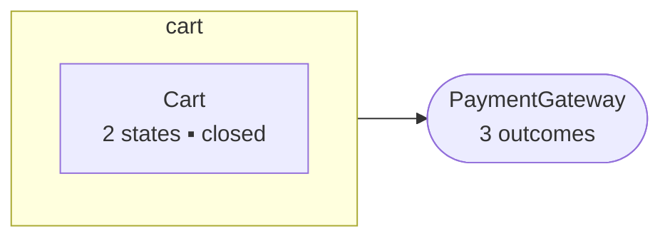
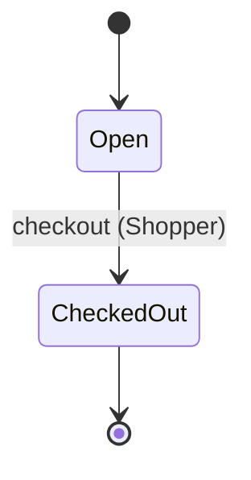

# Spec Readback: cart — v0.1.0

> Auto-generated by `tools/spec-readback.py` from `specs/cart.area.json`. Do not edit; regenerate after spec changes.

**⚠ NOT READY** — 4 of 4 requirement(s) not verified against code; 2 of 2 invariant(s) not holding; 4 open question(s).

**Status:** structured  |  **Requirements:** 0/4 verified, 0/4 witnessed  |  **Invariants:** 0 proven + 0 bounded / 2  |  **Coverage:** matrix not run  |  **Extraction:** 18/18 sites accounted  |  **Open questions:** 4  |  **Last verified:** never

*Legend: ✓ verified — witness trace replayed green against real code · ◐ witnessed — proven possible in the model, not yet demonstrated in code · ✗ no witness — claimed behavior is UNREACHABLE in the model · ⏳ not checked yet · ⊘ skipped with justification (rejection-style requirement; an invariant carries the proof)*

## Purpose

BROWNFIELD EXAMPLE. The spec extracted from code/legacy-cart/cart.js — code that already existed, with a threshold nobody documented, a rejection nobody tested, and one line that turned out to be dead. Shows the three things only brownfield can do: declare a substitution boundary, account for every decision site in the implementation, and measure fidelity against the original instead of asserting it.

## Shape

*Rounded nodes are outside systems this area depends on; each declared outcome is a cell the coverage matrix requires an answer for.*

## Scope

**In scope:** adding items to a cart, checkout, clearing a cart

**Deliberately out of scope** — these are decisions, not oversights:

- **pricing** — Totals here count quantities; money is the billing area's. _(owned by billing)_
- **inventory-reservation** — Nothing in this code reserves stock; adding an item does not hold it.

## What a Replacement Must Preserve

**Entry points:**

- `addItem(cartId, sku, qty)`
- `checkout(cartId)`
- `clear(cartId)`

**Observable state (what the differential comparator diffs):** `cart.status`, `cart.items (sku → qty)`

**Persistence:** The store's cart shape IS the contract — existing carts must remain readable. A replacement may change how it talks to the store, not what a stored cart looks like.

**Deliberately free:** — a replacement may do these differently.

- file and class layout
- log wording and level
- how items are looked up (find vs index)
- error class names, as long as the call still throws

## ⚠ Needs Your Attention

- **Unchecked requirement** — REQ-001: Adding something already in the basket makes that line bigger rather than adding a second line for the same product.
- **Unchecked requirement** — REQ-002: A product not yet in the basket gets its own line, as long as the basket is still open and has not already reached MAX_ITEMS (= 20, CON-001) lines.
- **Unchecked requirement** — REQ-004: If the payment provider fails during checkout, the basket stays open and the shopper is told the checkout did not go through — nothing is half-completed.
- **Coverage unknown** — state machines declared but the state×event matrix has never been recorded (run `tools/spec-matrix.py` with `--record`).
- **Open question** — Q-001: What should adding an item to a full cart do — throw as today, or return a result the UI can render? The code throws, which no requirement describes. _(source: extraction)_
- **Open question** — Q-002: Retry after a thrown charge assumes the money did not move (ASM-001). Should checkout send an idempotency key before we rely on that? _(source: extraction)_
- **Open question** — Q-003: Checkout of an empty cart THROWS while declined and unavailable RETURN ok:false. Is the inconsistency intentional? _(source: extraction)_
- **Open question** — Q-004: clear() is implemented and unspecified. Is it product behavior, or a leftover from an admin tool? _(source: extraction)_

## At a Glance

| | ID | Behavior | Modality |
|---|---|---|---|
| ⏳ | [REQ-001](#req-001) | Adding something already in the basket makes that line bigger rather than adding a seco… | must |
| ⏳ | [REQ-002](#req-002) | A product not yet in the basket gets its own line, as long as the basket is still open… | must |
| ⊘ | [REQ-003](#req-003) | Once a basket has been checked out it is finished: further attempts to add to it are re… | forbidden |
| ⏳ | [REQ-004](#req-004) | If the payment provider fails during checkout, the basket stays open and the shopper is… | must |

## What the System Does

_No journeys reference this area. Run `/spec _journeys/<name>` to group requirements into flows._

#### REQ-001

⏳ Adding something already in the basket makes that line bigger rather than adding a second line for the same product.

> _Extracted from `code/legacy-cart/cart.js:31-35` (high confidence)._

EARS sentence, Quint action `add_item`

**As specified (EARS):** While the Cart is Open, when a shopper adds a SKU already present, the system shall increase that line's quantity by the amount added.

_action `add_item` not found in `specs/cart.qnt`_

#### REQ-002

⏳ A product not yet in the basket gets its own line, as long as the basket is still open and has not already reached MAX_ITEMS (= 20, CON-001) lines.

> _Extracted from `code/legacy-cart/cart.js:26-36` (high confidence)._

EARS sentence, Quint action `add_item`

**As specified (EARS):** While the Cart is Open and holds fewer than MAX_ITEMS (= 20, CON-001) lines, when a shopper adds a new SKU, the system shall append a line for that SKU.

_action `add_item` not found in `specs/cart.qnt`_

#### REQ-003

⊘  *(failure path)* Once a basket has been checked out it is finished: further attempts to add to it are refused and the basket's contents stay exactly as they were at checkout.

> _Extracted from `code/legacy-cart/cart.js:22-24` (high confidence)._

> **Forbidden** — this must never happen, so there is no trace to find. The proof is the invariant that stays true: **INV-001**.

> **Refusal check:** ⏳ `tests/cart/refusal/closed-cart.test.js` — drives the code into cart.status == "checked_out", attempts the call, asserts it is refused and that `cart.items`, `cart.status` did not move.
> _Replay cannot cover this: a rejection has no trace to replay._

> **Witness skipped:** A refusal has no reachable state to witness. INV-001 carries the model-side proof.

EARS sentence, Quint action `add_item`

**As specified (EARS):** While the Cart is CheckedOut, if a shopper adds an item, then the system shall refuse the call and leave the cart untouched.

_action `add_item` not found in `specs/cart.qnt`_

#### REQ-004

⏳  *(failure path)* If the payment provider fails during checkout, the basket stays open and the shopper is told the checkout did not go through — nothing is half-completed.

> _Extracted from `code/legacy-cart/cart.js:58-62` (medium confidence)._

> **On PaymentGateway/OK:** CheckedOut
> **On PaymentGateway/DECLINED:** NO_CHANGE — the cart stays Open; reason 'declined' (safe to retry)
> **On PaymentGateway/UNAVAILABLE:** NO_CHANGE — the cart stays Open; reason 'unavailable'; caller retries (safe to retry)

EARS sentence, Quint action `checkout_unavailable`

**As specified (EARS):** While the Cart is Open, if the payment gateway throws during checkout, then the system shall leave the Cart Open and return ok:false with reason 'unavailable'.

_action `checkout_unavailable` not found in `specs/cart.qnt`_

## What Must Always Be True

_Invariant legend: ✓ proven — inductive, holds in ALL reachable states · ✓ (≤N steps) — bounded model check to depth N; no counterexample found within N, NOT a proof · ✗ counterexample · ⚠ accepted-risk · ⏳ not checked. Upgrade a bounded ✓ by raising the bound or marking the invariant `proof: inductive`._

- **INV-001** (`checkedOutIsFrozen`) — A CheckedOut cart's items never change. Criticality: critical. ⏳
- **INV-002** (`underItemCap`) — A cart never holds more than MAX_ITEMS distinct lines. Criticality: high. ⏳

## What the Outside World Can Do

| Dependency | Outcome | What we do | Where |
|---|---|---|---|
| PaymentGateway | OK | CheckedOut | REQ-004 |
| PaymentGateway | DECLINED | NO_CHANGE — the cart stays Open; reason 'declined' (retry-safe) | REQ-004 |
| PaymentGateway | UNAVAILABLE | NO_CHANGE — the cart stays Open; reason 'unavailable'; caller retries (retry-safe) | REQ-004 |

**Assumptions this specification rests on.** Results that depend on them are annotated `under ASM-NNN` — they hold if the assumption does, and not otherwise.

- **ASM-001** — A charge that throws did not take the money, so retrying is safe. Bears on: REQ-004. Checked in production by: Nothing today. A gateway idempotency key would discharge it.

## Worked Examples

_Author-written scenarios: illustration and regression pins, not proof. A witness trace shows a behavior is reachable at all; an example only asserts the one case somebody thought of._

**EX-001 — Adding a SKU twice merges the lines**

- Given: `cart.status` = `Open`, `cart.items` = `[{sku: 'a', qty: 1}]`
- When: `add_item(sku=a, qty=2)`
- Expect: `cart.items` = `[{sku: 'a', qty: 3}]`
- Illustrates: REQ-001

## What the Code Does That the Spec Does Not

_The only check here that runs code → spec. A branch nobody wrote down cannot be regenerated, cannot be witnessed, and cannot be missed by any spec-shaped check — because nothing spec-shaped knows it exists._

**9 mapped · 9 triaged · 0 unclaimed** of 18 decision site(s).

**GAP** (5)

- `code/legacy-cart/cart.js:27` The cart-full rejection is real behavior with no requirement: REQ-002 says what happens BELOW the limit and nothing says what happens at it. Exactly the kind of branch a regenerated implementation would omit. — Q-001
- `code/legacy-cart/cart.js:45` Checkout of an empty cart throws. No requirement mentions it, and the empty-cart case is not in any journey. — Q-003
- `code/legacy-cart/cart.js:45` Same site: the threshold itself is unspecified. Is an empty checkout an error, or a no-op returning ok:true? — Q-003
- `code/legacy-cart/cart.js:46` The empty-cart rejection, unspecified. Note it THROWS while the other two failure paths RETURN ok:false — an inconsistency the extraction surfaced. — Q-003
- `code/legacy-cart/cart.js:72` clear() has no requirement at all — the whole operation was extracted as code with no spec behind it. — Q-004

**DEAD** (1)

- `code/legacy-cart/cart.js:68` Unreachable given the store's current contract. A finding about the CODE: either delete it, or make the store contract explicit enough that the branch is justified.

**OUT-OF-SCOPE** (1)

- `code/legacy-cart/cart.js:77` total() sums quantities as a stand-in for an amount; anything money-shaped belongs to billing.

**DEFENSIVE** (1)

- `code/legacy-cart/cart.js:67` store.get always returns a cart today; the guard is a belt against a store contract that has never been violated.

**NOT-BEHAVIOR** (1)

- `code/legacy-cart/cart.js:39` Returns the updated cart the caller already holds; the observable change is the stored cart, covered by REQ-001/REQ-002.

_9 site(s) MAPPED to spec elements — listed in the ledger, not repeated here._

## Limits and Bounds

| ID | Name | Value | Unit | What it is | Referenced by | History |
|---|---|---|---|---|---|---|
| CON-001 | `MAX_ITEMS` | 20 | — | Maximum distinct lines in a cart. Read off the code — no document mentioned it. | REQ-002, INV-002 | — |

_Confirm every number AND its boundary semantics (on the Nth, or after N?) — off-by-one is the classic wrong-rule bug; the witness one-liners above show the machine-found count._

## State Machines

### Cart

## Completeness by Dimension

_One number would hide which half is missing. Each row is derived from declared obligations: ✓ discharged, ! outstanding, — nothing declared (which may itself be the gap)._

| Dimension | | Obligations |
|---|---|---|
| Data model | ✓ | 1 entities, 1 stateful, 1 closed |
| State space | — | matrix not run |
| Operations | ! | 1/4 requirements with a discharged witness |
| Failure behavior | — | 2 unwanted-path requirement(s); no external outcome matrix — unmeasured |
| External systems | ✓ | 1 declared, 3 outcomes |
| Assumptions | ✓ | 1 recorded, 0 open |
| Temporal behavior | — | none declared |
| Extraction coverage | ✓ | 9 mapped, 9 triaged, 0 unclaimed of 18 site(s) |
| Substitutability | — | not measured — needs a parallel build and `spec-record equiv` |
| Refusal coverage | ! | 1/1 rejection(s) with an artifact, 0 passing |
| Examples | ✓ | 1 worked example(s) |
| Invariants | ! | 0/2 holding |
| Adversarial review | — | never run — `/spec-check --reality` |

## Reference

Concepts, architecture, decisions, resolved questions, traceability, verification history

**Entities:**

- **Cart** (Open / CheckedOut) — CLOSED, read off the code: `status` is only ever compared to "checked_out" and only ever assigned it. Anything else a regenerated implementation invents (Abandoned, Locked) would be new behavior nobody specified.

**Actors:** Shopper, System

**Architecture (resolved project ⊕ area):** TypeScript 5.4 Node.js 20 Express Vitest pnpm · persistence: sql postgres Prisma

**Traceability:**

| ID | Quint | Component | Code | Verified |
|---|---|---|---|---|
| REQ-001 | `—` | — | `code/legacy-cart/cart.js:addItem` | ✗ |
| REQ-002 | `—` | — | `code/legacy-cart/cart.js:addItem` | ✗ |
| REQ-003 | `—` | — | `code/legacy-cart/cart.js:addItem` | ✗ |
| REQ-004 | `—` | — | `code/legacy-cart/cart.js:checkout` | ✗ |

_Approval lives in PR history — audit trail: `git log --follow specs/cart.area.json`_

