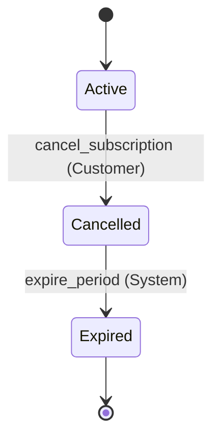

# Spec Readback: subscription — v0.1.0

> Auto-generated by `tools/spec-readback.py` from `specs/subscription.area.json`. Do not edit; regenerate after spec changes.

**⚠ NOT READY** — 7 of 7 requirement(s) not verified against code; 3 of 3 invariant(s) not holding; 1 open question(s).

**Status:** formalized  |  **Requirements:** 0/7 verified, 0/7 witnessed  |  **Invariants:** 0 proven + 0 bounded / 3  |  **Coverage:** 12 cells, 2 covered, 10 triaged, 0 untriaged  |  **Open questions:** 1  |  **Last verified:** never

*Legend: ✓ verified — witness trace replayed green against real code · ◐ witnessed — proven possible in the model, not yet demonstrated in code · ✗ no witness — claimed behavior is UNREACHABLE in the model · ⏳ not checked yet · ⊘ skipped with justification (rejection-style requirement; an invariant carries the proof)*

## Purpose

Subscription cancellation: stop future billing, preserve access to the end of the paid period, survive a flaky billing provider. This is the methodology's acceptance case — five sentences of prose turned into the decisions the prose leaves open.

## Scope

**In scope:** cancellation, billing suppression, access until period end

**Deliberately out of scope** — these are decisions, not oversights:

- **refunds** — Product policy: no refunds for the unused period (DEC-001). Nothing here may issue one.
- **proration** — No mid-period price adjustment exists in this product.
- **reactivation** — Resubscribing creates a new subscription; owned by the signup area. _(owned by signup)_
- **dunning** — Retry-and-chase on failed renewal payments is the billing area's job.

## ⚠ Needs Your Attention

- **Unchecked requirement** — REQ-001: While the Subscription is Active, when the customer cancels, the system shall stop future billing and mark the Subscription Cancelled.
- **Unchecked requirement** — REQ-002: While the Subscription is Cancelled and the paid period has not ended, the system shall keep access available.
- **Unchecked requirement** — REQ-003: While the Subscription is Cancelled, when the customer cancels again, the system shall make no further change and report success.
- **Unchecked requirement** — REQ-004: While the Subscription is Active, if the billing provider times out during cancellation, then the system shall leave the Subscription Active and billing enabled.
- **Unchecked requirement** — REQ-005: While the Subscription is Cancelled, when the paid period ends, the system shall withdraw access and mark the Subscription Expired.
- **Unchecked requirement** — REQ-007: When a cancellation succeeds, the system shall confirm to the customer by email or in-app notice.
- **Open question** — Q-001: After MAX_CANCEL_RETRIES exhausted TIMEOUTs, does the subscription stay Active forever, or does an operator get paged? ASM-001 assumes the provider answers eventually; nothing here says what happens if it does not. _(source: elicitation)_

## What the System Does

_No journeys reference this area. Run `/spec _journeys/<name>` to group requirements into flows._

#### REQ-001

⏳ While the Subscription is Active, when the customer cancels, the system shall stop future billing and mark the Subscription Cancelled.

> **On BillingProvider/SUCCESS:** Cancelled (safe to retry)
> **On BillingProvider/DECLINED:** NO_CHANGE — surface the provider's reason to the customer; the subscription stays Active (safe to retry)

<details><summary>Quint action `cancel_subscription`, witness predicate + trace</summary>

`specs/subscription.qnt:L54-L60` · model `b540b02e0797`

```quint
  action cancel_subscription(c: CustomerId): bool = all {
    status.get(c) == Active,
    lastBillingResult' = lastBillingResult.set(c, Success),
    status' = status.set(c, Cancelled),
    billingEnabled' = billingEnabled.set(c, false),
    accessUntilPeriodEnd' = accessUntilPeriodEnd.set(c, true),
  }
```

**Witness predicate:** `status.keys().exists(c => status.get(c) == Cancelled and not(billingEnabled.get(c)))` — true exactly when the behavior has happened.

</details>

#### REQ-002

⏳ While the Subscription is Cancelled and the paid period has not ended, the system shall keep access available.

<details><summary>Quint action `cancel_subscription`, witness predicate + trace</summary>

`specs/subscription.qnt:L54-L60` · model `b540b02e0797`

```quint
  action cancel_subscription(c: CustomerId): bool = all {
    status.get(c) == Active,
    lastBillingResult' = lastBillingResult.set(c, Success),
    status' = status.set(c, Cancelled),
    billingEnabled' = billingEnabled.set(c, false),
    accessUntilPeriodEnd' = accessUntilPeriodEnd.set(c, true),
  }
```

**Witness predicate:** `status.keys().exists(c => status.get(c) == Cancelled and accessUntilPeriodEnd.get(c))` — true exactly when the behavior has happened.

</details>

#### REQ-003

⏳ While the Subscription is Cancelled, when the customer cancels again, the system shall make no further change and report success.

<details><summary>Quint action `cancel_again`, witness predicate + trace</summary>

`specs/subscription.qnt:L65-L71` · model `b540b02e0797`

```quint
  action cancel_again(c: CustomerId): bool = all {
    status.get(c) == Cancelled,
    status' = status,
    billingEnabled' = billingEnabled,
    accessUntilPeriodEnd' = accessUntilPeriodEnd,
    lastBillingResult' = lastBillingResult,
  }
```

**Witness predicate:** `status.keys().exists(c => status.get(c) == Cancelled and accessUntilPeriodEnd.get(c))` — true exactly when the behavior has happened.

</details>

#### REQ-004

⏳  *(failure path)* While the Subscription is Active, if the billing provider times out during cancellation, then the system shall leave the Subscription Active and billing enabled.

> **On BillingProvider/TIMEOUT:** NO_CHANGE — the subscription stays Active and billable; retry (safe to retry)
> **On BillingProvider/NETWORK_ERROR:** NO_CHANGE — the request never landed; retry (safe to retry)

<details><summary>Quint action `cancel_times_out`, witness predicate + trace</summary>

`specs/subscription.qnt:L77-L83` · model `b540b02e0797`

```quint
  action cancel_times_out(c: CustomerId): bool = all {
    status.get(c) == Active,
    lastBillingResult' = lastBillingResult.set(c, Timeout),
    status' = status,
    billingEnabled' = billingEnabled,
    accessUntilPeriodEnd' = accessUntilPeriodEnd,
  }
```

**Witness predicate:** `status.keys().exists(c => lastBillingResult.get(c) == Timeout and status.get(c) == Active)` — true exactly when the behavior has happened.

</details>

#### REQ-005

⏳ While the Subscription is Cancelled, when the paid period ends, the system shall withdraw access and mark the Subscription Expired.

<details><summary>Quint action `expire_period`, witness predicate + trace</summary>

`specs/subscription.qnt:L86-L92` · model `b540b02e0797`

```quint
  action expire_period(c: CustomerId): bool = all {
    status.get(c) == Cancelled,
    status' = status.set(c, Expired),
    accessUntilPeriodEnd' = accessUntilPeriodEnd.set(c, false),
    billingEnabled' = billingEnabled,
    lastBillingResult' = lastBillingResult,
  }
```

**Witness predicate:** `status.keys().exists(c => status.get(c) == Expired and not(accessUntilPeriodEnd.get(c)))` — true exactly when the behavior has happened.

</details>

#### REQ-006

⊘  *(failure path)* If a subscription is cancelled mid-period, then the system shall issue no refund.

> **Forbidden** — this must never happen, so there is no trace to find. The proof is the invariant that stays true: **INV-002**.

> **Witness skipped:** A prohibition has no witness trace — there is no reachable state in which 'no refund happened' becomes visible. INV-002 carries the proof.

<details><summary>Quint action `cancel_subscription`, witness predicate + trace</summary>

`specs/subscription.qnt:L54-L60` · model `b540b02e0797`

```quint
  action cancel_subscription(c: CustomerId): bool = all {
    status.get(c) == Active,
    lastBillingResult' = lastBillingResult.set(c, Success),
    status' = status.set(c, Cancelled),
    billingEnabled' = billingEnabled.set(c, false),
    accessUntilPeriodEnd' = accessUntilPeriodEnd.set(c, true),
  }
```

</details>

#### REQ-007

⏳ When a cancellation succeeds, the system shall confirm to the customer by email or in-app notice.

> **Permitted, not required** — the system MAY do any of the following, and the choice is not this spec's to make. Each needs its own witness, or the permission has quietly become a rule:
>   - ⏳ **email**: `status.keys().exists(c => status.get(c) == Cancelled)`
>   - ⏳ **in-app**: `status.keys().exists(c => status.get(c) == Cancelled and accessUntilPeriodEnd.get(c))`

<details><summary>Quint action `cancel_subscription`, witness predicate + trace</summary>

`specs/subscription.qnt:L54-L60` · model `b540b02e0797`

```quint
  action cancel_subscription(c: CustomerId): bool = all {
    status.get(c) == Active,
    lastBillingResult' = lastBillingResult.set(c, Success),
    status' = status.set(c, Cancelled),
    billingEnabled' = billingEnabled.set(c, false),
    accessUntilPeriodEnd' = accessUntilPeriodEnd.set(c, true),
  }
```

</details>

## What Must Always Be True

_Invariant legend: ✓ proven — inductive, holds in ALL reachable states · ✓ (≤N steps) — bounded model check to depth N; no counterexample found within N, NOT a proof · ✗ counterexample · ⚠ accepted-risk · ⏳ not checked. Upgrade a bounded ✓ by raising the bound or marking the invariant `proof: inductive`._

- **INV-001** (`noBillingAfterCancel`) — A cancelled or expired subscription is never billed again. Criticality: critical. ⏳
- **INV-002** (`noRefundIssued`) — No refund is ever issued for the unused period. Criticality: high. ⏳
- **INV-003** (`timeoutLeavesActive`) — A timed-out cancellation leaves the subscription Active and billable. Criticality: critical. ⏳

## What the Outside World Can Do

| Dependency | Outcome | What we do | Where |
|---|---|---|---|
| BillingProvider | SUCCESS | Cancelled (retry-safe) | REQ-001 |
| BillingProvider | DECLINED | NO_CHANGE — surface the provider's reason to the customer; the subscription stays Active (retry-safe) | REQ-001 |
| BillingProvider | TIMEOUT | NO_CHANGE — the subscription stays Active and billable; retry (retry-safe) | REQ-004 |
| BillingProvider | NETWORK_ERROR | NO_CHANGE — the request never landed; retry (retry-safe) | REQ-004 |

**Assumptions this specification rests on.** Results that depend on them are annotated `under ASM-NNN` — they hold if the assumption does, and not otherwise.

- **ASM-001** — BillingProvider eventually responds to a cancellation request, within at most three retry windows. Bears on: INV-003, REQ-004. Checked in production by: Synthetic cancellation probe every 5 minutes; pages if a request is unanswered for 15.
- **ASM-002** — The paid period end is known locally and does not depend on the provider being reachable. Bears on: REQ-002, REQ-005. _Believed, not checked._

## Worked Examples

_Author-written scenarios: illustration and regression pins, not proof. A witness trace shows a behavior is reachable at all; an example only asserts the one case somebody thought of._

**EX-001 — Cancel mid-period: billing stops, access stays**

- Given: `status` = `Active`, `billingEnabled` = `True`
- When: `cancel_subscription(c=alice)`
- Expect: `status` = `Cancelled`, `billingEnabled` = `False`, `accessUntilPeriodEnd` = `True`
- Illustrates: REQ-001, REQ-002

**EX-002 — Cancelling twice is harmless**

- Given: `status` = `Cancelled`, `accessUntilPeriodEnd` = `True`
- When: `cancel_again(c=alice)`
- Expect: `status` = `Cancelled`, `accessUntilPeriodEnd` = `True`
- Illustrates: REQ-003

**EX-003 — Provider times out: nothing moves**

- Given: `status` = `Active`, `billingEnabled` = `True`
- When: `cancel_times_out(c=alice)`
- Expect: `status` = `Active`, `billingEnabled` = `True`
- Illustrates: REQ-004, INV-003

## Limits and Bounds

| ID | Name | Value | Unit | What it is | Referenced by | History |
|---|---|---|---|---|---|---|
| CON-001 | `BILLING_TIMEOUT_SECONDS` | 30 | seconds | How long the system waits for the provider before treating the call as TIMEOUT. | — | — |
| CON-002 | `MAX_CANCEL_RETRIES` | 3 | — | Retry budget after TIMEOUT or NETWORK_ERROR. Bounds ASM-001. | — | — |

_Confirm every number AND its boundary semantics (on the Nth, or after N?) — off-by-one is the classic wrong-rule bug; the witness one-liners above show the machine-found count._

## State Machines

### Subscription



## Completeness by Dimension

_One number would hide which half is missing. Each row is derived from declared obligations: ✓ discharged, ! outstanding, — nothing declared (which may itself be the gap)._

| Dimension | | Obligations |
|---|---|---|
| Data model | ✓ | 1 entities, 1 stateful, 1 closed |
| State space | ✓ | 2/12 cells covered, 10 triaged, 0 untriaged |
| Operations | ! | 1/7 requirements with a discharged witness |
| Failure behavior | ✓ | 4/4 external outcomes handled, 0 unspecified |
| External systems | ✓ | 1 declared, 4 outcomes |
| Assumptions | ✓ | 2 recorded, 0 open |
| Temporal behavior | — | none declared |
| Refusal coverage | ! | 0/1 rejection(s) with an artifact, 0 passing |
| Examples | ✓ | 3 worked example(s) |
| Invariants | ! | 0/3 holding |
| Adversarial review | — | never run — `/spec-check --reality` |

## Reference

<details><summary>Concepts, architecture, decisions, resolved questions, traceability, verification history</summary>

**Entities:** **Subscription** (Active / Cancelled / Expired) — CLOSED: exactly these three states exist. 'Paused', 'PendingCancellation' and friends are the states an implementation invents when nobody wrote the list down — the marker is what stops that.

**Actors:** Customer, System, BillingProvider

**Architecture (resolved project ⊕ area):** TypeScript 5.4 Node.js 20 Express Vitest pnpm · persistence: sql postgres Prisma

**Decisions:**

- **DEC-001** (accepted, 2026-05-15) — No refunds on cancellation. Cancellation stops future billing and preserves access to the end of the paid period. No money is returned. Rationale: Product policy; the paid period has already been delivered as access. Alternatives: Prorated refund of the unused days (rejected: Support and accounting cost outweighs the churn benefit at this price point.).

_No code generated yet. Run /spec-apply._

_Approval lives in PR history — audit trail: `git log --follow specs/subscription.area.json`_

</details>
